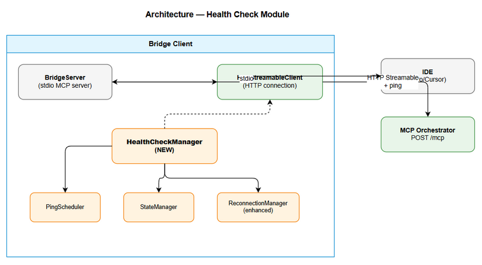
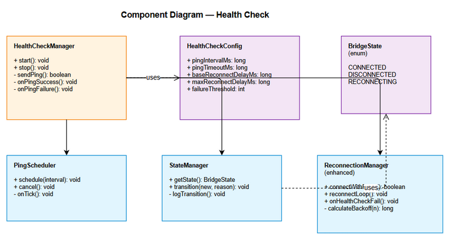

# Technical Design Document (TDD)

## MCPOrchestration — MTO-46: Bridge Client Health Check — Periodic Ping & Auto-Reconnect

---

## Document Information

| Field | Value |
|-------|-------|
| Jira Ticket | MTO-46 |
| Title | Bridge Client Health Check — Periodic Ping & Auto-Reconnect |
| Author | SA Agent |
| Version | 1.0 |
| Date | 2026-05-10 |
| Status | Draft |
| Related BRD | BRD-v1-MTO-46.docx |
| Related FSD | FSD-v1-MTO-46.docx |

---

## Author Tracking

| Role | Name - Position | Responsibility |
|------|-----------------|----------------|
| Author | SA Agent – Solution Architect | Create document |
| Peer Reviewer | Duc Nguyen – Project Lead | Review document |

---

## Revision History

| Version | Date | Author | Changes |
|---------|------|--------|---------|
| 1.0 | 2026-05-10 | SA Agent | Initiate document — technical design from BRD and FSD |

---

## 1. Introduction

### 1.1 Purpose

This TDD specifies the technical implementation of the Health Check (periodic ping) and Auto-Reconnect mechanism across all 6 MCP bridge clients. It covers architecture decisions, class design, integration patterns, and implementation details for each language/platform.

### 1.2 Scope

- Enhancement of existing Node.js and Kotlin bridge clients
- Design pattern for new Python, Bash, PowerShell, and CMD bridge clients
- Health check module architecture (reusable across all clients)
- Configuration parsing and validation
- State machine implementation

### 1.3 Technology Stack

| Client | Language | Runtime | HTTP Library | Async Model |
|--------|----------|---------|--------------|-------------|
| Node.js | TypeScript 5.x | Node.js 20+ | Built-in fetch | Event loop (setTimeout) |
| Kotlin | Kotlin 2.3.20 | JVM 21 | Ktor Client 3.4.0 | Coroutines |
| Python | Python 3.11+ | CPython | httpx | asyncio |
| Bash | Bash 4+ | Shell | curl | Background process (&) |
| PowerShell | PowerShell 7+ | .NET | Invoke-RestMethod | PowerShell Jobs |
| CMD | Batch | Windows CMD | curl (bundled) | Single-threaded loop |

### 1.4 Design Principles

- **Consistency First** — All clients implement identical behavior (same state machine, same backoff, same logs)
- **Non-Blocking** — Health check never blocks tool calls
- **Fail-Safe** — Logging/health check failures never crash the bridge
- **Zero-Config** — Works out of the box with sensible defaults
- **Enhance, Don't Replace** — Build on existing ReconnectionManager, don't rewrite

### 1.5 Constraints

- Bash and CMD have no native async — must use background processes or polling loops
- All clients must work on Windows, macOS, and Linux
- No additional dependencies for Bash/CMD (only curl, which is pre-installed)
- Ping must use existing HTTP Streamable connection (no new endpoints)

### 1.6 References

| Document | Location |
|----------|----------|
| BRD | BRD-v1-MTO-46.docx |
| FSD | FSD-v1-MTO-46.docx |
| Node.js Bridge | mcp-client-bridge/src/ |
| Kotlin Bridge | orchestrator-bridge/src/main/kotlin/.../bridge/ |

---

## 2. System Architecture

### 2.1 Architecture Overview

The health check is implemented as a module within each bridge client. It integrates with the existing ReconnectionManager and HttpStreamableClient.



```
┌─────────────────────────────────────────────────────────────┐
│                    Bridge Client                              │
│                                                              │
│  ┌──────────────┐     ┌──────────────────┐                  │
│  │ BridgeServer │────►│ HttpStreamableClient │──────────┐    │
│  │ (tool calls) │     └──────────────────┘              │    │
│  └──────────────┘              ▲                        │    │
│                                │ uses                    │    │
│  ┌──────────────────────────────────────────────┐       │    │
│  │         HealthCheckManager (NEW)              │       │    │
│  │  ┌────────────┐  ┌───────────────────────┐   │       │    │
│  │  │PingScheduler│  │ Enhanced              │   │       │    │
│  │  │(timer loop) │  │ ReconnectionManager   │   │       │    │
│  │  └────────────┘  └───────────────────────┘   │       │    │
│  │  ┌────────────┐  ┌───────────────────────┐   │       │    │
│  │  │StateManager │  │ ConfigValidator       │   │       │    │
│  │  │(state enum) │  │ (parse + validate)    │   │       │    │
│  │  └────────────┘  └───────────────────────┘   │       │    │
│  └───────────────────────────────────────────────┘       │    │
│                                                          │    │
│                                                          ▼    │
│                                              ┌──────────────┐ │
│                                              │  Orchestrator │ │
│                                              │  POST /mcp    │ │
│                                              └──────────────┘ │
└─────────────────────────────────────────────────────────────┘
```

### 2.2 Component Diagram



| Component | Responsibility | Technology |
|-----------|---------------|------------|
| HealthCheckManager | Orchestrates ping scheduling, state management, and reconnection | All languages |
| PingScheduler | Sends periodic ping requests via HTTP client | Timer/scheduler per language |
| StateManager | Manages CONNECTED/DISCONNECTED/RECONNECTING state transitions | Enum + atomic variable |
| ReconnectionManager (enhanced) | Handles exponential backoff reconnection loop | Existing + health check trigger |
| ConfigValidator | Parses and validates health check configuration | CLI parser per language |

### 2.3 Communication Patterns

| From | To | Protocol | Pattern | Description |
|------|----|----------|---------|-------------|
| PingScheduler | Orchestrator | HTTP POST (JSON-RPC) | Sync request/response | Ping every 30s |
| HealthCheckManager | ReconnectionManager | Internal method call | Event-driven | Trigger reconnect on ping fail |
| BridgeServer | StateManager | Internal method call | Query | Check state before proxying tool calls |

---

## 3. API Design

### 3.1 Ping Request (Bridge → Orchestrator)

**Implements:** UC-1, BR-4

| Attribute | Value |
|-----------|-------|
| Method | POST |
| Path | /mcp (existing HTTP Streamable endpoint) |
| Auth | Mcp-Session-Id header (existing session) |
| Rate Limit | 1 request per ping interval (not rate-limited) |

**Request Headers:**

| Header | Required | Description |
|--------|----------|-------------|
| Content-Type | Yes | application/json |
| Mcp-Session-Id | Yes | Existing session ID from initial connection |

**Request Body:**

```json
{
  "jsonrpc": "2.0",
  "id": 42,
  "method": "ping"
}
```

**Response — 200 OK (ping success):**

```json
{
  "jsonrpc": "2.0",
  "id": 42,
  "result": {}
}
```

**Response — 200 OK with error (still counts as alive per BR-4):**

```json
{
  "jsonrpc": "2.0",
  "id": 42,
  "error": {
    "code": -32601,
    "message": "Method not found: ping"
  }
}
```

**Error Responses:**

| Status | Meaning | Bridge Action |
|--------|---------|---------------|
| 200 (any JSON-RPC) | Server alive | Reset failure counter |
| 503 | Server overloaded | Treat as alive (BR-5) |
| Timeout (5s) | Server unresponsive | Increment failure counter |
| Connection refused | Server down | Increment failure counter |
| Network error | Network issue | Increment failure counter |

---

## 4. Data Design

No persistent storage required. All health check state is in-memory only.

### 4.1 In-Memory State Model

```kotlin
// Kotlin representation (canonical)
data class HealthCheckState(
    val connectionState: BridgeState,          // CONNECTED | DISCONNECTED | RECONNECTING
    val consecutiveFailures: Int,              // 0..N
    val reconnectAttempt: Int,                 // 0..N
    val lastPingAt: Instant?,                  // timestamp of last ping sent
    val lastPongAt: Instant?,                  // timestamp of last successful response
    val pingId: AtomicInteger,                 // incrementing request ID
    val healthCheckEnabled: Boolean,           // from config
)

data class HealthCheckConfig(
    val pingIntervalMs: Long = 30000,          // 30s default
    val pingTimeoutMs: Long = 5000,            // 5s default
    val baseReconnectDelayMs: Long = 1000,     // 1s default
    val maxReconnectDelayMs: Long = 15000,     // 15s cap
    val failureThreshold: Int = 1,             // consecutive failures before reconnect
)
```

---

## 5. Class / Module Design

### 5.1 Node.js Implementation

**File:** `mcp-client-bridge/src/health-check-manager.ts` (NEW)

```typescript
// health-check-manager.ts
export class HealthCheckManager {
  private timer: NodeJS.Timeout | null = null;
  private pingId = 0;
  private consecutiveFailures = 0;

  constructor(
    private readonly config: HealthCheckConfig,
    private readonly httpClient: HttpStreamableClient,
    private readonly reconnectionManager: ReconnectionManager,
    private readonly stateManager: StateManager,
  ) {}

  start(): void                    // Start ping timer (called when CONNECTED)
  stop(): void                     // Stop ping timer (called on disconnect/shutdown)
  private async sendPing(): Promise<boolean>  // Send ping, return true if OK
  private onPingSuccess(): void    // Reset failures, log
  private onPingFailure(): void    // Increment failures, maybe trigger reconnect
}

export interface HealthCheckConfig {
  pingIntervalMs: number;          // default 30000
  pingTimeoutMs: number;           // default 5000
  baseReconnectDelayMs: number;    // default 1000
  maxReconnectDelayMs: number;     // default 15000
  failureThreshold: number;        // default 1
}
```

**Enhancement to existing files:**

- `bridge-config.ts` — Add `pingIntervalMs`, `pingTimeoutMs` fields + CLI parsing
- `bridge-server.ts` — Instantiate HealthCheckManager, call `start()` after connect
- `reconnection-manager.ts` — Add `onReconnectSuccess` callback to restart health check

### 5.2 Kotlin Implementation

**File:** `orchestrator-bridge/src/main/kotlin/.../bridge/HealthCheckManager.kt` (NEW)

```kotlin
class HealthCheckManager(
    private val config: HealthCheckConfig,
    private val httpClient: HttpStreamableClient,
    private val reconnectionManager: ReconnectionManager,
) {
    private val state = AtomicReference(BridgeState.DISCONNECTED)
    private val consecutiveFailures = AtomicInteger(0)
    private val pingId = AtomicInteger(0)
    private var healthCheckJob: Job? = null

    suspend fun start()              // Launch coroutine for ping loop
    fun stop()                       // Cancel coroutine
    private suspend fun sendPing(): Boolean  // Send ping via httpClient
    private fun onPingSuccess()      // Reset failures
    private fun onPingFailure()      // Increment, maybe trigger reconnect
}

data class HealthCheckConfig(
    val pingIntervalMs: Long = 30000,
    val pingTimeoutMs: Long = 5000,
    val baseReconnectDelayMs: Long = 1000,
    val maxReconnectDelayMs: Long = 15000,
    val failureThreshold: Int = 1,
)
```

**Enhancement to existing files:**

- `BridgeConfig.kt` — Add health check config properties
- `BridgeApplication.kt` — Parse `--ping-interval` CLI arg
- `BridgeServer.kt` — Instantiate HealthCheckManager, start after connect
- `ReconnectionManager.kt` — Add callback for health-check-triggered reconnect

### 5.3 Python Implementation

**File:** `mcp-bridge-python/src/health_check.py` (NEW)

```python
class HealthCheckManager:
    def __init__(self, config: HealthCheckConfig, http_client, reconnection_manager):
        self._config = config
        self._http_client = http_client
        self._reconnection_manager = reconnection_manager
        self._consecutive_failures = 0
        self._ping_id = 0
        self._task: asyncio.Task | None = None

    async def start(self) -> None:       # Create asyncio task for ping loop
    async def stop(self) -> None:        # Cancel task
    async def _ping_loop(self) -> None:  # Main loop: sleep → ping → check
    async def _send_ping(self) -> bool:  # Send ping via httpx
```

### 5.4 Bash Implementation

**File:** `mcp-bridge-bash/health-check.sh` (NEW)

```bash
#!/bin/bash
# Health check runs as background function

health_check_loop() {
    local interval="${PING_INTERVAL:-30000}"
    local timeout="${PING_TIMEOUT:-5000}"
    local interval_sec=$((interval / 1000))
    local timeout_sec=$((timeout / 1000))
    
    while [ "$BRIDGE_STATE" = "CONNECTED" ]; do
        sleep "$interval_sec"
        
        # Send ping via curl
        response=$(curl -s -m "$timeout_sec" -X POST \
            -H "Content-Type: application/json" \
            -H "Mcp-Session-Id: $SESSION_ID" \
            -d '{"jsonrpc":"2.0","id":'$((++PING_ID))',"method":"ping"}' \
            "$ORCHESTRATOR_URL" 2>/dev/null)
        
        if [ $? -eq 0 ] && echo "$response" | grep -q '"jsonrpc"'; then
            CONSECUTIVE_FAILURES=0
        else
            ((CONSECUTIVE_FAILURES++))
            if [ "$CONSECUTIVE_FAILURES" -ge "$FAILURE_THRESHOLD" ]; then
                transition_state "DISCONNECTED" "ping timeout"
                reconnect_loop &
                break
            fi
        fi
    done
}
```

### 5.5 PowerShell Implementation

**File:** `mcp-bridge-powershell/health-check.ps1` (NEW)

```powershell
function Start-HealthCheck {
    param(
        [int]$IntervalMs = 30000,
        [int]$TimeoutMs = 5000,
        [string]$OrchestratorUrl
    )
    
    $script:HealthCheckJob = Start-Job -ScriptBlock {
        param($Interval, $Timeout, $Url, $SessionId)
        
        $pingId = 0
        $failures = 0
        
        while ($true) {
            Start-Sleep -Milliseconds $Interval
            $pingId++
            
            try {
                $body = @{ jsonrpc = "2.0"; id = $pingId; method = "ping" } | ConvertTo-Json
                $response = Invoke-RestMethod -Uri $Url -Method POST `
                    -Body $body -ContentType "application/json" `
                    -Headers @{ "Mcp-Session-Id" = $SessionId } `
                    -TimeoutSec ($Timeout / 1000)
                $failures = 0
            } catch {
                $failures++
                if ($failures -ge 1) {
                    # Signal main thread to reconnect
                    break
                }
            }
        }
    } -ArgumentList $IntervalMs, $TimeoutMs, $OrchestratorUrl, $script:SessionId
}
```

### 5.6 CMD Implementation

**File:** `mcp-bridge-cmd/health-check.bat` (NEW)

```batch
:health_check_loop
set /a PING_ID+=1
set INTERVAL_SEC=%PING_INTERVAL_SEC%
if "%INTERVAL_SEC%"=="" set INTERVAL_SEC=30

timeout /t %INTERVAL_SEC% /nobreak >nul

curl -s -m %PING_TIMEOUT_SEC% -X POST ^
    -H "Content-Type: application/json" ^
    -H "Mcp-Session-Id: %SESSION_ID%" ^
    -d "{\"jsonrpc\":\"2.0\",\"id\":%PING_ID%,\"method\":\"ping\"}" ^
    "%ORCHESTRATOR_URL%" > %TEMP%\ping_response.json 2>nul

if errorlevel 1 (
    set /a CONSECUTIVE_FAILURES+=1
    if %CONSECUTIVE_FAILURES% GEQ 1 (
        call :transition_state DISCONNECTED "ping timeout"
        goto :reconnect_loop
    )
) else (
    set CONSECUTIVE_FAILURES=0
)
goto :health_check_loop
```

### 5.7 Design Patterns

| Pattern | Where Used | Rationale |
|---------|-----------|-----------|
| Observer/Callback | ReconnectionManager → HealthCheckManager | Restart health check after reconnect |
| State Machine | StateManager | Clean state transitions with logging |
| Strategy | Per-language HTTP implementation | Same interface, different HTTP libraries |
| Template Method | HealthCheckManager base logic | Same algorithm, language-specific details |

---

## 6. Integration Design

### 6.1 Integration: Bridge → Orchestrator (Ping)

| Attribute | Value |
|-----------|-------|
| Protocol | HTTP POST (JSON-RPC 2.0) |
| Endpoint | `{ORCHESTRATOR_URL}` (default: `http://localhost:8080/mcp`) |
| Authentication | Mcp-Session-Id header |
| Timeout | 5000ms (configurable) |
| Retry Policy | No retry for individual pings; reconnect loop handles recovery |
| Circuit Breaker | Not applicable (ping IS the health check) |

### 6.2 Integration: HealthCheckManager → ReconnectionManager

| Attribute | Value |
|-----------|-------|
| Protocol | Internal method call |
| Trigger | consecutiveFailures >= failureThreshold |
| Action | Call `reconnectionManager.reconnectLoop()` |
| Callback | On reconnect success → `healthCheckManager.start()` |

---

## 7. Security Design

### 7.1 Authentication

Health check uses the existing Mcp-Session-Id from the initial HTTP Streamable connection. No additional authentication required.

### 7.2 Data Protection

| Data Type | At Rest | In Transit | In Logs |
|-----------|---------|------------|---------|
| Ping request | N/A (in-memory) | TLS (if configured) | Method name only |
| Session ID | N/A (in-memory) | HTTP header | Masked in logs |
| State transitions | N/A (in-memory) | N/A | Full state names |

### 7.3 Input Validation

| Field | Validation | Sanitization |
|-------|-----------|--------------|
| --ping-interval | Integer, range [0] ∪ [5000, 300000] | Parse as integer, reject non-numeric |
| --ping-timeout | Integer, range [1000, ping_interval) | Parse as integer |
| ORCHESTRATOR_URL | Valid URL format | URL parsing library |

---

## 8. Performance & Scalability

### 8.1 Performance Targets

| Operation | Target | Measurement |
|-----------|--------|-------------|
| Ping request overhead | < 1ms CPU | Profiling |
| Ping round-trip (local) | < 100ms | Timer measurement |
| State transition | < 0.1ms | Atomic operation |
| Memory overhead | < 1KB | Heap analysis |

### 8.2 Resource Usage

| Resource | Usage | Notes |
|----------|-------|-------|
| CPU | Negligible (1 HTTP request per 30s) | Single small JSON payload |
| Memory | ~500 bytes per bridge | State enum + counters + timer reference |
| Network | ~200 bytes per ping (request + response) | Minimal JSON-RPC payload |
| Threads | 0 additional (uses existing event loop/coroutine) | No new threads created |

---

## 9. Monitoring & Observability

### 9.1 Logging

| Log Event | Level | Format | Destination |
|-----------|-------|--------|-------------|
| Health check started | INFO | `[mcp-bridge] Health check started (interval={N}ms)` | stderr |
| Health check disabled | INFO | `[mcp-bridge] Health check disabled (interval=0)` | stderr |
| Ping OK | DEBUG | `[mcp-bridge] Ping OK (id={N}, rtt={N}ms)` | stderr (debug only) |
| State change | INFO | `[mcp-bridge] State: {old} → {new} (reason: {reason})` | stderr |
| Reconnect attempt | INFO | `[mcp-bridge] Reconnecting in {delay}ms (attempt {N})` | stderr |
| Reconnect success | INFO | `[mcp-bridge] State: RECONNECTING → CONNECTED (after {N} attempts)` | stderr |
| 3+ failures | WARN | `[mcp-bridge] WARN: {N} consecutive ping failures` | stderr |
| 5+ failures | ERROR | `[mcp-bridge] ERROR: {N} consecutive ping failures, still reconnecting` | stderr |

---

## 10. Deployment Considerations

### 10.1 Configuration

| Property | Default | Description |
|----------|---------|-------------|
| --ping-interval | 30000 | Ping interval in ms (0 = disabled) |
| --ping-timeout | 5000 | Ping timeout in ms |
| --reconnect-delay | 1000 | Base reconnect delay in ms |
| --max-reconnect-delay | 15000 | Max reconnect delay cap in ms |

### 10.2 Backward Compatibility

- Existing bridge clients (without --ping-interval flag) use default 30s interval
- Health check is enabled by default — no action required from users
- Existing ReconnectionManager behavior preserved for initial connection failures
- No changes to Orchestrator server required

### 10.3 Rollback Strategy

- Remove HealthCheckManager instantiation from BridgeServer
- Revert BridgeConfig changes
- No data migration needed (all in-memory)
- Bridges continue to work without health check (same as current behavior)

---

## 11. Implementation Checklist

### Files to Create

| # | File | Client | Description |
|---|------|--------|-------------|
| 1 | `mcp-client-bridge/src/health-check-manager.ts` | Node.js | Health check module |
| 2 | `orchestrator-bridge/src/.../bridge/HealthCheckManager.kt` | Kotlin | Health check module |
| 3 | `mcp-bridge-python/src/health_check.py` | Python | Health check module |
| 4 | `mcp-bridge-bash/health-check.sh` | Bash | Health check functions |
| 5 | `mcp-bridge-powershell/health-check.ps1` | PowerShell | Health check module |
| 6 | `mcp-bridge-cmd/health-check.bat` | CMD | Health check batch |

### Files to Modify

| # | File | Client | Changes |
|---|------|--------|---------|
| 1 | `mcp-client-bridge/src/bridge-config.ts` | Node.js | Add pingIntervalMs, pingTimeoutMs |
| 2 | `mcp-client-bridge/src/bridge-server.ts` | Node.js | Instantiate + start HealthCheckManager |
| 3 | `mcp-client-bridge/src/reconnection-manager.ts` | Node.js | Add onReconnectSuccess callback |
| 4 | `orchestrator-bridge/src/.../bridge/BridgeConfig.kt` | Kotlin | Add health check config |
| 5 | `orchestrator-bridge/src/.../bridge/BridgeApplication.kt` | Kotlin | Parse --ping-interval |
| 6 | `orchestrator-bridge/src/.../bridge/BridgeServer.kt` | Kotlin | Instantiate + start HealthCheckManager |
| 7 | `orchestrator-bridge/src/.../bridge/ReconnectionManager.kt` | Kotlin | Add callback |

### Tests to Create

| # | File | Type | Description |
|---|------|------|-------------|
| 1 | `mcp-client-bridge/src/health-check-manager.test.ts` | Unit | Ping scheduling, state transitions |
| 2 | `orchestrator-bridge/src/test/.../HealthCheckManagerTest.kt` | Unit | Kotlin health check |
| 3 | Integration test (all clients) | Integration | Verify identical behavior |

---

## 12. Appendix

### Glossary

| Term | Definition |
|------|------------|
| Ping | JSON-RPC request with method "ping" to verify server availability |
| Exponential Backoff | Delay = base × 2^attempt, capped at max |
| State Machine | CONNECTED ↔ DISCONNECTED ↔ RECONNECTING |
| Bridge Client | stdio MCP server proxying to Orchestrator via HTTP Streamable |

### Open Questions

| # | Question | Status | Answer |
|---|----------|--------|--------|
| 1 | Should ping use a dedicated lightweight endpoint instead of /mcp? | Resolved | No — reuse existing endpoint; any JSON-RPC response proves server alive |
| 2 | Should failure threshold be configurable? | Resolved | Default 1 (immediate reconnect on first failure); can be made configurable later |
| 3 | Should Bash/CMD bridges support health check? | Resolved | Yes — use background process (Bash) or polling loop (CMD) |

### Diagram Index

| # | Diagram | Image | Source (editable) |
|---|---------|-------|-------------------|
| 1 | Architecture Overview | [architecture-health-check.png](diagrams/architecture-health-check.png) | [architecture-health-check.drawio](diagrams/architecture-health-check.drawio) |
| 2 | Component Diagram | [component-health-check.png](diagrams/component-health-check.png) | [component-health-check.drawio](diagrams/component-health-check.drawio) |
| 3 | Class Diagram | [class-diagram.png](diagrams/class-diagram.png) | [class-diagram.drawio](diagrams/class-diagram.drawio) |
