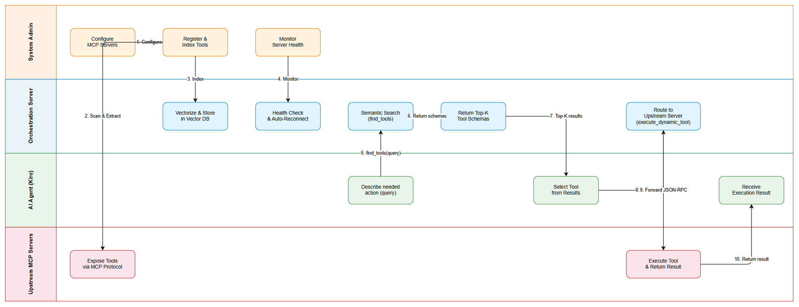
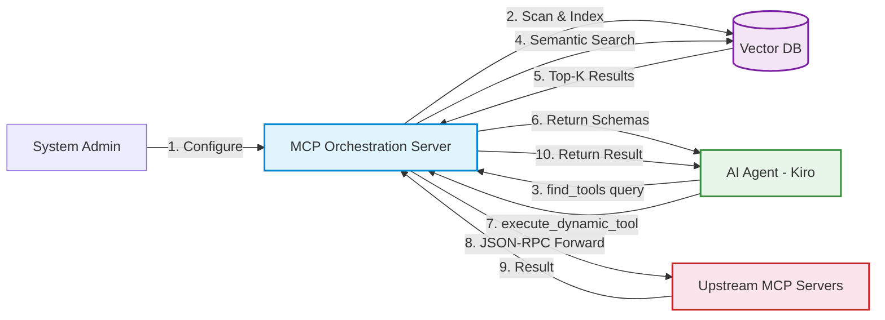
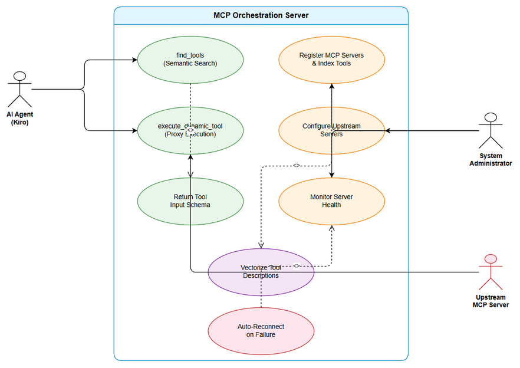
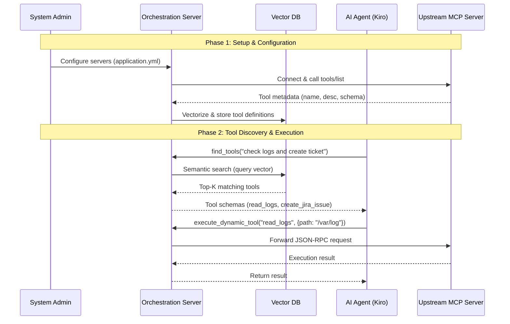

# Business Requirements Document (BRD)

## MCP Orchestration Server — MTO-5: Create MCP Tool Orchestration

---

## Document Information

| Field | Value |
|-------|-------|
| Jira Ticket | MTO-5 |
| Title | Create MCP Tool Orchestration |
| Author | BA Agent |
| Version | 3.0 |
| Date | 2026-05-01 |
| Status | Approved |

---

## Revision History

| Version | Date | Author | Changes |
|---------|------|--------|---------|
| 1.0 | 2026-05-01 | BA Agent | Initial BRD — auto-generated from Jira ticket |
| 2.0 | 2026-05-01 | BA Agent | Added Business Flow Diagram, Use Case Diagram, and inline Mermaid diagrams |
| 3.0 | 2026-05-07 | BA Agent | STORY-4: Added AC5 (--config CLI argument) and AC6 (mcpServers format specification) |

---

## 1. Executive Summary

### 1.1 Problem Statement

AI IDEs (như Kiro) hiện tại phải nạp toàn bộ tool definitions từ tất cả MCP Servers vào Context Window. Khi số lượng tools tăng (100+), Context Window bị overload, giảm chất lượng response và tăng chi phí token.

### 1.2 Proposed Solution

Xây dựng **MCP Orchestration Server** bằng Kotlin — một Proxy thông minh giữa AI IDE (Kiro) và các MCP Servers khác. Hệ thống chỉ expose **2 tools duy nhất** cho IDE:
- `find_tools` — Semantic search để tìm tools phù hợp
- `execute_dynamic_tool` — Proxy execution đến upstream MCP servers

### 1.3 Business Value

- Giảm Context Window usage từ N tools xuống còn 2 tools
- Tăng response quality nhờ focused context
- Giảm token cost
- Scalable: hỗ trợ 1000+ tools, 50+ servers

---

## 2. Scope

### 2.1 High Level Process Map

The following diagram illustrates the end-to-end business flow of the MCP Orchestration Server — from admin configuration through tool discovery and execution.

**Business Flow Steps:**

1. **System Admin** configures upstream MCP servers via `application.yml` or `config.json`
2. **Orchestration Server** scans configured servers, extracts tool metadata via `tools/list` MCP method
3. **Orchestration Server** vectorizes tool descriptions and stores them in Vector DB
4. **Health Monitor** periodically checks upstream server connectivity and auto-reconnects on failure
5. **AI Agent (Kiro)** sends a natural language query via `find_tools(query)`
6. **Orchestration Server** performs semantic search on Vector DB, returns Top-K matching tool schemas
7. **AI Agent** selects the appropriate tool from results
8. **AI Agent** calls `execute_dynamic_tool(tool_name, arguments)`
9. **Orchestration Server** routes the request to the correct upstream MCP server via JSON-RPC
10. **Upstream Server** executes the tool and returns the result back through the proxy to the AI Agent

### 2.2 Use Case Overview

The following Use Case diagram shows the primary actors and their interactions with the MCP Orchestration Server.

**Actors:**
- **AI Agent (Kiro):** Discovers and executes tools via the orchestration layer
- **System Administrator:** Configures servers, registers tools, monitors health
- **Upstream MCP Server:** Provides tool implementations via MCP protocol

**Use Cases:**
| # | Use Case | Primary Actor | Description |
|---|----------|---------------|-------------|
| UC-1 | find_tools (Semantic Search) | AI Agent | Search for tools by natural language query |
| UC-2 | execute_dynamic_tool (Proxy Execution) | AI Agent | Execute a discovered tool on upstream server |
| UC-3 | Register MCP Servers & Index Tools | System Admin | Add servers and auto-index their tools |
| UC-4 | Configure Upstream Servers | System Admin | Manage server connections via config files |
| UC-5 | Monitor Server Health | System Admin | Track server status and connectivity |
| UC-6 | Vectorize Tool Descriptions | System (internal) | Convert tool metadata to vectors for search |
| UC-7 | Return Tool Input Schema | System (internal) | Include JSON Schema in discovery results |
| UC-8 | Auto-Reconnect on Failure | System (internal) | Automatically restore lost connections |

---

### 2.3 In Scope

- MCP Orchestration Server (Kotlin/Ktor)
- Tool Discovery via Semantic Search (Vector DB)
- Tool Execution Proxy (JSON-RPC forwarding)
- Tool Registration & Indexing
- Server Configuration (application.yml/config.json)
- Health Monitoring & Auto-reconnect
- Support stdio + HTTP transport

### 2.4 Out of Scope

- AI model training/fine-tuning
- IDE plugin development
- MCP protocol specification changes
- Production deployment infrastructure

---

## 3. User Stories

### STORY-1: Tool Discovery (find_tools)

**As an** AI Agent (Kiro),
**I want to** search for relevant tools by describing what I need,
**So that** I can discover available tools without loading all tool definitions.

**Acceptance Criteria:**
- AC1: `find_tools(query: String)` performs semantic search on Vector DB
- AC2: Returns Top-K results (configurable, default 5)
- AC3: Each result includes `name`, `description`, `input_schema`
- AC4: Response time < 500ms (p95)
- AC5: Falls back to keyword search if Vector DB unavailable

### STORY-2: Tool Execution (execute_dynamic_tool)

**As an** AI Agent (Kiro),
**I want to** execute a discovered tool by name with arguments,
**So that** I can use any tool from any upstream MCP server transparently.

**Acceptance Criteria:**
- AC1: `execute_dynamic_tool(tool_name: String, arguments: Map)` routes to correct upstream server
- AC2: Proxy overhead < 100ms
- AC3: Proper error codes: TOOL_NOT_FOUND, SERVER_UNAVAILABLE, EXECUTION_TIMEOUT
- AC4: Supports both stdio and HTTP transport to upstream servers
- AC5: Returns upstream server response as-is (transparent proxy)

### STORY-3: Tool Registration & Indexing

**As a** System Administrator,
**I want to** register MCP servers and auto-index their tools,
**So that** tools are discoverable via semantic search.

**Acceptance Criteria:**
- AC1: Scan MCP servers and extract tool metadata automatically
- AC2: Vectorize tool descriptions using OpenAI/HuggingFace embeddings
- AC3: Store vectors in Vector DB (Qdrant/Milvus/FAISS)
- AC4: Support incremental updates (add/remove tools)
- AC5: Resilient to server failures during indexing

### STORY-4: Server Configuration

**As a** System Administrator,
**I want to** configure upstream MCP servers via config file,
**So that** I can manage server connections without code changes.

**Acceptance Criteria:**
- AC1: Configuration via `application.yml` or `config.json`
- AC2: Hot-reload configuration changes
- AC3: Support stdio and HTTP transport types
- AC4: Validate configuration on startup
- AC5: Support `--config <path>` CLI argument to load upstream servers from an external JSON file. The path can be absolute or relative to the working directory. If the file does not exist, the server logs a warning and continues with default/YAML config only.
- AC6: The external JSON config file uses the **MCP setting format** (`mcpServers` key), where each key is the server name and the value is the server configuration object (with `command`, `args`, `env`, `url` fields). This is the same format used by Kiro IDE's `mcp.json`.

### STORY-5: Health Monitoring

**As a** System Administrator,
**I want to** monitor upstream server health,
**So that** I can detect and recover from server failures.

**Acceptance Criteria:**
- AC1: Periodic health checks for all upstream servers
- AC2: Server states: CONNECTED, DISCONNECTED, ERROR, STARTING
- AC3: Auto-reconnect on disconnection
- AC4: Health status exposed via API endpoint

### STORY-6: Schema in Discovery Results

**As an** AI Agent,
**I want to** receive `input_schema` in find_tools results,
**So that** I know exactly how to call each discovered tool.

**Acceptance Criteria:**
- AC1: `input_schema` (JSON Schema) included in each find_tools result
- AC2: Schema is the original schema from upstream server (not modified)

### STORY-7: Auto Metadata Extraction

**As a** System,
**I want to** automatically extract tool metadata on server registration,
**So that** tools are immediately searchable after server connection.

**Acceptance Criteria:**
- AC1: On server connect, automatically call `tools/list` MCP method
- AC2: Extract name, description, inputSchema for each tool
- AC3: Index into Vector DB automatically
- AC4: Re-index on server reconnect (detect changes)

---

## 4. Technical Stack

| Component | Technology |
|-----------|-----------|
| Language | Kotlin 2.x |
| Framework | Ktor |
| Serialization | kotlinx.serialization |
| Vector DB | Qdrant / Milvus / FAISS (local) |
| Embeddings | OpenAI API / HuggingFace local |
| Protocol | MCP (Model Context Protocol) — JSON-RPC |
| Transport | stdio + HTTP |
| Build | Gradle (Kotlin DSL) |

---

## 5. Non-Functional Requirements

| Category | Requirement | Target |
|----------|------------|--------|
| Performance | find_tools response time | < 500ms (p95) |
| Performance | execute_dynamic_tool overhead | < 100ms |
| Scalability | Number of tools | 1000+ |
| Scalability | Number of upstream servers | 50+ |
| Reliability | Vector DB fallback | Keyword search if Vector DB down |
| Security | Secrets handling | No secrets in logs |
| Quality | Code standards | SOLID principles |
| Quality | Test coverage | > 80% |
| Availability | Server reconnection | Auto-reconnect with exponential backoff |

---

## 6. Dependencies

| Dependency | Type | Description |
|-----------|------|-------------|
| Vector DB (Qdrant/Milvus) | External Service | Tool vector storage |
| OpenAI API / HuggingFace | External Service | Embedding generation |
| Upstream MCP Servers | External Service | Tool providers |
| Kotlin 2.x | Technology | Language runtime |
| Ktor | Technology | HTTP framework |

---

## 7. Risks & Mitigations

| Risk | Impact | Probability | Mitigation |
|------|--------|-------------|------------|
| Vector DB unavailable | Tool discovery degraded | Medium | Fallback to keyword search |
| Upstream server timeout | Tool execution fails | Medium | Configurable timeouts + circuit breaker |
| Embedding API rate limit | Indexing delayed | Low | Batch processing + local model fallback |
| MCP protocol changes | Breaking changes | Low | Abstract protocol layer |

---

## 8. Success Metrics

| Metric | Target |
|--------|--------|
| Context Window reduction | From N tools to 2 tools |
| Tool discovery accuracy | > 90% relevant results in Top-5 |
| System uptime | > 99.5% |
| Average find_tools latency | < 200ms |
| Tool execution success rate | > 99% (when upstream available) |

---

## 9. Diagram Index

| # | Diagram | Image | Source (editable) |
|---|---------|-------|-------------------|
| 1 | Business Flow | [business-flow.png](diagrams/business-flow.png) | [business-flow.drawio](diagrams/business-flow.drawio) |
| 2 | Use Case Diagram | [use-case.png](diagrams/use-case.png) | [use-case.drawio](diagrams/use-case.drawio) |
