# Functional Specification Document (FSD)

## MCP Orchestration Server — MTO-5: Create MCP Tool Orchestration

---

## Document Information

| Field | Value |
|-------|-------|
| Jira Ticket | MTO-5 |
| Title | Create MCP Tool Orchestration |
| Author | BA Agent |
| Version | 1.0 |
| Date | 2026-05-01 |
| Status | Draft |
| Related BRD | BRD-v2-MTO-5.docx |
| Related SRS | requirement/mcp_orchestration.md |

---

## Revision History

| Version | Date | Author | Changes |
|---------|------|--------|---------|
| 1.0 | 2026-05-01 | BA Agent | Initial document — auto-generated from BRD and Jira ticket MTO-5 |

---

## 1. Introduction

### 1.1 Purpose

This FSD specifies the functional and technical design of the **MCP Orchestration Server** — a Kotlin/Ktor application that acts as an intelligent proxy between the Kiro AI IDE and multiple upstream MCP (Model Context Protocol) Servers. The server exposes exactly **two MCP tools** (`find_tools` and `execute_dynamic_tool`) to minimize AI context window consumption while providing access to an unlimited number of upstream tools via semantic search and dynamic proxying.

### 1.2 Scope

**In Scope:**
- MCP-compliant server exposing `find_tools` and `execute_dynamic_tool` tools
- Semantic search over tool definitions using a Vector Database (Qdrant, Milvus, or local FAISS)
- Dynamic proxy execution to upstream MCP Servers via JSON-RPC
- Tool registration, indexing, and metadata extraction from upstream servers
- Server health monitoring with auto-reconnect
- Configuration via `application.yml` / `config.json` with hot-reload support
- Support for stdio and HTTP transports

**Out of Scope:**
- UI/Dashboard for tool management (future phase)
- Authentication/authorization between Kiro IDE and Orchestrator (relies on local transport security)
- Custom tool creation within the Orchestrator itself

### 1.3 Definitions & Acronyms

| Term | Definition |
|------|------------|
| MCP | Model Context Protocol — open standard for AI tool communication |
| Orchestrator | The MCP Orchestration Server being specified in this document |
| Upstream Server | An external MCP Server that hosts actual tools (e.g., Jira MCP, Git MCP) |
| Tool Definition | Metadata describing a tool: name, description, input_schema |
| Vector DB | Vector Database used for semantic similarity search (Qdrant, Milvus, FAISS) |
| Embedding | Dense vector representation of text, used for semantic search |
| Top-K | The K most similar results returned from a vector search |
| JSON-RPC | JSON Remote Procedure Call — the wire protocol used by MCP |
| Context Window | The limited token budget available to an AI model per request |
| Kiro IDE | The AI-powered IDE that consumes MCP tools |
| Hot-Reload | Ability to update configuration without restarting the server |

### 1.4 References

| Document | Location |
|----------|----------|
| BRD | BRD-v2-MTO-5.docx |
| SRS | requirement/mcp_orchestration.md |
| MCP Specification | https://modelcontextprotocol.io/specification |
| Ktor Documentation | https://ktor.io/docs/ |

---

## 2. System Overview

### 2.1 System Context Diagram

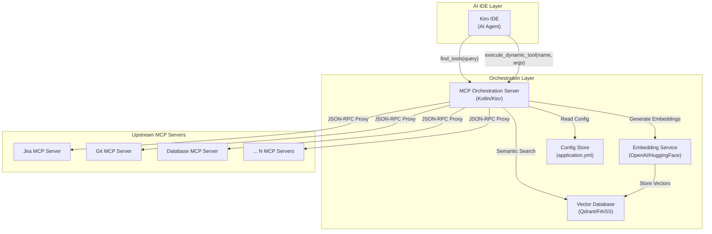

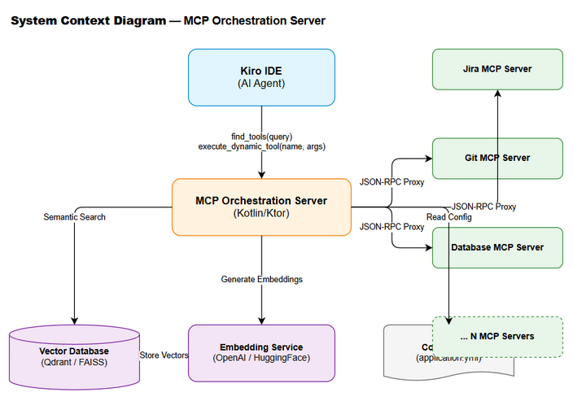

The MCP Orchestration Server sits between the Kiro AI IDE and multiple upstream MCP Servers. Kiro only sees two tools (`find_tools`, `execute_dynamic_tool`), while the Orchestrator manages discovery and routing to potentially hundreds of tools across dozens of upstream servers.

### 2.2 System Architecture

The system follows a **layered architecture** with clear separation of concerns:

```
┌─────────────────────────────────────────────────┐
│                 Transport Layer                  │
│         (stdio / HTTP / SSE adapters)            │
├─────────────────────────────────────────────────┤
│                MCP Protocol Layer                │
│    (JSON-RPC handler, tool registration)         │
├─────────────────────────────────────────────────┤
│              Orchestration Layer                 │
│  ┌──────────────┐  ┌──────────────────────────┐ │
│  │ ToolDiscovery │  │ ToolExecutionDispatcher  │ │
│  │   Service     │  │                          │ │
│  └──────┬───────┘  └──────────┬───────────────┘ │
│         │                     │                  │
├─────────┼─────────────────────┼──────────────────┤
│         │    Infrastructure Layer                │
│  ┌──────▼───────┐  ┌─────────▼────────────────┐ │
│  │  VectorDB     │  │ UpstreamServerManager    │ │
│  │  Client       │  │ (connection pool, health)│ │
│  └──────┬───────┘  └──────────┬───────────────┘ │
│         │                     │                  │
│  ┌──────▼───────┐  ┌─────────▼────────────────┐ │
│  │  Embedding    │  │ ConfigurationManager     │ │
│  │  Service      │  │ (hot-reload, validation) │ │
│  └──────────────┘  └─────────────────────────┘  │
└─────────────────────────────────────────────────┘
```

**Key Components:**

| Component | Responsibility |
|-----------|---------------|
| Transport Layer | Handles stdio and HTTP communication with Kiro IDE |
| MCP Protocol Layer | Parses JSON-RPC messages, registers the 2 exposed tools |
| ToolDiscoveryService | Converts queries to embeddings, searches Vector DB, returns Top-K tools |
| ToolExecutionDispatcher | Routes `execute_dynamic_tool` calls to the correct upstream server |
| VectorDB Client | Abstraction over Qdrant/Milvus/FAISS for vector storage and search |
| Embedding Service | Generates vector embeddings via OpenAI API or local HuggingFace model |
| UpstreamServerManager | Manages connections, health checks, and reconnection to upstream MCP servers |
| ConfigurationManager | Loads, validates, and hot-reloads configuration from YAML/JSON files |


---

## 3. Functional Requirements

### 3.1 Feature: Tool Discovery (`find_tools`)

**Source:** BRD User Story #1 — Tool Discovery, SRS Section 3.A

#### 3.1.1 Description

The `find_tools` tool accepts a natural-language query describing what the AI agent wants to accomplish. It converts the query into a vector embedding, performs a semantic similarity search against the Vector Database containing all indexed tool definitions, and returns the Top-K most relevant tool definitions including their full `input_schema`. This enables the AI to dynamically discover tools without having all tool schemas loaded in its context window.

#### 3.1.2 Use Case

**Use Case ID:** UC-01
**Actor:** Kiro AI Agent
**Preconditions:**
- MCP Orchestration Server is running and connected to Kiro IDE
- Vector Database is populated with at least one tool definition
- Embedding service is available

**Postconditions:**
- AI Agent receives a list of 0 to K tool definitions matching the query
- No state change on the server (read-only operation)

**Main Flow:**

| Step | Actor | System | Description |
|------|-------|--------|-------------|
| 1 | Kiro AI Agent | | Sends `find_tools` request with `query` parameter (e.g., "check logs and create Jira ticket") |
| 2 | | Orchestrator | Validates the `query` parameter is non-empty and within max length (2000 chars) |
| 3 | | Embedding Service | Converts the query string into a vector embedding |
| 4 | | Vector DB | Performs approximate nearest neighbor (ANN) search with the query vector |
| 5 | | Orchestrator | Filters results by minimum similarity threshold (configurable, default 0.7) |
| 6 | | Orchestrator | Limits results to Top-K (configurable, default 5) |
| 7 | | Orchestrator | Assembles response with `name`, `description`, `input_schema`, `server_name`, and `similarity_score` for each match |
| 8 | | Kiro AI Agent | Returns JSON array of tool definitions |

**Alternative Flows:**

| ID | Condition | Steps |
|----|-----------|-------|
| AF-01 | No tools match above similarity threshold | Return empty array `[]` with a message: "No tools found matching the query. Try rephrasing." |
| AF-02 | Vector DB is unavailable | Fall back to keyword-based search over cached tool definitions in memory. Log warning. |
| AF-03 | Embedding service is unavailable | Fall back to keyword-based search. Log warning. Return results with `search_mode: "keyword"` flag. |
| AF-04 | Query matches tools from offline upstream servers | Include tools in results but add `server_status: "DISCONNECTED"` flag per tool |

**Exception Flows:**

| ID | Condition | Steps |
|----|-----------|-------|
| EF-01 | Query parameter is empty or null | Return MCP error: `INVALID_PARAMS` with message "Query parameter is required and must be non-empty" |
| EF-02 | Query exceeds max length (2000 chars) | Return MCP error: `INVALID_PARAMS` with message "Query exceeds maximum length of 2000 characters" |
| EF-03 | Internal server error during search | Return MCP error: `INTERNAL_ERROR` with message "Tool discovery failed. Please retry." Log full stack trace. |

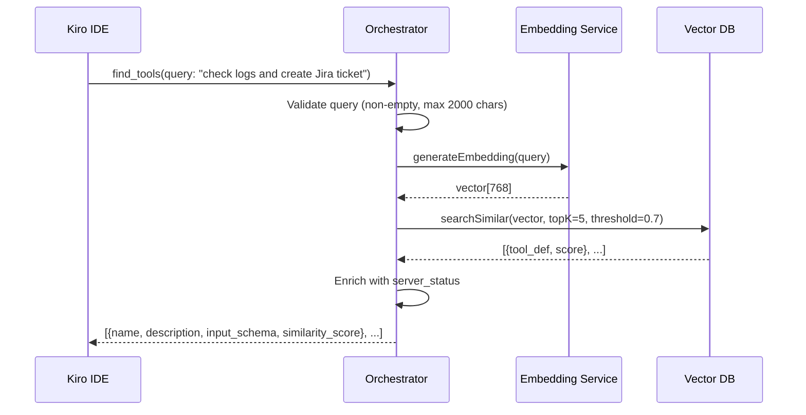

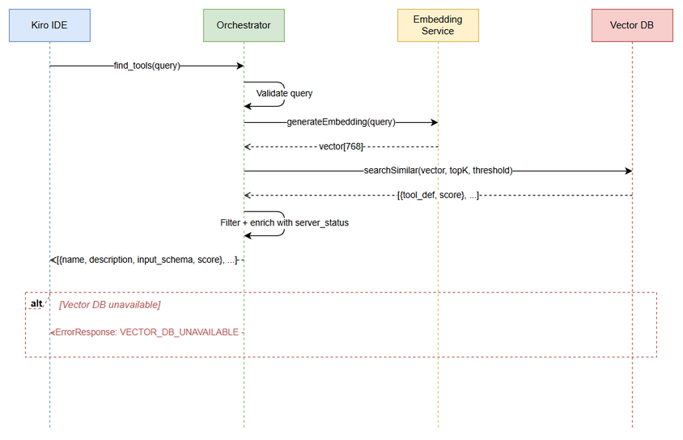

#### 3.1.3 Business Rules

| Rule ID | Rule | Source |
|---------|------|--------|
| BR-01 | `find_tools` must return results within 500ms at p95 latency | BRD NFR, SRS §1 |
| BR-02 | Top-K value must be configurable (default: 5, range: 1–20) | BRD Story #1 |
| BR-03 | Similarity threshold must be configurable (default: 0.7, range: 0.0–1.0) | BRD Story #1 |
| BR-04 | Each result must include `name`, `description`, and `input_schema` | SRS §3.A |
| BR-05 | If Vector DB is down, system must fall back to keyword search | BRD NFR — Reliability |
| BR-06 | Results must be sorted by similarity score descending | Derived from semantic search behavior |
| BR-07 | Tool definitions from DISCONNECTED servers should still be returned but flagged | BRD Story #5 |

#### 3.1.4 Data Specifications

**Input Data:**

| Field | Type | Required | Validation | Description |
|-------|------|----------|------------|-------------|
| query | String | Y | Non-empty, max 2000 chars, trimmed | Natural language description of desired action |

**Output Data:**

| Field | Type | Description |
|-------|------|-------------|
| tools | Array\<ToolDefinition\> | List of matching tool definitions |
| tools[].name | String | Unique tool name (e.g., `read_logs`) |
| tools[].description | String | Human-readable description of the tool |
| tools[].input_schema | Object (JSON Schema) | Full JSON Schema defining the tool's input parameters |
| tools[].server_name | String | Name of the upstream MCP server hosting this tool |
| tools[].server_status | String | Current status: `CONNECTED`, `DISCONNECTED`, `ERROR` |
| tools[].similarity_score | Float | Cosine similarity score (0.0–1.0) |
| search_mode | String | `"semantic"` or `"keyword"` (indicates fallback) |
| total_indexed | Integer | Total number of tools in the index |

#### 3.1.5 API Specifications

**MCP Tool Definition:**

```json
{
  "name": "find_tools",
  "description": "Search for available MCP tools by describing what you want to accomplish. Returns tool definitions with input schemas so you can call them via execute_dynamic_tool.",
  "inputSchema": {
    "type": "object",
    "properties": {
      "query": {
        "type": "string",
        "description": "Natural language description of the action you want to perform",
        "maxLength": 2000
      },
      "top_k": {
        "type": "integer",
        "description": "Maximum number of results to return (default: 5)",
        "default": 5,
        "minimum": 1,
        "maximum": 20
      },
      "threshold": {
        "type": "number",
        "description": "Minimum similarity score threshold (default: 0.7)",
        "default": 0.7,
        "minimum": 0.0,
        "maximum": 1.0
      }
    },
    "required": ["query"]
  }
}
```

**Success Response Example:**

```json
{
  "content": [
    {
      "type": "text",
      "text": "{\"tools\":[{\"name\":\"read_logs\",\"description\":\"Read application log files\",\"input_schema\":{\"type\":\"object\",\"properties\":{\"path\":{\"type\":\"string\"},\"lines\":{\"type\":\"integer\",\"default\":100}}},\"server_name\":\"log-server\",\"server_status\":\"CONNECTED\",\"similarity_score\":0.92},{\"name\":\"create_jira_issue\",\"description\":\"Create a new Jira issue\",\"input_schema\":{\"type\":\"object\",\"properties\":{\"project_key\":{\"type\":\"string\"},\"summary\":{\"type\":\"string\"},\"issue_type\":{\"type\":\"string\"}}},\"server_name\":\"jira-server\",\"server_status\":\"CONNECTED\",\"similarity_score\":0.87}],\"search_mode\":\"semantic\",\"total_indexed\":150}"
    }
  ]
}
```

**Error Codes:**

| Code | Message | Description |
|------|---------|-------------|
| INVALID_PARAMS | Query parameter is required and must be non-empty | Empty or null query |
| INVALID_PARAMS | Query exceeds maximum length of 2000 characters | Query too long |
| INTERNAL_ERROR | Tool discovery failed. Please retry. | Unrecoverable internal error |


---

### 3.2 Feature: Dynamic Tool Execution (`execute_dynamic_tool`)

**Source:** BRD User Story #2 — Tool Execution, SRS Section 3.B

#### 3.2.1 Description

The `execute_dynamic_tool` tool accepts a tool name and arguments, resolves which upstream MCP Server hosts that tool, proxies the execution request via JSON-RPC, and returns the result. This enables the AI agent to execute any discovered tool without needing a direct connection to the upstream server.

#### 3.2.2 Use Case

**Use Case ID:** UC-02
**Actor:** Kiro AI Agent
**Preconditions:**
- Tool name exists in the tool registry
- The upstream MCP Server hosting the tool is in `CONNECTED` state
- Arguments conform to the tool's `input_schema`

**Postconditions:**
- Tool execution result is returned to the AI Agent
- Execution metrics are logged (duration, success/failure, server)

**Main Flow:**

| Step | Actor | System | Description |
|------|-------|--------|-------------|
| 1 | Kiro AI Agent | | Sends `execute_dynamic_tool` with `tool_name` and `arguments` |
| 2 | | Orchestrator | Validates `tool_name` is non-empty |
| 3 | | ToolRegistry | Looks up the tool definition and its hosting upstream server |
| 4 | | Orchestrator | Validates `arguments` against the tool's `input_schema` (optional, configurable) |
| 5 | | UpstreamServerManager | Retrieves the active connection to the target upstream server |
| 6 | | Orchestrator | Constructs JSON-RPC `tools/call` request with tool_name and arguments |
| 7 | | Upstream MCP Server | Forwards the request to the upstream server |
| 8 | | Upstream MCP Server | Executes the tool and returns the result |
| 9 | | Orchestrator | Receives the response, logs execution metrics |
| 10 | | Kiro AI Agent | Returns the tool execution result (pass-through) |

**Alternative Flows:**

| ID | Condition | Steps |
|----|-----------|-------|
| AF-05 | Upstream server responds slowly (approaching timeout) | Log warning. Continue waiting until configurable timeout (default: 30s). |
| AF-06 | Tool exists on multiple upstream servers | Use the first registered server. Log info about alternatives. |
| AF-07 | Arguments validation is disabled in config | Skip step 4, pass arguments as-is to upstream server. |

**Exception Flows:**

| ID | Condition | Steps |
|----|-----------|-------|
| EF-04 | `tool_name` not found in registry | Return MCP error with code `TOOL_NOT_FOUND`: "Tool '{tool_name}' is not registered. Use find_tools to discover available tools." |
| EF-05 | Upstream server is DISCONNECTED | Return MCP error with code `SERVER_UNAVAILABLE`: "Server hosting '{tool_name}' is currently unavailable. Status: DISCONNECTED." |
| EF-06 | Upstream server execution timeout (>30s default) | Return MCP error with code `EXECUTION_TIMEOUT`: "Tool execution timed out after {timeout}s." |
| EF-07 | Upstream server returns an error | Pass through the upstream error to the AI Agent with additional context: `upstream_server`, `upstream_error_code`. |
| EF-08 | Arguments fail schema validation | Return MCP error with code `INVALID_PARAMS`: "Argument validation failed: {details}" |

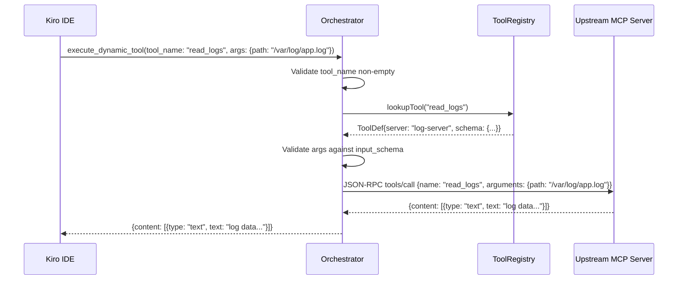

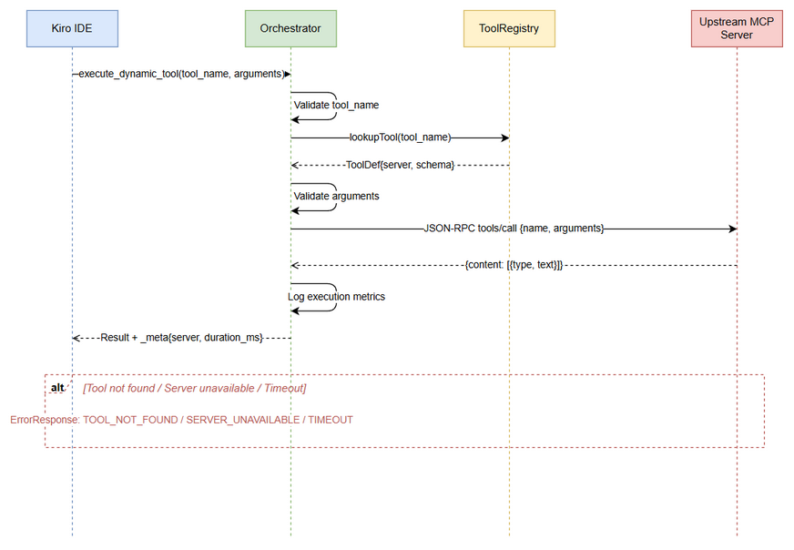

#### 3.2.3 Business Rules

| Rule ID | Rule | Source |
|---------|------|--------|
| BR-08 | Proxy overhead must be <100ms (excluding upstream execution time) | BRD NFR |
| BR-09 | Execution timeout is configurable (default: 30s, range: 5s–300s) | Derived from reliability requirements |
| BR-10 | Tool name lookup must be case-sensitive and exact match | Derived from MCP protocol |
| BR-11 | Upstream errors must be passed through transparently with added context | BRD Story #2 |
| BR-12 | All executions must be logged with: tool_name, server, duration_ms, success/failure | BRD NFR — Observability |
| BR-13 | Schema validation of arguments is optional and configurable (default: enabled) | Derived from flexibility requirement |

#### 3.2.4 Data Specifications

**Input Data:**

| Field | Type | Required | Validation | Description |
|-------|------|----------|------------|-------------|
| tool_name | String | Y | Non-empty, must exist in registry | Name of the tool to execute |
| arguments | Object | N | Must conform to tool's input_schema (if validation enabled) | Arguments to pass to the tool |

**Output Data:**

| Field | Type | Description |
|-------|------|-------------|
| content | Array\<Content\> | MCP content array — pass-through from upstream server |
| content[].type | String | Content type: `"text"`, `"image"`, `"resource"` |
| content[].text | String | Text content (for type `"text"`) |
| _meta.upstream_server | String | Name of the server that executed the tool |
| _meta.execution_time_ms | Integer | Total execution time in milliseconds |

#### 3.2.5 API Specifications

**MCP Tool Definition:**

```json
{
  "name": "execute_dynamic_tool",
  "description": "Execute a tool on an upstream MCP server. Use find_tools first to discover available tools and their input schemas.",
  "inputSchema": {
    "type": "object",
    "properties": {
      "tool_name": {
        "type": "string",
        "description": "The exact name of the tool to execute (as returned by find_tools)"
      },
      "arguments": {
        "type": "object",
        "description": "Arguments to pass to the tool, conforming to its input_schema",
        "additionalProperties": true
      }
    },
    "required": ["tool_name"]
  }
}
```

**Error Codes:**

| Code | Message | Description |
|------|---------|-------------|
| TOOL_NOT_FOUND | Tool '{name}' is not registered | Tool name not in registry |
| SERVER_UNAVAILABLE | Server hosting '{name}' is currently unavailable | Upstream server disconnected |
| EXECUTION_TIMEOUT | Tool execution timed out after {N}s | Upstream did not respond in time |
| INVALID_PARAMS | Argument validation failed: {details} | Arguments don't match input_schema |
| UPSTREAM_ERROR | Upstream error: {message} | Error from the upstream MCP server |


---

### 3.3 Feature: Tool Registration & Indexing

**Source:** BRD User Story #3 — Tool Registration & Indexing, SRS Section 4.1

#### 3.3.1 Description

The system must be able to scan upstream MCP Servers, extract tool metadata (name, description, input_schema), generate vector embeddings for each tool description, and store them in the Vector Database. This process runs at startup and can be triggered on-demand or on configuration change.

#### 3.3.2 Use Case

**Use Case ID:** UC-03
**Actor:** System (automatic), Administrator (manual trigger)
**Preconditions:**
- At least one upstream MCP Server is configured
- Embedding service is available
- Vector DB is accessible

**Postconditions:**
- All tools from reachable upstream servers are indexed in Vector DB
- Tool-to-server mapping is stored in the ToolRegistry

**Main Flow:**

| Step | Actor | System | Description |
|------|-------|--------|-------------|
| 1 | System | | Startup trigger or config change detected |
| 2 | | ConfigManager | Load list of upstream MCP servers from configuration |
| 3 | | UpstreamServerManager | Establish connections to each configured server (parallel via coroutines) |
| 4 | | Orchestrator | For each connected server: send `tools/list` JSON-RPC request |
| 5 | | Upstream Server | Returns list of tool definitions |
| 6 | | EmbeddingService | Generate embedding vector for each tool's `description` field |
| 7 | | VectorDB | Upsert tool vectors with metadata (name, description, input_schema, server_name) |
| 8 | | ToolRegistry | Update in-memory tool-to-server mapping |
| 9 | | System | Log summary: "{N} tools indexed from {M} servers" |

**Alternative Flows:**

| ID | Condition | Steps |
|----|-----------|-------|
| AF-08 | An upstream server is unreachable during scan | Skip that server, log warning, continue with remaining servers. Mark server as DISCONNECTED. |
| AF-09 | Embedding service is unavailable during indexing | Use keyword-based indexing (store raw text, no vectors). Log warning. |
| AF-10 | Incremental update — server already indexed | Compare tool lists. Add new tools, remove deleted tools, update changed tools. |

**Exception Flows:**

| ID | Condition | Steps |
|----|-----------|-------|
| EF-09 | Vector DB is completely unavailable | Fall back to in-memory keyword index. Log error. System operates in degraded mode. |
| EF-10 | All upstream servers are unreachable | Log critical error. System starts with empty tool registry. Retry on next health check cycle. |

#### 3.3.3 Business Rules

| Rule ID | Rule | Source |
|---------|------|--------|
| BR-14 | Tool indexing must support incremental updates (add/remove/update) | BRD Story #3 |
| BR-15 | Indexing must be resilient — failure of one server must not block others | BRD Acceptance Criteria |
| BR-16 | Each tool must be uniquely identified by `server_name + tool_name` composite key | Derived from multi-server architecture |
| BR-17 | Tool descriptions must be embedded using the same model used for query embedding | Consistency requirement |
| BR-18 | Indexing must run at server startup and on configuration change | BRD Story #7 |

---

### 3.4 Feature: Server Configuration Management

**Source:** BRD User Story #4 — Server Configuration, SRS Section 4.3

#### 3.4.1 Description

The system reads upstream MCP Server configurations from `application.yml` or `config.json`. Configuration includes server names, transport types (stdio/HTTP), connection parameters, and orchestrator settings (Top-K, thresholds, timeouts). The system supports hot-reload — configuration changes are detected and applied without server restart.

#### 3.4.2 Use Case

**Use Case ID:** UC-04
**Actor:** Administrator / DevOps
**Preconditions:**
- Configuration file exists and is valid YAML/JSON

**Postconditions:**
- Server operates with the updated configuration
- New upstream servers are connected; removed servers are disconnected

**Main Flow:**

| Step | Actor | System | Description |
|------|-------|--------|-------------|
| 1 | Admin | | Modifies `application.yml` or `config.json` |
| 2 | | ConfigManager | Detects file change via file watcher (or periodic poll) |
| 3 | | ConfigManager | Parses and validates the new configuration |
| 4 | | ConfigManager | Computes diff: added servers, removed servers, changed settings |
| 5 | | UpstreamServerManager | Connects to newly added servers |
| 6 | | UpstreamServerManager | Disconnects from removed servers |
| 7 | | ToolRegistry | Re-indexes tools for changed servers |
| 8 | | System | Applies new settings (Top-K, thresholds, timeouts) |
| 9 | | System | Logs: "Configuration reloaded. Added: {N}, Removed: {M}, Updated: {P}" |

**Exception Flows:**

| ID | Condition | Steps |
|----|-----------|-------|
| EF-11 | New configuration is invalid (parse error) | Reject the change, keep current config. Log error with validation details. |
| EF-12 | New server in config is unreachable | Mark as DISCONNECTED, continue with other changes. Schedule retry. |

#### 3.4.3 Business Rules

| Rule ID | Rule | Source |
|---------|------|--------|
| BR-19 | Configuration must support both YAML and JSON formats | BRD Story #4 |
| BR-20 | Hot-reload must not cause downtime or dropped requests | BRD Acceptance Criteria |
| BR-21 | Invalid configuration must be rejected — system keeps previous valid config | Derived from reliability |
| BR-22 | Both stdio and HTTP transports must be supported for upstream connections | SRS §2 |

#### 3.4.4 Configuration Schema

```yaml
# application.yml
orchestrator:
  server:
    port: 8080
    transport: stdio  # stdio | http
  
  discovery:
    top_k: 5
    similarity_threshold: 0.7
    max_query_length: 2000
    fallback_to_keyword: true
  
  execution:
    timeout_seconds: 30
    validate_arguments: true
    max_retries: 1
  
  embedding:
    provider: openai  # openai | huggingface
    model: text-embedding-3-small
    api_key: ${OPENAI_API_KEY}  # environment variable reference
    dimensions: 768
  
  vector_db:
    provider: qdrant  # qdrant | milvus | faiss
    host: localhost
    port: 6333
    collection_name: mcp_tools
  
  health:
    check_interval_seconds: 30
    auto_reconnect: true
    max_reconnect_attempts: 5
  
  upstream_servers:
    - name: jira-server
      transport: stdio
      command: npx
      args: ["-y", "@modelcontextprotocol/server-jira"]
      env:
        JIRA_URL: "https://mycompany.atlassian.net"
        JIRA_TOKEN: ${JIRA_TOKEN}
    
    - name: git-server
      transport: http
      url: "http://localhost:3001/mcp"
    
    - name: database-server
      transport: stdio
      command: python
      args: ["-m", "mcp_server_database"]
```

---

### 3.5 Feature: Health Monitoring & Auto-Reconnect

**Source:** BRD User Story #5 — Health Monitoring, SRS Section 4.2

#### 3.5.1 Description

The system periodically checks the health of all upstream MCP Servers. Each server has a state machine with states: `STARTING`, `CONNECTED`, `DISCONNECTED`, `ERROR`. When a server becomes disconnected, the system automatically attempts to reconnect with exponential backoff.

#### 3.5.2 Use Case

**Use Case ID:** UC-05
**Actor:** System (automatic)
**Preconditions:**
- At least one upstream server is configured
- Health check interval is configured (default: 30s)

**Postconditions:**
- Server states are up-to-date
- Disconnected servers are reconnected when possible
- Tool registry is updated to reflect server availability

**Main Flow:**

| Step | Actor | System | Description |
|------|-------|--------|-------------|
| 1 | | HealthMonitor | Timer fires at configured interval (default: 30s) |
| 2 | | HealthMonitor | For each upstream server: send `ping` or `tools/list` request |
| 3 | | Upstream Server | Responds (or times out) |
| 4 | | HealthMonitor | Update server state based on response |
| 5 | | HealthMonitor | If state changed: log state transition, update ToolRegistry |
| 6 | | HealthMonitor | If DISCONNECTED and auto_reconnect enabled: schedule reconnect |

**State Machine:**

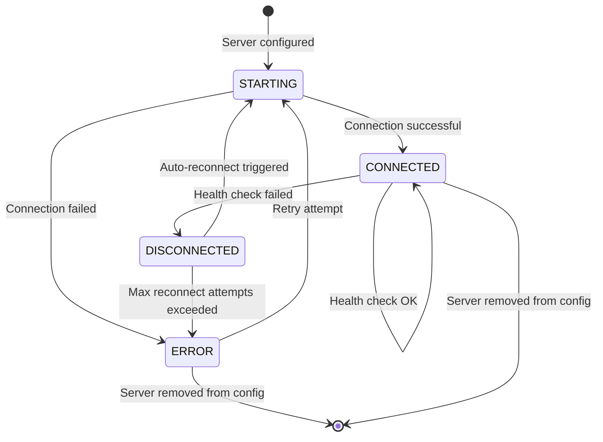

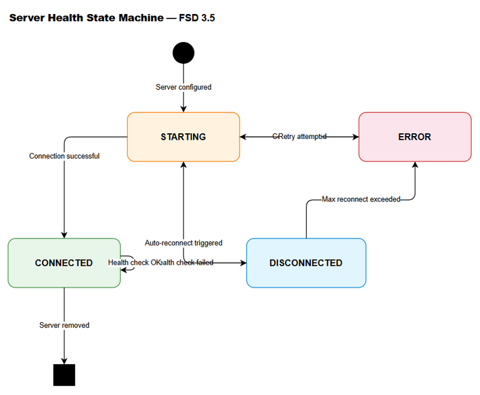

#### 3.5.3 Business Rules

| Rule ID | Rule | Source |
|---------|------|--------|
| BR-23 | Health check interval must be configurable (default: 30s) | BRD Story #5 |
| BR-24 | Auto-reconnect must use exponential backoff (1s, 2s, 4s, 8s, ...) | Derived from reliability |
| BR-25 | Max reconnect attempts must be configurable (default: 5) | BRD Acceptance Criteria |
| BR-26 | Server state transitions must be logged | BRD NFR — Observability |
| BR-27 | Tools from DISCONNECTED servers remain in search results but flagged | BR-07 |


---

## 4. Data Model

### 4.1 Entity Relationship Diagram

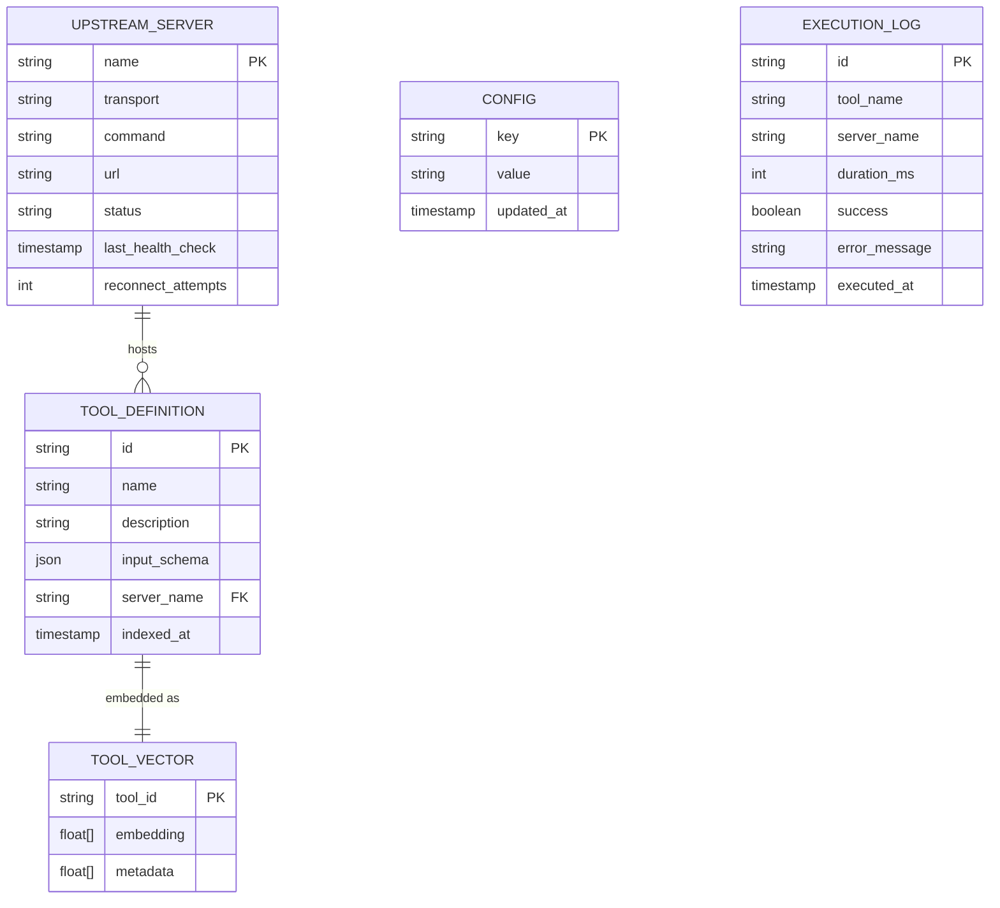

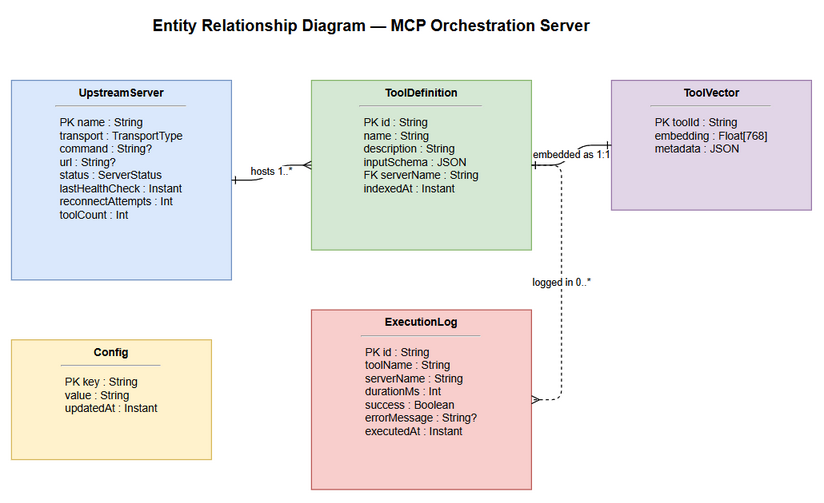

### 4.2 Data Structures

> **Note:** This system uses a Vector Database (not a traditional RDBMS). The following describes the logical data structures stored in Vector DB collections and in-memory registries.

#### Collection: `mcp_tools` (Vector DB)

| Field | Type | Indexed | Description |
|-------|------|---------|-------------|
| id | String (UUID) | Y (primary) | Unique identifier: `{server_name}::{tool_name}` |
| name | String | Y (payload) | Tool name as registered in MCP |
| description | String | N (payload) | Human-readable tool description |
| input_schema | JSON | N (payload) | Full JSON Schema for tool input |
| server_name | String | Y (payload filter) | Name of the hosting upstream server |
| embedding | Float[768] | Y (vector) | Embedding vector of the description |
| indexed_at | Timestamp | N (payload) | When this tool was last indexed |

**Vector Index Configuration:**

| Parameter | Value |
|-----------|-------|
| Distance Metric | Cosine Similarity |
| Vector Dimensions | 768 (configurable per embedding model) |
| Index Type | HNSW (Hierarchical Navigable Small World) |
| ef_construct | 128 |
| M | 16 |

#### In-Memory: `ToolRegistry`

| Field | Type | Description |
|-------|------|-------------|
| toolMap | Map\<String, ToolEntry\> | Key: tool_name, Value: ToolEntry |
| serverToolMap | Map\<String, List\<String\>\> | Key: server_name, Value: list of tool_names |

#### In-Memory: `ToolEntry`

| Field | Type | Description |
|-------|------|-------------|
| name | String | Tool name |
| description | String | Tool description |
| inputSchema | JsonObject | JSON Schema for input |
| serverName | String | Hosting server name |
| serverStatus | ServerStatus | Current server status enum |

#### In-Memory: `UpstreamServerState`

| Field | Type | Description |
|-------|------|-------------|
| name | String | Server name (from config) |
| transport | TransportType | STDIO or HTTP |
| status | ServerStatus | STARTING, CONNECTED, DISCONNECTED, ERROR |
| connection | McpConnection? | Active MCP connection (nullable) |
| lastHealthCheck | Instant | Timestamp of last health check |
| reconnectAttempts | Int | Current reconnect attempt count |
| toolCount | Int | Number of tools hosted by this server |

#### Enum: `ServerStatus`

| Value | Description |
|-------|-------------|
| STARTING | Initial connection in progress |
| CONNECTED | Active and healthy |
| DISCONNECTED | Health check failed, may auto-reconnect |
| ERROR | Failed after max reconnect attempts |

#### Enum: `TransportType`

| Value | Description |
|-------|-------------|
| STDIO | Standard I/O transport (subprocess) |
| HTTP | HTTP/SSE transport |

---

## 5. Integration Specifications

### 5.1 External System: Upstream MCP Servers

| Attribute | Value |
|-----------|-------|
| Protocol | MCP (Model Context Protocol) over JSON-RPC 2.0 |
| Transport | stdio (subprocess) or HTTP (SSE) |
| Authentication | Per-server via environment variables (API keys, tokens) |
| Data Format | JSON |

**Supported MCP Methods (Outbound):**

| Method | Purpose | When Used |
|--------|---------|-----------|
| `initialize` | Establish MCP session with upstream server | On connection |
| `tools/list` | Retrieve all tool definitions from upstream | During indexing and health checks |
| `tools/call` | Execute a specific tool | During `execute_dynamic_tool` |
| `ping` | Health check | During periodic health monitoring |

**Data Mapping — Tool Discovery:**

| Source (Upstream `tools/list`) | Target (Vector DB) | Transformation |
|-------------------------------|-------------------|----------------|
| tool.name | name | Direct copy |
| tool.description | description | Direct copy |
| tool.description | embedding | Vectorize via Embedding Service |
| tool.inputSchema | input_schema | Direct copy (JSON) |
| (connection context) | server_name | From config |

### 5.2 External System: Embedding Service

| Attribute | Value |
|-----------|-------|
| Protocol | REST API (HTTPS) |
| Endpoint | `https://api.openai.com/v1/embeddings` (OpenAI) or local HTTP endpoint (HuggingFace) |
| Authentication | API Key via `Authorization: Bearer {key}` header |
| Data Format | JSON |

**Request:**

```json
{
  "model": "text-embedding-3-small",
  "input": "Read application log files and return recent entries"
}
```

**Response:**

```json
{
  "data": [
    {
      "embedding": [0.0023, -0.0091, ...],
      "index": 0
    }
  ],
  "usage": {
    "prompt_tokens": 12,
    "total_tokens": 12
  }
}
```

### 5.3 External System: Vector Database (Qdrant)

| Attribute | Value |
|-----------|-------|
| Protocol | gRPC or REST API |
| Endpoint | `http://localhost:6333` (default) |
| Authentication | API Key (optional) |
| Data Format | JSON |

**Key Operations:**

| Operation | Qdrant API | Description |
|-----------|-----------|-------------|
| Create Collection | `PUT /collections/{name}` | Initialize tool vector collection |
| Upsert Points | `PUT /collections/{name}/points` | Add/update tool vectors |
| Search | `POST /collections/{name}/points/search` | Semantic similarity search |
| Delete Points | `POST /collections/{name}/points/delete` | Remove tools from index |

### 5.4 External System: Kiro AI IDE

| Attribute | Value |
|-----------|-------|
| Protocol | MCP (Model Context Protocol) over JSON-RPC 2.0 |
| Transport | stdio (primary) or HTTP |
| Direction | Inbound — Kiro calls the Orchestrator |
| Data Format | JSON |

**Exposed MCP Tools (Inbound):**

| Tool | Description |
|------|-------------|
| `find_tools` | Semantic search for tools (UC-01) |
| `execute_dynamic_tool` | Proxy execution to upstream servers (UC-02) |


---

## 6. Processing Logic

### 6.1 Server Startup Process

**Trigger:** Application launch
**Schedule:** One-time at startup
**Input:** Configuration file (application.yml / config.json)
**Output:** Fully initialized Orchestrator with indexed tools

**Processing Steps:**

| Step | Description | Error Handling |
|------|-------------|----------------|
| 1 | Load and validate configuration file | Exit with error if config is invalid |
| 2 | Initialize Vector DB connection | Fall back to in-memory keyword index |
| 3 | Initialize Embedding Service connection | Fall back to keyword-based indexing |
| 4 | Connect to each upstream MCP server (parallel coroutines) | Mark failed servers as ERROR, continue with others |
| 5 | For each connected server: fetch `tools/list` | Skip server, mark as ERROR |
| 6 | Generate embeddings for all tool descriptions (batch) | Use keyword index for failed embeddings |
| 7 | Upsert all tool vectors into Vector DB | Fall back to in-memory index |
| 8 | Build in-memory ToolRegistry | Critical — must succeed |
| 9 | Register `find_tools` and `execute_dynamic_tool` as MCP tools | Critical — must succeed |
| 10 | Start health monitoring coroutine | Log warning if fails, system operates without health checks |
| 11 | Start config file watcher for hot-reload | Log warning if fails |
| 12 | Begin accepting MCP requests from Kiro IDE | Server is ready |

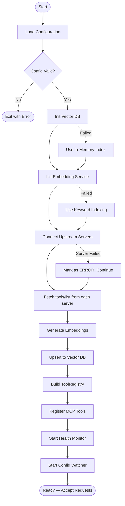

### 6.2 Tool Indexing Process

**Trigger:** Startup, config change, manual trigger, or periodic re-index
**Input:** List of upstream MCP servers
**Output:** Updated Vector DB and ToolRegistry

**Processing Steps:**

| Step | Description | Error Handling |
|------|-------------|----------------|
| 1 | Determine which servers need (re-)indexing | — |
| 2 | For each server: send `tools/list` request | Skip server on timeout/error |
| 3 | Compare returned tools with existing index | — |
| 4 | Identify: new tools, removed tools, updated tools | — |
| 5 | For new/updated tools: generate embeddings (batch, max 100 per request) | Retry once, then skip tool |
| 6 | Upsert new/updated vectors to Vector DB | Retry once, then use in-memory |
| 7 | Delete removed tool vectors from Vector DB | Log warning on failure |
| 8 | Update in-memory ToolRegistry | Must succeed |
| 9 | Log summary: "Indexed {added} new, {updated} updated, {removed} removed tools from {server}" | — |

### 6.3 Health Check Process

**Trigger:** Periodic timer (configurable interval, default: 30s)
**Input:** List of upstream servers with current states
**Output:** Updated server states, reconnection attempts

**Processing Steps:**

| Step | Description | Error Handling |
|------|-------------|----------------|
| 1 | For each server in CONNECTED state: send `ping` | If fails → transition to DISCONNECTED |
| 2 | For each server in DISCONNECTED state (if auto_reconnect enabled): attempt reconnect | If fails → increment reconnect_attempts |
| 3 | If reconnect_attempts > max_reconnect_attempts: transition to ERROR | Log critical warning |
| 4 | For each server in STARTING state: check if connection completed | If timeout → transition to ERROR |
| 5 | For reconnected servers: re-index tools | If indexing fails → keep old tool data |
| 6 | Log all state transitions | — |

### 6.4 Request Routing Process (execute_dynamic_tool)

**Trigger:** Incoming `execute_dynamic_tool` call from Kiro IDE
**Input:** tool_name, arguments
**Output:** Tool execution result or error

**Processing Steps:**

| Step | Description | Error Handling |
|------|-------------|----------------|
| 1 | Look up tool_name in ToolRegistry | Return TOOL_NOT_FOUND error |
| 2 | Get the hosting server's connection | Return SERVER_UNAVAILABLE if DISCONNECTED/ERROR |
| 3 | Optionally validate arguments against input_schema | Return INVALID_PARAMS on failure |
| 4 | Construct JSON-RPC `tools/call` message | — |
| 5 | Send request to upstream server with timeout | Return EXECUTION_TIMEOUT on timeout |
| 6 | Receive response from upstream | Return UPSTREAM_ERROR on error |
| 7 | Add execution metadata (_meta) to response | — |
| 8 | Log execution: tool, server, duration, success | — |
| 9 | Return result to Kiro IDE | — |

---

## 7. Security Requirements

### 7.1 Authentication & Authorization

| Role | Permissions | Context |
|------|-------------|---------|
| Kiro IDE (AI Agent) | Full access to `find_tools` and `execute_dynamic_tool` | Local transport (stdio) — no auth needed |
| Administrator | Configuration management, server restart | OS-level access to config files |
| Upstream MCP Servers | Receive proxied tool calls | Authenticated via per-server API keys/tokens in config |

> **Note:** Since the Orchestrator communicates with Kiro IDE via local stdio transport, no additional authentication layer is required for the IDE-to-Orchestrator connection. Security is enforced at the OS process level.

### 7.2 Data Security

| Data Type | Security Measure | Details |
|-----------|-----------------|---------|
| API Keys (OpenAI, Jira, etc.) | Environment variable references | Config files use `${ENV_VAR}` syntax — never store plaintext secrets |
| Upstream server credentials | Environment variable injection | Passed to subprocess via `env` config, never logged |
| Tool execution arguments | No logging of argument values | Only tool_name and server_name are logged, not argument content |
| Vector embeddings | No PII in embeddings | Embeddings are generated from tool descriptions only (no user data) |

### 7.3 Audit Trail

| Event | Logged Fields | Retention |
|-------|--------------|-----------|
| Tool Discovery | query (truncated to 100 chars), result_count, search_mode, duration_ms | Application logs |
| Tool Execution | tool_name, server_name, duration_ms, success/failure, error_code | Application logs |
| Server State Change | server_name, old_state, new_state, timestamp | Application logs |
| Config Reload | added_servers, removed_servers, changed_settings | Application logs |
| Indexing | server_name, tools_added, tools_removed, tools_updated | Application logs |

---

## 8. Non-Functional Specifications

| Category | Specification | Target |
|----------|--------------|--------|
| Performance — find_tools | End-to-end latency including embedding generation and vector search | < 500ms at p95 |
| Performance — execute_dynamic_tool | Proxy overhead (excluding upstream execution time) | < 100ms |
| Performance — Indexing | Time to index all tools from a single server | < 5s for 100 tools |
| Scalability — Tools | Maximum number of tools in the vector index | 1,000+ tools |
| Scalability — Servers | Maximum number of concurrent upstream server connections | 50+ servers |
| Scalability — Concurrent Requests | Simultaneous find_tools + execute requests | 100+ concurrent |
| Availability | System uptime target | 99.9% (during IDE session) |
| Reliability — Fallback | Keyword search fallback when Vector DB is unavailable | Must be functional |
| Reliability — Graceful Degradation | System must remain operational if some upstream servers are down | Partial functionality |
| Memory | Maximum heap usage for ToolRegistry with 1000 tools | < 256 MB |
| Startup Time | Time from process start to accepting first request | < 10s (with 5 servers) |
| Kotlin Coroutines | All I/O operations must be non-blocking | Coroutine-based |
| Code Quality | SOLID principles compliance | Required |
| Test Coverage | Unit test coverage for core logic | > 80% |

---

## 9. Error Handling & Logging

### 9.1 Error Codes

| Code | Severity | Message | User Action | System Action |
|------|----------|---------|-------------|---------------|
| INVALID_PARAMS | Warning | Query/arguments validation failed | Fix input and retry | Return error response, log at WARN |
| TOOL_NOT_FOUND | Warning | Tool '{name}' is not registered | Use find_tools to discover tools | Return error response, log at WARN |
| SERVER_UNAVAILABLE | Error | Server hosting '{name}' is unavailable | Retry later or use alternative tool | Return error, trigger health check, log at ERROR |
| EXECUTION_TIMEOUT | Error | Tool execution timed out after {N}s | Retry with simpler request | Return error, log at ERROR, increment timeout counter |
| UPSTREAM_ERROR | Error | Upstream server returned error | Check tool arguments | Pass through upstream error, log at ERROR |
| INTERNAL_ERROR | Critical | Internal server error | Retry request | Log full stack trace at ERROR, return generic error |
| VECTOR_DB_UNAVAILABLE | Warning | Vector DB is unavailable, using keyword fallback | No action needed | Switch to keyword search, log at WARN, attempt reconnect |
| EMBEDDING_SERVICE_ERROR | Warning | Embedding service unavailable | No action needed | Switch to keyword search, log at WARN |
| CONFIG_INVALID | Critical | Configuration file is invalid | Fix configuration file | Reject config change, keep previous config, log at ERROR |

### 9.2 Logging Specifications

| Log Type | Level | Content | Destination |
|----------|-------|---------|-------------|
| Request Log | INFO | tool_name, request_id, timestamp | stdout / log file |
| Response Log | INFO | tool_name, request_id, duration_ms, status | stdout / log file |
| Health Check | DEBUG | server_name, status, response_time_ms | stdout / log file |
| State Transition | INFO | server_name, old_state → new_state | stdout / log file |
| Error | ERROR | error_code, message, stack_trace (if applicable) | stderr / log file |
| Indexing | INFO | server_name, tools_count, duration_ms | stdout / log file |
| Config Reload | INFO | changes_summary | stdout / log file |
| Startup | INFO | version, config_path, servers_count, tools_count | stdout / log file |

**Logging Framework:** SLF4J with Logback (Kotlin idiomatic)

**Log Format:**
```
{timestamp} [{level}] [{coroutine-name}] {logger} - {message}
```

**Example:**
```
2026-05-01T10:30:00.123Z [INFO] [find-tools-handler] ToolDiscoveryService - Query: "check logs...", Results: 3, Mode: semantic, Duration: 45ms
```

---

## 10. Testing Considerations

### 10.1 Test Scenarios

| ID | Scenario | Input | Expected Output | Priority |
|----|----------|-------|-----------------|----------|
| TC-01 | find_tools with valid query | query: "read log files" | Array of matching tools with similarity scores | High |
| TC-02 | find_tools with empty query | query: "" | INVALID_PARAMS error | High |
| TC-03 | find_tools with no matching tools | query: "quantum computing simulation" | Empty array with message | Medium |
| TC-04 | find_tools with Vector DB down | query: "read logs" (VDB offline) | Results via keyword fallback, search_mode: "keyword" | High |
| TC-05 | find_tools with custom top_k | query: "jira", top_k: 2 | Maximum 2 results | Medium |
| TC-06 | execute_dynamic_tool success | tool_name: "read_logs", args: {path: "/var/log"} | Tool execution result from upstream | High |
| TC-07 | execute_dynamic_tool — tool not found | tool_name: "nonexistent_tool" | TOOL_NOT_FOUND error | High |
| TC-08 | execute_dynamic_tool — server unavailable | tool_name: "read_logs" (server DISCONNECTED) | SERVER_UNAVAILABLE error | High |
| TC-09 | execute_dynamic_tool — timeout | tool_name: "slow_tool" (>30s) | EXECUTION_TIMEOUT error | High |
| TC-10 | execute_dynamic_tool — upstream error | tool_name: "failing_tool" | UPSTREAM_ERROR with upstream details | Medium |
| TC-11 | Tool indexing — new server added | Add server to config | Tools from new server appear in search | High |
| TC-12 | Tool indexing — server removed | Remove server from config | Tools from removed server no longer in search | Medium |
| TC-13 | Health check — server goes down | Kill upstream server process | Server state → DISCONNECTED, auto-reconnect starts | High |
| TC-14 | Health check — server recovers | Restart upstream server | Server state → CONNECTED, tools re-indexed | High |
| TC-15 | Config hot-reload | Modify application.yml while running | New config applied without restart | Medium |
| TC-16 | Config hot-reload — invalid config | Write invalid YAML | Config rejected, previous config retained | Medium |
| TC-17 | Concurrent find_tools requests | 50 simultaneous queries | All return within 500ms p95 | Medium |
| TC-18 | Startup with no servers reachable | All servers offline | System starts, empty registry, health checks retry | Medium |
| TC-19 | find_tools — tools from disconnected server | Server DISCONNECTED | Tools returned with server_status: "DISCONNECTED" | Low |
| TC-20 | execute_dynamic_tool — argument validation | Invalid args for tool schema | INVALID_PARAMS error with details | Medium |

---

## 11. Appendix

### 11.1 Diagrams

| Diagram | File |
|---------|------|
| System Context Diagram | [system-context.png](diagrams/system-context.png) |
| ER Diagram | [er-diagram.png](diagrams/er-diagram.png) |
| Sequence — find_tools (UC-01) | [sequence-find-tools.png](diagrams/sequence-find-tools.png) |
| Sequence — execute_dynamic_tool (UC-02) | [sequence-execute-tool.png](diagrams/sequence-execute-tool.png) |
| State — Server Health (UC-05) | [state-server-health.png](diagrams/state-server-health.png) |

### 11.2 Change Log from BRD

| Item | BRD Statement | FSD Clarification |
|------|--------------|-------------------|
| Top-K default | "Top-K configurable" | Specified default: 5, range: 1–20 |
| Similarity threshold | Not explicitly stated in BRD | Added configurable threshold, default: 0.7 |
| Execution timeout | "<100ms overhead" | Clarified: 100ms is proxy overhead only. Total timeout: 30s configurable. |
| Transport support | "stdio+http transport" | Specified both for IDE-to-Orchestrator and Orchestrator-to-Upstream connections |
| Keyword fallback | "fallback to keyword search" | Specified triggers: Vector DB down OR Embedding service down |
| Server states | "CONNECTED/DISCONNECTED/ERROR/STARTING" | Added state machine diagram with transitions |
| Config format | "application.yml or config.json" | Provided full YAML schema with all configurable parameters |
| Argument validation | Not in BRD | Added as optional, configurable feature (default: enabled) |
| Execution metadata | Not in BRD | Added `_meta` field in execute response with server name and duration |

### 11.3 Kotlin Package Structure (Recommended)

```
com.orchestrator.mcp/
├── Application.kt                  # Ktor application entry point
├── config/
│   ├── OrchestratorConfig.kt       # Configuration data classes
│   └── ConfigurationManager.kt     # Hot-reload logic
├── mcp/
│   ├── McpProtocolHandler.kt       # JSON-RPC message handling
│   ├── McpToolRegistrar.kt         # Register find_tools + execute_dynamic_tool
│   └── McpTransport.kt             # stdio/HTTP transport abstraction
├── discovery/
│   ├── ToolDiscoveryService.kt     # find_tools business logic
│   ├── EmbeddingService.kt         # Vector embedding generation
│   └── VectorDbClient.kt           # Vector DB abstraction (Qdrant/FAISS)
├── execution/
│   ├── ToolExecutionDispatcher.kt  # execute_dynamic_tool routing
│   └── UpstreamProxy.kt            # JSON-RPC proxy to upstream servers
├── registry/
│   ├── ToolRegistry.kt             # In-memory tool-to-server mapping
│   └── ToolIndexer.kt              # Scan + index tools from upstream
├── upstream/
│   ├── UpstreamServerManager.kt    # Connection lifecycle management
│   ├── HealthMonitor.kt            # Periodic health checks
│   └── ServerState.kt              # State machine (STARTING/CONNECTED/etc.)
└── model/
    ├── ToolDefinition.kt           # Tool data class
    ├── ServerConfig.kt             # Server configuration data class
    └── ErrorCodes.kt               # Error code constants
```

