# Technical Design Document (TDD)

## MCP Orchestration Server — MTO-5: Create MCP Tool Orchestration

---

## Document Information

| Field | Value |
|-------|-------|
| Jira Ticket | MTO-5 |
| Title | Create MCP Tool Orchestration |
| Author | SA Agent |
| Version | 2.0 |
| Date | 2026-05-07 |
| Status | Draft |
| Related BRD | BRD-v3-MTO-5.docx |
| Related FSD | FSD-v2-MTO-5.docx |

---

## Author Tracking

| Role | Name - Position | Responsibility |
|------|-----------------|----------------|
| Author | SA Agent – Solution Architect | Create document |
| Peer Reviewer | Tech Lead – Senior Engineer | Review document |

---

## Revision History

| Version | Date | Author | Changes |
|---------|------|--------|---------|
| 1.0 | 2026-05-02 | SA Agent | Initiate document — auto-generated from BRD and FSD |
| 2.0 | 2026-05-07 | SA Agent | Added §3.5 CLI Arguments (--config), §3.6 mcpServers format, Application.kt/JsonConfigLoader/ConfigurationManagerImpl design changes |

---

## Sign-Off

| Name | Signature and date |
|------|--------------------|
| | ☐ I agree and confirm the technical design in this TDD |
| | ☐ I agree and confirm the technical design in this TDD |

---

## 1. Introduction

### 1.1 Purpose

This TDD specifies the technical architecture and detailed design of the **MCP Orchestration Server** — a Kotlin/Ktor application that acts as an intelligent proxy between the Kiro AI IDE and multiple upstream MCP (Model Context Protocol) Servers. The server exposes exactly **two MCP tools** (`find_tools` and `execute_dynamic_tool`) to minimize AI context window consumption while providing access to an unlimited number of upstream tools via semantic search and dynamic proxying.

This document translates the functional requirements from the FSD into concrete implementation decisions: system architecture, API contracts, data structures, class design, integration patterns, security controls, and deployment strategy.

### 1.2 Scope

**Technical scope covered:**
- Kotlin/Ktor application architecture with layered design
- MCP Protocol implementation (JSON-RPC 2.0 over stdio/HTTP)
- Semantic search pipeline: Embedding generation → Vector DB storage → ANN search
- Dynamic proxy execution to upstream MCP servers
- Tool registration, indexing, and metadata extraction
- Server health monitoring with state machine and auto-reconnect
- Configuration management with hot-reload
- Fallback strategies (keyword search when Vector DB/Embedding unavailable)

**Not covered:**
- UI/Dashboard (future phase)
- IDE plugin development
- Production infrastructure provisioning (Kubernetes, cloud)

### 1.3 Technology Stack

| Layer | Technology | Version |
|-------|-----------|---------|
| Language | Kotlin | 2.3.20 |
| Framework | Ktor | 3.4.0 |
| DI Framework | Koin | 4.1.1 |
| Serialization | kotlinx.serialization | 1.8.1 |
| Coroutines | kotlinx.coroutines | 1.10.2 |
| Date/Time | kotlinx.datetime | 0.6.2 |
| Vector DB (primary) | Qdrant | 1.9+ |
| Vector DB (local fallback) | FAISS (via JNI) | Latest |
| Embeddings | OpenAI text-embedding-3-small | API v1 |
| Protocol | MCP (JSON-RPC 2.0) | 2024-11-05 |
| Transport | stdio + HTTP/SSE | — |
| Build Tool | Gradle (Kotlin DSL) | 8.x |
| Testing | JUnit 5 + Ktor Test Host | 5.11.4 / 3.4.0 |
| Logging | SLF4J + Logback | 1.4.x |
| HTTP Client | Ktor Client | 3.4.0 |

### 1.4 Design Principles

- **SOLID** — Single Responsibility, Open/Closed, Liskov Substitution, Interface Segregation, Dependency Inversion
- **Coroutine-first** — All I/O operations are non-blocking, using Kotlin coroutines and structured concurrency
- **Fail-safe with graceful degradation** — System remains operational even when Vector DB, Embedding service, or upstream servers are unavailable
- **Interface-driven** — Core services defined as interfaces, enabling testability and swappable implementations
- **Configuration over code** — All tunable parameters externalized to `application.yml`
- **Transparent proxy** — Upstream responses passed through without modification (except metadata enrichment)

### 1.5 Constraints

- MCP protocol compliance: Must implement JSON-RPC 2.0 as specified by the MCP specification (version 2024-11-05)
- Embedding model dimension: 768 dimensions for `text-embedding-3-small` (configurable)
- Vector DB must support HNSW index for ANN search
- stdio transport requires single-process model (no horizontal scaling for stdio mode)
- OpenAI API rate limits: 3,000 RPM for embedding requests (batch to mitigate)

### 1.6 References

| Document | Location |
|----------|----------|
| BRD | BRD-v3-MTO-5.docx |
| FSD | FSD-v2-MTO-5.docx |
| SRS | requirement/mcp_orchestration.md |
| MCP Specification | https://modelcontextprotocol.io/specification |
| Ktor Documentation | https://ktor.io/docs/ |
| Qdrant Documentation | https://qdrant.tech/documentation/ |


---

## 2. System Architecture

### 2.1 Architecture Overview

The MCP Orchestration Server follows a **layered architecture** with four distinct layers: Transport, Protocol, Orchestration, and Infrastructure. Each layer has a single responsibility and communicates only with adjacent layers through well-defined interfaces.

The system acts as a **smart proxy** — it sits between the Kiro AI IDE (downstream client) and multiple upstream MCP Servers. Kiro sees only 2 tools; the Orchestrator manages discovery and routing to potentially hundreds of tools across dozens of upstream servers.

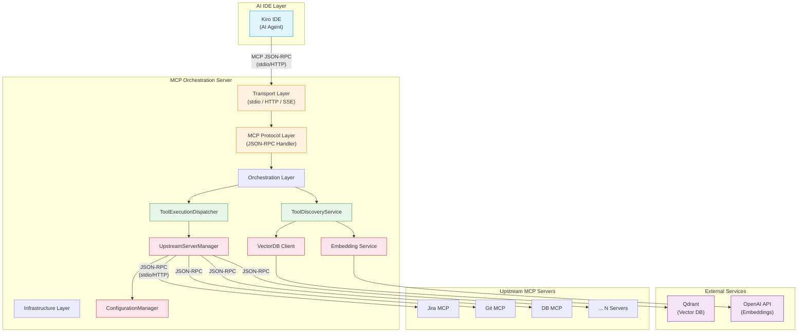

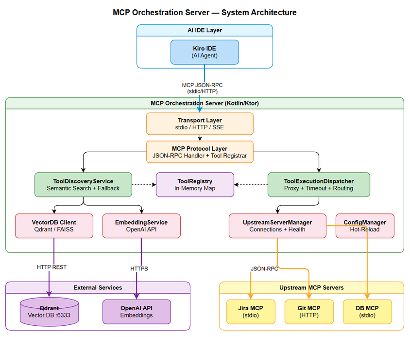

### 2.2 Component Diagram

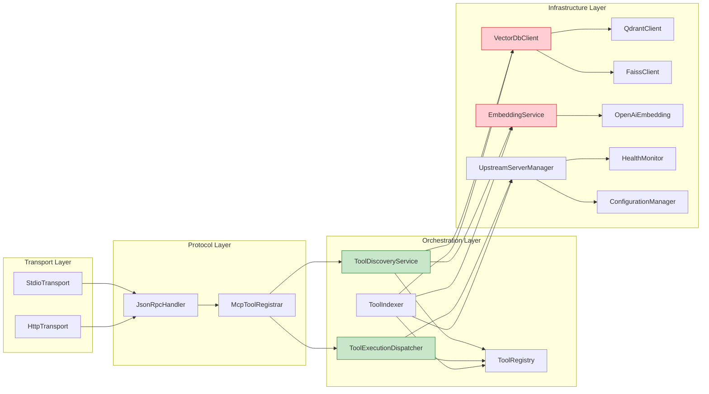

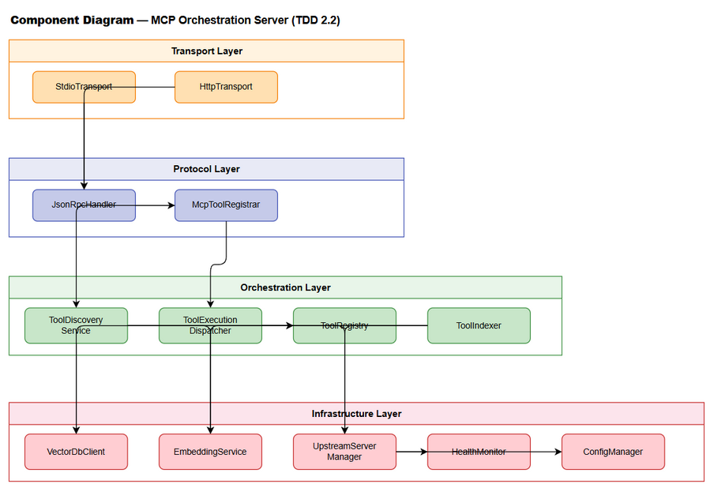

| Component | Responsibility | Technology |
|-----------|---------------|------------|
| StdioTransport | Read/write JSON-RPC messages via stdin/stdout | Kotlin coroutines + System.in/out |
| HttpTransport | HTTP/SSE endpoint for MCP communication | Ktor Server (Netty) |
| JsonRpcHandler | Parse JSON-RPC 2.0 requests, dispatch to handlers, format responses | kotlinx.serialization |
| McpToolRegistrar | Register `find_tools` and `execute_dynamic_tool` as MCP tools | MCP protocol |
| ToolDiscoveryService | Semantic search: query → embedding → vector search → results | Ktor Client, Qdrant |
| ToolExecutionDispatcher | Route tool calls to correct upstream server, handle timeouts | Kotlin coroutines |
| ToolRegistry | In-memory tool-to-server mapping, thread-safe concurrent access | ConcurrentHashMap |
| ToolIndexer | Scan upstream servers, extract tool metadata, generate embeddings, upsert to Vector DB | Batch processing |
| VectorDbClient | Abstraction over Qdrant/FAISS for vector CRUD and search | Interface + implementations |
| EmbeddingService | Generate vector embeddings from text via OpenAI API | Ktor HTTP Client |
| UpstreamServerManager | Manage connections to upstream MCP servers (stdio/HTTP) | Process management, Ktor Client |
| HealthMonitor | Periodic health checks, state transitions, auto-reconnect | Kotlin coroutines (ticker) |
| ConfigurationManager | Load, validate, watch, and hot-reload configuration | YAML parser, file watcher |

### 2.3 Deployment Architecture

The MCP Orchestration Server runs as a **single JVM process** on the developer's local machine, co-located with the Kiro IDE. In stdio mode, Kiro spawns the Orchestrator as a subprocess. In HTTP mode, it runs as a standalone server.

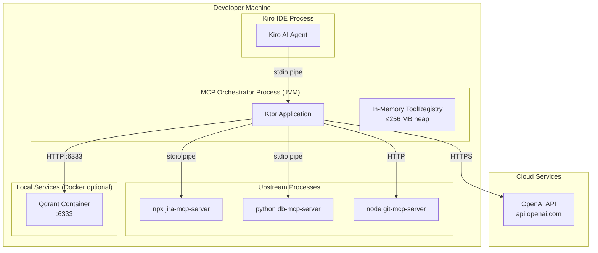

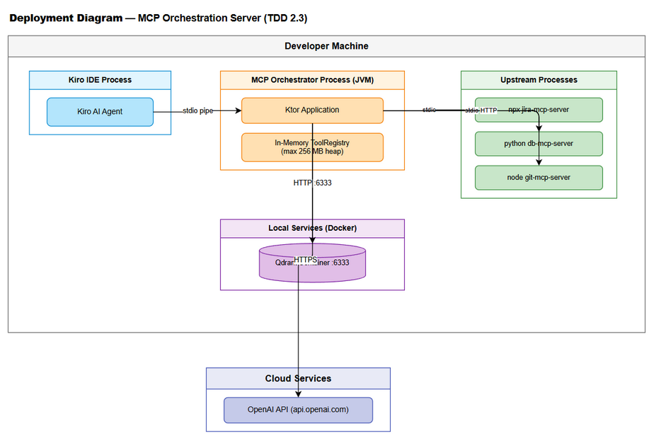

### 2.4 Communication Patterns

| From | To | Protocol | Pattern | Description |
|------|----|----------|---------|-------------|
| Kiro IDE | Orchestrator | MCP/JSON-RPC over stdio | Sync request-response | Tool discovery and execution |
| Kiro IDE | Orchestrator | MCP/JSON-RPC over HTTP | Sync request-response | Alternative transport |
| Orchestrator | Qdrant | HTTP REST | Sync request-response | Vector upsert, search, delete |
| Orchestrator | OpenAI API | HTTPS REST | Sync request-response | Embedding generation |
| Orchestrator | Upstream (stdio) | JSON-RPC over stdio | Sync request-response | Tool listing and execution |
| Orchestrator | Upstream (HTTP) | JSON-RPC over HTTP/SSE | Sync request-response | Tool listing and execution |
| HealthMonitor | Upstream Servers | JSON-RPC ping | Async periodic | Health checks every 30s |
| ConfigManager | File System | File watch | Async event-driven | Hot-reload on config change |


---

## 3. API Design

### 3.1 API Overview

The Orchestrator exposes exactly **2 MCP tools** via JSON-RPC 2.0. These are not REST endpoints — they are MCP tool definitions invoked through the MCP protocol.

| # | Tool Name | Method | Description | Source |
|---|-----------|--------|-------------|--------|
| 1 | `find_tools` | `tools/call` | Semantic search for available tools | UC-01, BR-01..BR-07 |
| 2 | `execute_dynamic_tool` | `tools/call` | Proxy execution to upstream MCP server | UC-02, BR-08..BR-13 |

Additionally, the system responds to standard MCP protocol methods:

| # | MCP Method | Description | Source |
|---|-----------|-------------|--------|
| 3 | `initialize` | MCP session handshake | MCP Spec |
| 4 | `tools/list` | Return the 2 tool definitions | MCP Spec |
| 5 | `ping` | Health check from IDE | MCP Spec |

---

### 3.2 Tool: `find_tools`

**Implements:** UC-01, BR-01, BR-02, BR-03, BR-04, BR-05, BR-06, BR-07

| Attribute | Value |
|-----------|-------|
| Tool Name | `find_tools` |
| Protocol | MCP JSON-RPC 2.0 |
| Transport | stdio / HTTP |
| Auth | None (local transport) |

**MCP Tool Definition (registered via `tools/list`):**

```json
{
  "name": "find_tools",
  "description": "Search for available MCP tools by describing what you want to accomplish. Returns tool definitions with input schemas so you can call them via execute_dynamic_tool.",
  "inputSchema": {
    "type": "object",
    "properties": {
      "query": {
        "type": "string",
        "description": "Natural language description of the action you want to perform",
        "maxLength": 2000
      },
      "top_k": {
        "type": "integer",
        "description": "Maximum number of results to return (default: 5)",
        "default": 5,
        "minimum": 1,
        "maximum": 20
      },
      "threshold": {
        "type": "number",
        "description": "Minimum similarity score threshold (default: 0.7)",
        "default": 0.7,
        "minimum": 0.0,
        "maximum": 1.0
      }
    },
    "required": ["query"]
  }
}
```

**JSON-RPC Request Example:**

```json
{
  "jsonrpc": "2.0",
  "id": 1,
  "method": "tools/call",
  "params": {
    "name": "find_tools",
    "arguments": {
      "query": "check logs and create Jira ticket",
      "top_k": 5,
      "threshold": 0.7
    }
  }
}
```

**JSON-RPC Response — Success:**

```json
{
  "jsonrpc": "2.0",
  "id": 1,
  "result": {
    "content": [
      {
        "type": "text",
        "text": "{\"tools\":[{\"name\":\"read_logs\",\"description\":\"Read application log files\",\"input_schema\":{\"type\":\"object\",\"properties\":{\"path\":{\"type\":\"string\"},\"lines\":{\"type\":\"integer\",\"default\":100}}},\"server_name\":\"log-server\",\"server_status\":\"CONNECTED\",\"similarity_score\":0.92},{\"name\":\"create_jira_issue\",\"description\":\"Create a new Jira issue\",\"input_schema\":{\"type\":\"object\",\"properties\":{\"project_key\":{\"type\":\"string\"},\"summary\":{\"type\":\"string\"},\"issue_type\":{\"type\":\"string\"}}},\"server_name\":\"jira-server\",\"server_status\":\"CONNECTED\",\"similarity_score\":0.87}],\"search_mode\":\"semantic\",\"total_indexed\":150}"
      }
    ]
  }
}
```

**JSON-RPC Response — Error:**

```json
{
  "jsonrpc": "2.0",
  "id": 1,
  "result": {
    "content": [
      {
        "type": "text",
        "text": "{\"error\":{\"code\":\"INVALID_PARAMS\",\"message\":\"Query parameter is required and must be non-empty\"}}"
      }
    ],
    "isError": true
  }
}
```

**Error Codes:**

| Code | Message | Condition |
|------|---------|-----------|
| INVALID_PARAMS | Query parameter is required and must be non-empty | Empty or null query |
| INVALID_PARAMS | Query exceeds maximum length of 2000 characters | Query too long |
| INTERNAL_ERROR | Tool discovery failed. Please retry. | Unrecoverable internal error |

**Processing Flow:**

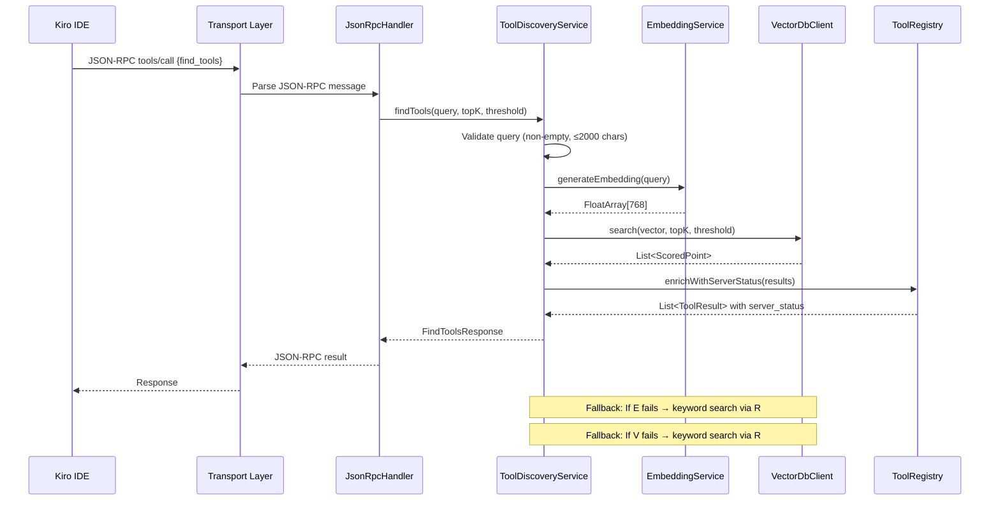

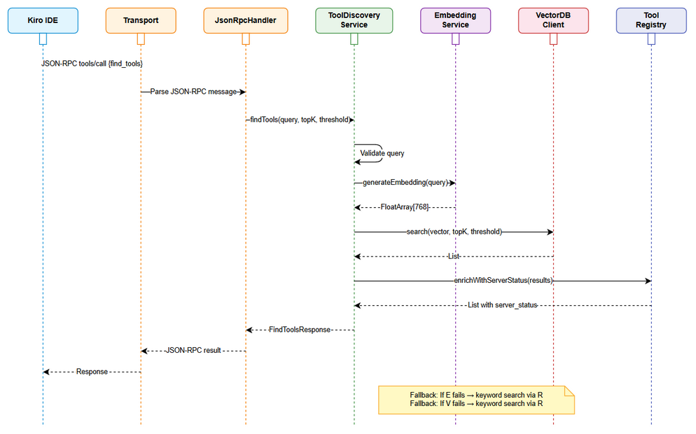

---

### 3.3 Tool: `execute_dynamic_tool`

**Implements:** UC-02, BR-08, BR-09, BR-10, BR-11, BR-12, BR-13

| Attribute | Value |
|-----------|-------|
| Tool Name | `execute_dynamic_tool` |
| Protocol | MCP JSON-RPC 2.0 |
| Transport | stdio / HTTP |
| Auth | None (local transport) |

**MCP Tool Definition:**

```json
{
  "name": "execute_dynamic_tool",
  "description": "Execute a tool on an upstream MCP server. Use find_tools first to discover available tools and their input schemas.",
  "inputSchema": {
    "type": "object",
    "properties": {
      "tool_name": {
        "type": "string",
        "description": "The exact name of the tool to execute (as returned by find_tools)"
      },
      "arguments": {
        "type": "object",
        "description": "Arguments to pass to the tool, conforming to its input_schema",
        "additionalProperties": true
      }
    },
    "required": ["tool_name"]
  }
}
```

**JSON-RPC Request Example:**

```json
{
  "jsonrpc": "2.0",
  "id": 2,
  "method": "tools/call",
  "params": {
    "name": "execute_dynamic_tool",
    "arguments": {
      "tool_name": "read_logs",
      "arguments": {
        "path": "/var/log/app.log",
        "lines": 50
      }
    }
  }
}
```

**JSON-RPC Response — Success:**

```json
{
  "jsonrpc": "2.0",
  "id": 2,
  "result": {
    "content": [
      {
        "type": "text",
        "text": "2026-05-01 10:30:00 INFO Application started\n2026-05-01 10:30:01 INFO Processing request..."
      }
    ],
    "_meta": {
      "upstream_server": "log-server",
      "execution_time_ms": 145
    }
  }
}
```

**Error Codes:**

| Code | Message | Condition |
|------|---------|-----------|
| TOOL_NOT_FOUND | Tool '{name}' is not registered. Use find_tools to discover available tools. | Tool name not in registry |
| SERVER_UNAVAILABLE | Server hosting '{name}' is currently unavailable. Status: DISCONNECTED. | Upstream server disconnected |
| EXECUTION_TIMEOUT | Tool execution timed out after {N}s. | Upstream did not respond in time |
| INVALID_PARAMS | Argument validation failed: {details} | Arguments don't match input_schema |
| UPSTREAM_ERROR | Upstream error: {message} | Error from the upstream MCP server |

**Processing Flow:**

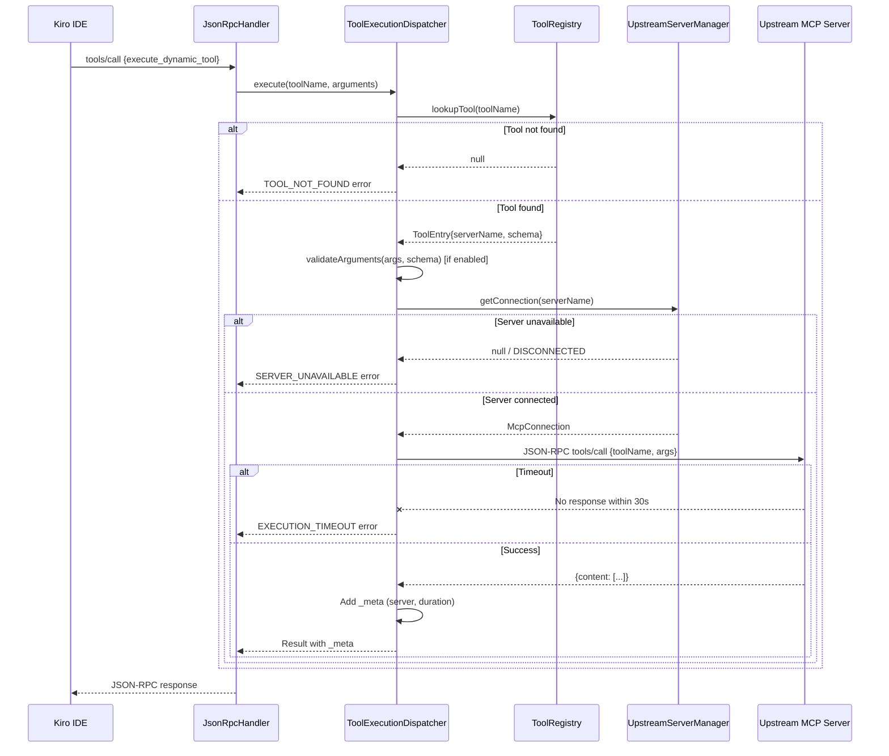

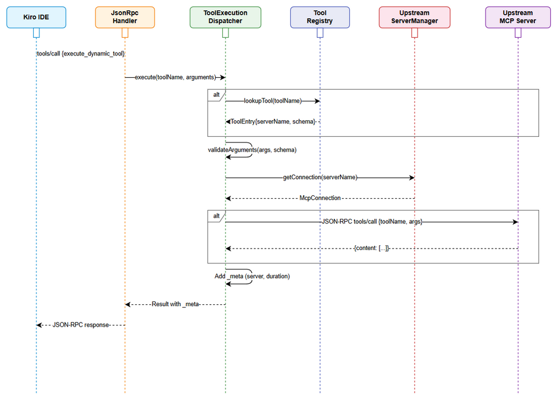

---

### 3.4 MCP Protocol Methods

#### 3.4.1 `initialize`

Standard MCP handshake. The Orchestrator responds with its capabilities.

**Request:**
```json
{
  "jsonrpc": "2.0",
  "id": 0,
  "method": "initialize",
  "params": {
    "protocolVersion": "2024-11-05",
    "capabilities": {},
    "clientInfo": {
      "name": "kiro",
      "version": "1.0.0"
    }
  }
}
```

**Response:**
```json
{
  "jsonrpc": "2.0",
  "id": 0,
  "result": {
    "protocolVersion": "2024-11-05",
    "capabilities": {
      "tools": {}
    },
    "serverInfo": {
      "name": "mcp-orchestrator",
      "version": "1.0.0"
    }
  }
}
```

#### 3.4.2 `tools/list`

Returns the 2 registered tools with their full schemas.

**Response:**
```json
{
  "jsonrpc": "2.0",
  "id": 1,
  "result": {
    "tools": [
      { "name": "find_tools", "description": "...", "inputSchema": { ... } },
      { "name": "execute_dynamic_tool", "description": "...", "inputSchema": { ... } }
    ]
  }
}
```

### 3.5 CLI Arguments

**Implements:** UC-04 AF-11, BR-28, BR-30

The server accepts command-line arguments to override configuration at startup.

| Argument | Type | Required | Default | Description |
|----------|------|----------|---------|-------------|
| `--config` | String (file path) | No | None | Path to external JSON config file in mcpServers format |

**Parsing Logic in `Application.kt`:**

```kotlin
fun main(args: Array<String>) = runBlocking {
    val configPath = parseConfigArg(args)
    // Pass configPath to ConfigurationManagerImpl
    startKoin {
        modules(appModule(configPath))
    }
    // ... rest of startup
}

private fun parseConfigArg(args: Array<String>): String? {
    val idx = args.indexOf("--config")
    return if (idx >= 0 && idx + 1 < args.size) args[idx + 1] else null
}
```

**`main()` function signature change:** `fun main()` → `fun main(args: Array<String>)` to accept CLI arguments.

### 3.6 mcpServers JSON Format (--config)

**Implements:** UC-04 AF-12, BR-29, BR-31

The `--config` file uses the MCP setting format:

```json
{
  "mcpServers": {
    "server-name": {
      "command": "npx",
      "args": ["-y", "@mcp/server-jira"],
      "env": { "JIRA_URL": "...", "JIRA_TOKEN": "..." }
    },
    "http-server": {
      "url": "http://localhost:3001/mcp"
    }
  }
}
```

**JsonConfigLoader changes:**

Current `parseUpstreamServers()` supports `upstream_servers` array format. Add `parseMcpServersFormat()`:

```kotlin
fun parseMcpServersFormat(content: String): List<UpstreamServerConfig> {
    val root = json.parseToJsonElement(content).jsonObject
    val mcpServers = root["mcpServers"]?.jsonObject ?: return emptyList()
    return mcpServers.entries.map { (name, config) ->
        val obj = config.jsonObject
        val url = obj["url"]?.jsonPrimitive?.content
        val command = obj["command"]?.jsonPrimitive?.content
        UpstreamServerConfig(
            name = name,
            transport = if (url != null) "http" else "stdio",
            command = command,
            args = obj["args"]?.jsonArray?.map { it.jsonPrimitive.content } ?: emptyList(),
            env = obj["env"]?.jsonObject?.mapValues { it.value.jsonPrimitive.content } ?: emptyMap(),
            url = url
        )
    }
}
```

**ConfigurationManagerImpl changes:**

Add `configPath` parameter to constructor. In `loadConfig()`, after loading YAML + JSON servers, also load `--config` servers:

```kotlin
class ConfigurationManagerImpl(
    private val configContent: String? = null,
    private val configPath: String? = null,  // ← from --config CLI arg
    private val workingDirectory: File = File(".")
) : ConfigurationManager {

    private fun loadConfig(): OrchestratorConfig {
        val yamlConfig = loadYamlConfig()
        val jsonServers = loadJsonServers()
        val cliServers = loadCliConfigServers()  // ← NEW
        return mergeAllServers(yamlConfig, jsonServers, cliServers)
    }

    private fun loadCliConfigServers(): List<UpstreamServerConfig> {
        val path = configPath ?: return emptyList()
        val file = File(path).let { if (it.isAbsolute) it else File(workingDirectory, path) }
        if (!file.exists()) {
            logger.warn("Config file not found: ${file.absolutePath}. Continuing without it.")
            return emptyList()
        }
        val content = file.readText()
        return JsonConfigLoader.parseMcpServersFormat(content)
    }
}
```


---

## 4. Database Design

### 4.1 Schema Overview

This system uses a **Vector Database (Qdrant)** as its primary data store — not a traditional RDBMS. All persistent data is stored as vector points with payload metadata in Qdrant collections. Volatile runtime state (ToolRegistry, server connections) is held in-memory.

For local development/testing, **FAISS** serves as a fallback vector store (file-based, no external service required).

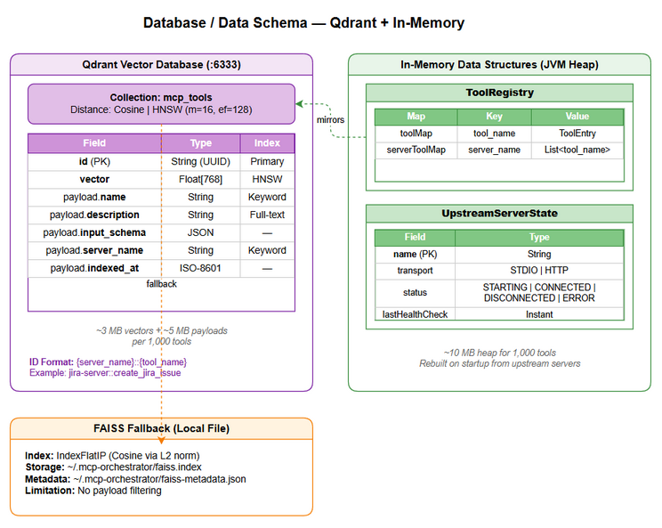

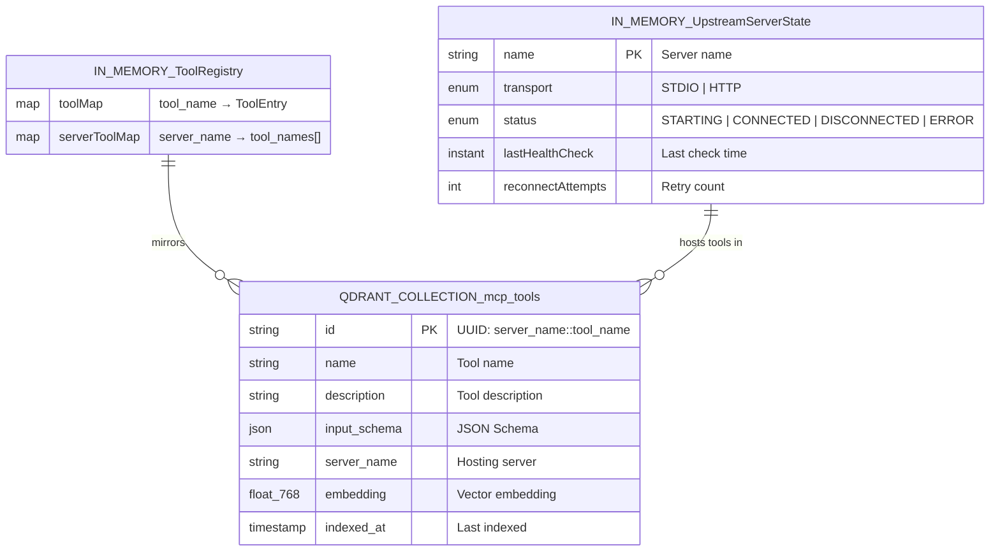

### 4.2 Qdrant Collection: `mcp_tools`

**Collection Creation:**

```json
PUT /collections/mcp_tools
{
  "vectors": {
    "size": 768,
    "distance": "Cosine"
  },
  "hnsw_config": {
    "m": 16,
    "ef_construct": 128
  },
  "optimizers_config": {
    "indexing_threshold": 100
  }
}
```

**Point Schema:**

| Field | Type | Indexed | Description |
|-------|------|---------|-------------|
| id | String (UUID) | Primary | Composite key: `{server_name}::{tool_name}` |
| vector | Float[768] | HNSW vector index | Embedding of tool description |
| payload.name | String | Keyword index | Tool name as registered in MCP |
| payload.description | String | Full-text index | Human-readable tool description |
| payload.input_schema | JSON | Not indexed | Full JSON Schema for tool input |
| payload.server_name | String | Keyword index (filterable) | Name of the hosting upstream server |
| payload.indexed_at | String (ISO-8601) | Not indexed | When this tool was last indexed |

**Payload Index Configuration:**

```json
PUT /collections/mcp_tools/index
{
  "field_name": "name",
  "field_schema": "keyword"
}

PUT /collections/mcp_tools/index
{
  "field_name": "server_name",
  "field_schema": "keyword"
}

PUT /collections/mcp_tools/index
{
  "field_name": "description",
  "field_schema": "text"
}
```

**Vector Index Parameters:**

| Parameter | Value | Rationale |
|-----------|-------|-----------|
| Distance Metric | Cosine | Standard for text embeddings; normalized similarity 0.0–1.0 |
| Dimensions | 768 | `text-embedding-3-small` output size |
| Index Type | HNSW | Best balance of speed and recall for <10K vectors |
| ef_construct | 128 | Higher build quality for small dataset |
| M | 16 | Standard connectivity for HNSW graph |
| indexing_threshold | 100 | Start building HNSW index after 100 points |

### 4.3 Upsert Operation

```json
PUT /collections/mcp_tools/points
{
  "points": [
    {
      "id": "jira-server::create_jira_issue",
      "vector": [0.0023, -0.0091, ...],
      "payload": {
        "name": "create_jira_issue",
        "description": "Create a new Jira issue with summary, description, and type",
        "input_schema": {
          "type": "object",
          "properties": {
            "project_key": { "type": "string" },
            "summary": { "type": "string" },
            "issue_type": { "type": "string" }
          },
          "required": ["project_key", "summary", "issue_type"]
        },
        "server_name": "jira-server",
        "indexed_at": "2026-05-02T10:30:00Z"
      }
    }
  ]
}
```

### 4.4 Search Operation

```json
POST /collections/mcp_tools/points/search
{
  "vector": [0.0015, -0.0082, ...],
  "limit": 5,
  "score_threshold": 0.7,
  "with_payload": true
}
```

**Expected Performance:**
- Search latency: < 10ms for 1,000 vectors (HNSW)
- Upsert latency: < 5ms per point
- Batch upsert (100 points): < 200ms

### 4.5 Delete Operation (Server Removal)

```json
POST /collections/mcp_tools/points/delete
{
  "filter": {
    "must": [
      {
        "key": "server_name",
        "match": { "value": "removed-server" }
      }
    ]
  }
}
```

### 4.6 FAISS Fallback (Local)

When Qdrant is unavailable, the system falls back to a local FAISS index:

| Aspect | FAISS Configuration |
|--------|-------------------|
| Index Type | IndexFlatIP (Inner Product, after L2 normalization = Cosine) |
| Storage | File-based (`~/.mcp-orchestrator/faiss.index`) |
| Metadata | Companion JSON file (`~/.mcp-orchestrator/faiss-metadata.json`) |
| Limitations | No payload filtering, full scan for keyword search |

### 4.7 In-Memory Data Structures

These are not persisted — rebuilt on startup from upstream servers.

**ToolRegistry:**
```kotlin
class ToolRegistry {
    // Key: tool_name, Value: ToolEntry
    private val toolMap = ConcurrentHashMap<String, ToolEntry>()
    // Key: server_name, Value: list of tool_names
    private val serverToolMap = ConcurrentHashMap<String, MutableList<String>>()
}
```

**Data Volume Estimates:**

| Data | Estimated Size | Notes |
|------|---------------|-------|
| 1,000 tool vectors (768 dim) | ~3 MB in Qdrant | 768 × 4 bytes × 1000 |
| 1,000 tool payloads | ~5 MB in Qdrant | ~5 KB avg per tool (schema included) |
| In-memory ToolRegistry (1,000 tools) | ~10 MB heap | ToolEntry objects + maps |
| FAISS index (1,000 vectors) | ~3 MB on disk | Same as Qdrant vector size |


---

## 5. Class / Module Design

### 5.1 Package Structure

```
com.orchestrator.mcp/
├── Application.kt                          # Ktor application entry point
├── config/
│   ├── OrchestratorConfig.kt               # @Serializable config data classes
│   ├── ConfigurationManager.kt             # Hot-reload, validation, file watching
│   └── ConfigValidator.kt                  # Config schema validation
├── transport/
│   ├── McpTransport.kt                     # Interface: send/receive JSON-RPC
│   ├── StdioTransport.kt                   # stdio implementation
│   └── HttpTransport.kt                    # HTTP/SSE implementation (Ktor routes)
├── protocol/
│   ├── JsonRpcHandler.kt                   # JSON-RPC 2.0 message parsing & dispatch
│   ├── McpToolRegistrar.kt                 # Register find_tools + execute_dynamic_tool
│   ├── McpProtocolHandler.kt               # Handle initialize, tools/list, ping
│   └── model/
│       ├── JsonRpcMessage.kt               # JSON-RPC request/response/notification
│       ├── McpInitialize.kt                # Initialize request/response models
│       └── McpToolCall.kt                  # tools/call request/response models
├── discovery/
│   ├── ToolDiscoveryService.kt             # Interface: findTools(query, topK, threshold)
│   ├── ToolDiscoveryServiceImpl.kt         # Semantic + keyword fallback implementation
│   ├── KeywordSearchEngine.kt              # In-memory keyword/TF-IDF fallback
│   └── model/
│       ├── FindToolsRequest.kt             # Input DTO
│       └── FindToolsResponse.kt            # Output DTO with tools array
├── execution/
│   ├── ToolExecutionDispatcher.kt          # Interface: execute(toolName, args)
│   ├── ToolExecutionDispatcherImpl.kt      # Routing + timeout + error handling
│   └── model/
│       ├── ExecuteToolRequest.kt           # Input DTO
│       └── ExecuteToolResponse.kt          # Output DTO with content + _meta
├── registry/
│   ├── ToolRegistry.kt                     # Interface: lookup, register, remove tools
│   ├── ToolRegistryImpl.kt                 # ConcurrentHashMap-based implementation
│   └── ToolIndexer.kt                      # Scan servers → embed → upsert → update registry
├── embedding/
│   ├── EmbeddingService.kt                 # Interface: generateEmbedding(text)
│   ├── OpenAiEmbeddingService.kt           # OpenAI API implementation
│   └── model/
│       ├── EmbeddingRequest.kt             # OpenAI API request
│       └── EmbeddingResponse.kt            # OpenAI API response
├── vectordb/
│   ├── VectorDbClient.kt                   # Interface: upsert, search, delete
│   ├── QdrantVectorDbClient.kt             # Qdrant REST API implementation
│   ├── FaissVectorDbClient.kt              # Local FAISS fallback implementation
│   └── model/
│       ├── VectorPoint.kt                  # Point with vector + payload
│       └── SearchResult.kt                 # Scored search result
├── upstream/
│   ├── UpstreamServerManager.kt            # Interface: connect, disconnect, getConnection
│   ├── UpstreamServerManagerImpl.kt        # Connection lifecycle management
│   ├── HealthMonitor.kt                    # Periodic health checks + auto-reconnect
│   ├── McpConnection.kt                    # Interface: sendRequest(method, params)
│   ├── StdioMcpConnection.kt              # stdio subprocess connection
│   ├── HttpMcpConnection.kt               # HTTP connection
│   └── model/
│       ├── ServerState.kt                  # Enum: STARTING, CONNECTED, DISCONNECTED, ERROR
│       ├── TransportType.kt                # Enum: STDIO, HTTP
│       └── UpstreamServerInfo.kt           # Runtime server state data class
├── model/
│   ├── ToolDefinition.kt                   # Core tool data class
│   ├── ToolEntry.kt                        # Registry entry (tool + server info)
│   └── ErrorCodes.kt                       # Error code constants
├── di/
│   └── AppModule.kt                        # Koin module definitions
└── util/
    ├── JsonRpcUtils.kt                     # JSON-RPC helper functions
    └── RetryUtils.kt                       # Exponential backoff retry utility
```

### 5.2 Key Interfaces

```kotlin
// --- Discovery Layer ---
interface ToolDiscoveryService {
    suspend fun findTools(query: String, topK: Int = 5, threshold: Float = 0.7f): FindToolsResponse
}

// --- Execution Layer ---
interface ToolExecutionDispatcher {
    suspend fun execute(toolName: String, arguments: JsonObject?): ExecuteToolResponse
}

// --- Registry ---
interface ToolRegistry {
    fun lookupTool(toolName: String): ToolEntry?
    fun registerTool(entry: ToolEntry)
    fun removeTool(toolName: String)
    fun removeServerTools(serverName: String)
    fun getAllTools(): List<ToolEntry>
    fun getToolsByServer(serverName: String): List<ToolEntry>
    fun getToolCount(): Int
}

// --- Vector DB ---
interface VectorDbClient {
    suspend fun createCollection(name: String, dimensions: Int)
    suspend fun upsert(collectionName: String, points: List<VectorPoint>)
    suspend fun search(collectionName: String, vector: FloatArray, limit: Int, scoreThreshold: Float): List<SearchResult>
    suspend fun delete(collectionName: String, filter: Map<String, String>)
    suspend fun isHealthy(): Boolean
}

// --- Embedding ---
interface EmbeddingService {
    suspend fun generateEmbedding(text: String): FloatArray
    suspend fun generateEmbeddings(texts: List<String>): List<FloatArray>
    suspend fun isHealthy(): Boolean
}

// --- Upstream Connection ---
interface McpConnection {
    suspend fun sendRequest(method: String, params: JsonObject?): JsonObject
    suspend fun close()
    fun isActive(): Boolean
}

// --- Upstream Server Manager ---
interface UpstreamServerManager {
    suspend fun connectAll()
    suspend fun connect(serverName: String)
    suspend fun disconnect(serverName: String)
    fun getConnection(serverName: String): McpConnection?
    fun getServerState(serverName: String): ServerState
    fun getAllServerStates(): Map<String, UpstreamServerInfo>
}

// --- Transport ---
interface McpTransport {
    suspend fun start()
    suspend fun stop()
    suspend fun sendMessage(message: String)
    fun onMessage(handler: suspend (String) -> String)
}

// --- Configuration ---
interface ConfigurationManager {
    fun getConfig(): OrchestratorConfig
    fun watchForChanges(onChange: (OrchestratorConfig) -> Unit)
    fun reload(): OrchestratorConfig
}
```

### 5.3 Class Diagram

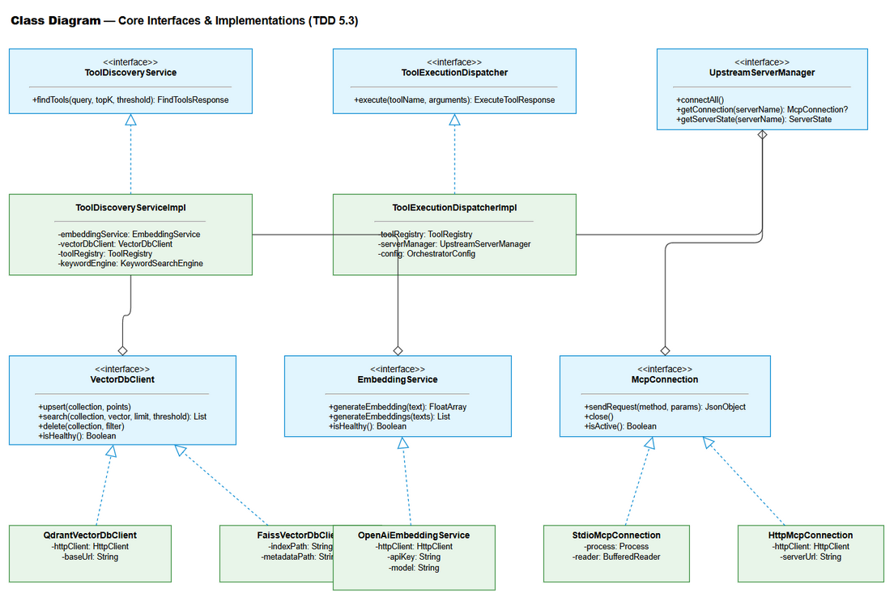

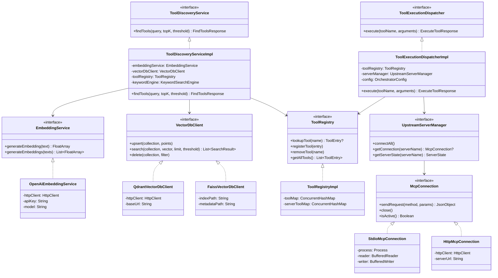

### 5.4 Design Patterns

| Pattern | Where Used | Rationale |
|---------|-----------|-----------|
| **Strategy** | VectorDbClient (Qdrant vs FAISS), EmbeddingService (OpenAI vs HuggingFace), McpConnection (stdio vs HTTP) | Swappable implementations based on config/availability |
| **Facade** | ToolDiscoveryService, ToolExecutionDispatcher | Simplify complex multi-step operations behind a single interface |
| **Registry** | ToolRegistry | Central lookup for tool-to-server mapping |
| **Observer** | ConfigurationManager (file watcher → onChange callback) | React to config changes without polling |
| **State Machine** | UpstreamServerInfo (STARTING → CONNECTED → DISCONNECTED → ERROR) | Manage server lifecycle with well-defined transitions |
| **Proxy** | ToolExecutionDispatcher → McpConnection | Transparent forwarding of tool calls to upstream servers |
| **Circuit Breaker** | HealthMonitor (max reconnect attempts → ERROR state) | Prevent infinite reconnection loops |
| **Template Method** | McpConnection.sendRequest() | Common JSON-RPC framing with transport-specific I/O |

### 5.5 Dependency Injection (Koin)

```kotlin
// di/AppModule.kt
val appModule = module {
    // Configuration
    single<ConfigurationManager> { ConfigurationManagerImpl(configPath = get()) }
    single { get<ConfigurationManager>().getConfig() }

    // Embedding
    single<EmbeddingService> {
        val config = get<OrchestratorConfig>()
        when (config.embedding.provider) {
            "openai" -> OpenAiEmbeddingService(
                httpClient = get(),
                apiKey = config.embedding.apiKey,
                model = config.embedding.model
            )
            else -> throw IllegalArgumentException("Unsupported embedding provider")
        }
    }

    // Vector DB
    single<VectorDbClient> {
        val config = get<OrchestratorConfig>()
        when (config.vectorDb.provider) {
            "qdrant" -> QdrantVectorDbClient(
                httpClient = get(),
                baseUrl = "http://${config.vectorDb.host}:${config.vectorDb.port}"
            )
            "faiss" -> FaissVectorDbClient(indexPath = config.vectorDb.faissPath)
            else -> throw IllegalArgumentException("Unsupported vector DB provider")
        }
    }

    // Registry & Indexer
    single<ToolRegistry> { ToolRegistryImpl() }
    single { ToolIndexer(get(), get(), get(), get()) }

    // Upstream
    single<UpstreamServerManager> { UpstreamServerManagerImpl(get()) }
    single { HealthMonitor(get(), get()) }

    // Core Services
    single<ToolDiscoveryService> {
        ToolDiscoveryServiceImpl(get(), get(), get(), KeywordSearchEngine(get()))
    }
    single<ToolExecutionDispatcher> {
        ToolExecutionDispatcherImpl(get(), get(), get())
    }

    // HTTP Client (shared)
    single {
        HttpClient(CIO) {
            install(ContentNegotiation) { json() }
            install(Logging) { level = LogLevel.INFO }
        }
    }
}
```

### 5.6 Error Handling Strategy

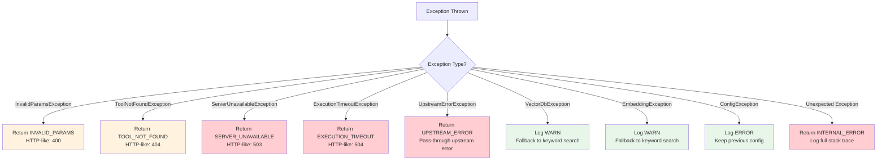

**Exception Hierarchy:**

```kotlin
// Base exception
sealed class McpOrchestratorException(
    val errorCode: String,
    override val message: String,
    override val cause: Throwable? = null
) : Exception(message, cause)

// Client errors (input validation)
class InvalidParamsException(message: String) :
    McpOrchestratorException("INVALID_PARAMS", message)

// Tool not found
class ToolNotFoundException(toolName: String) :
    McpOrchestratorException("TOOL_NOT_FOUND",
        "Tool '$toolName' is not registered. Use find_tools to discover available tools.")

// Server unavailable
class ServerUnavailableException(toolName: String, serverName: String, status: ServerState) :
    McpOrchestratorException("SERVER_UNAVAILABLE",
        "Server hosting '$toolName' is currently unavailable. Status: $status.")

// Execution timeout
class ExecutionTimeoutException(toolName: String, timeoutSeconds: Int) :
    McpOrchestratorException("EXECUTION_TIMEOUT",
        "Tool execution timed out after ${timeoutSeconds}s.")

// Upstream error (pass-through)
class UpstreamErrorException(message: String, val upstreamServer: String) :
    McpOrchestratorException("UPSTREAM_ERROR", "Upstream error: $message")

// Infrastructure errors (non-fatal, trigger fallback)
class VectorDbUnavailableException(cause: Throwable) :
    McpOrchestratorException("VECTOR_DB_UNAVAILABLE",
        "Vector DB is unavailable, using keyword fallback", cause)

class EmbeddingServiceException(cause: Throwable) :
    McpOrchestratorException("EMBEDDING_SERVICE_ERROR",
        "Embedding service unavailable", cause)
```


---

## 6. Integration Design

### 6.1 External System: Upstream MCP Servers

| Attribute | Value |
|-----------|-------|
| Protocol | MCP (Model Context Protocol) over JSON-RPC 2.0 |
| Transport | stdio (subprocess) or HTTP/SSE |
| Authentication | Per-server via environment variables (API keys, tokens) |
| Timeout | 30s (configurable per-server) |
| Retry Policy | 1 retry for transient errors (configurable) |
| Circuit Breaker | Max 5 reconnect attempts → ERROR state |

**Outbound MCP Methods:**

| Method | Purpose | When Used |
|--------|---------|-----------|
| `initialize` | Establish MCP session | On connection |
| `tools/list` | Retrieve tool definitions | During indexing |
| `tools/call` | Execute a tool | During `execute_dynamic_tool` |
| `ping` | Health check | Periodic monitoring |

**stdio Connection Lifecycle:**

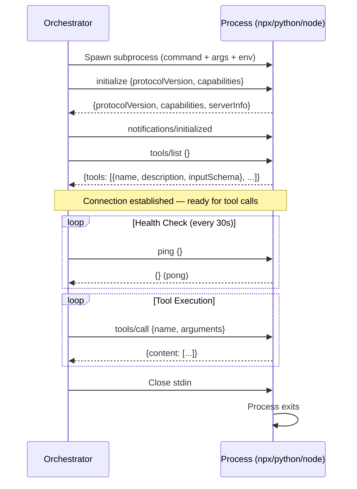

**HTTP Connection Lifecycle:**

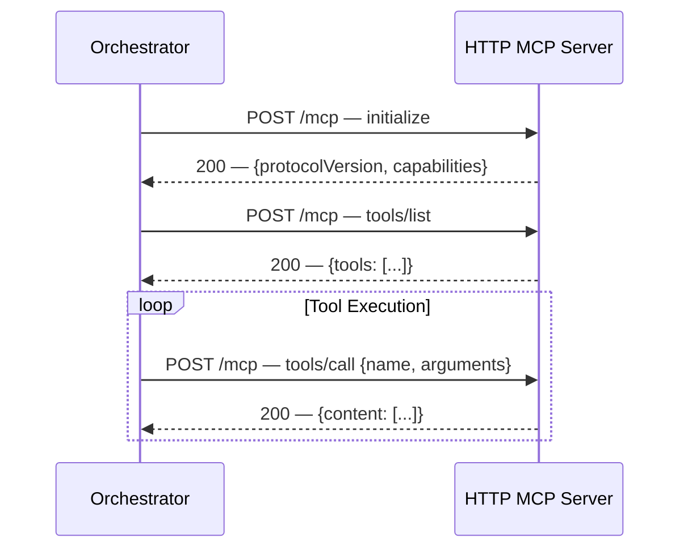

### 6.2 External System: OpenAI Embedding API

| Attribute | Value |
|-----------|-------|
| Protocol | HTTPS REST |
| Endpoint | `https://api.openai.com/v1/embeddings` |
| Authentication | Bearer token (`Authorization: Bearer {OPENAI_API_KEY}`) |
| Timeout | 10s |
| Retry Policy | 2 retries with exponential backoff (1s, 2s) |
| Rate Limit | 3,000 RPM (batch requests to stay under) |

**Request:**

```json
POST https://api.openai.com/v1/embeddings
Authorization: Bearer sk-...
Content-Type: application/json

{
  "model": "text-embedding-3-small",
  "input": ["Read application log files and return recent entries", "Create a new Jira issue"],
  "dimensions": 768
}
```

**Response:**

```json
{
  "object": "list",
  "data": [
    { "object": "embedding", "index": 0, "embedding": [0.0023, -0.0091, ...] },
    { "object": "embedding", "index": 1, "embedding": [0.0015, -0.0082, ...] }
  ],
  "model": "text-embedding-3-small",
  "usage": { "prompt_tokens": 24, "total_tokens": 24 }
}
```

**Batching Strategy:**
- Batch up to 100 tool descriptions per API call during indexing
- Single embedding per call during `find_tools` (real-time query)
- Track token usage for cost monitoring

### 6.3 External System: Qdrant Vector Database

| Attribute | Value |
|-----------|-------|
| Protocol | HTTP REST (gRPC optional) |
| Endpoint | `http://localhost:6333` (configurable) |
| Authentication | API Key (optional, header: `api-key`) |
| Timeout | 5s |
| Retry Policy | 1 retry for connection errors |

**Key API Calls:**

| Operation | Method | Endpoint | Description |
|-----------|--------|----------|-------------|
| Create Collection | PUT | `/collections/mcp_tools` | Initialize on first startup |
| Check Collection | GET | `/collections/mcp_tools` | Verify collection exists |
| Upsert Points | PUT | `/collections/{name}/points` | Add/update tool vectors |
| Search | POST | `/collections/{name}/points/search` | ANN similarity search |
| Delete by Filter | POST | `/collections/{name}/points/delete` | Remove server's tools |
| Health Check | GET | `/healthz` | Qdrant health status |

### 6.4 External System: Kiro AI IDE (Inbound)

| Attribute | Value |
|-----------|-------|
| Protocol | MCP JSON-RPC 2.0 |
| Transport | stdio (primary), HTTP (alternative) |
| Direction | Inbound — Kiro calls the Orchestrator |
| Authentication | None (local transport security) |

**Exposed MCP Capabilities:**

```json
{
  "capabilities": {
    "tools": {}
  },
  "serverInfo": {
    "name": "mcp-orchestrator",
    "version": "1.0.0"
  }
}
```

---

## 7. Security Design

### 7.1 Authentication

| Connection | Auth Method | Details |
|-----------|-------------|---------|
| Kiro IDE → Orchestrator | None | Local stdio transport — OS process isolation provides security |
| Orchestrator → OpenAI API | Bearer Token | `Authorization: Bearer {OPENAI_API_KEY}` from environment variable |
| Orchestrator → Qdrant | API Key (optional) | `api-key` header, from environment variable |
| Orchestrator → Upstream (stdio) | Per-server env vars | API keys injected via subprocess environment |
| Orchestrator → Upstream (HTTP) | Per-server headers | Configurable auth headers per server |

### 7.2 Authorization

Since the Orchestrator runs locally as a single-user tool, there is no multi-tenant authorization model. All requests from Kiro IDE have full access to both tools.

| Role | Endpoints | Permissions |
|------|-----------|-------------|
| Kiro IDE (AI Agent) | `find_tools`, `execute_dynamic_tool` | Full access |
| Administrator | Config files, process management | OS-level access |

### 7.3 Data Protection

| Data Type | At Rest | In Transit | In Logs |
|-----------|---------|------------|---------|
| API Keys (OpenAI, Jira, etc.) | Environment variables only — never in config files | TLS 1.2+ (HTTPS) | **Excluded** — never logged |
| Upstream server credentials | Environment variable injection to subprocess | TLS for HTTP servers | **Excluded** |
| Tool execution arguments | Not persisted | JSON-RPC (local stdio or HTTPS) | **Excluded** — only tool_name logged |
| Tool descriptions | Qdrant (plaintext payload) | HTTP to Qdrant (local) | Truncated to 100 chars |
| Vector embeddings | Qdrant (float arrays) | HTTP to Qdrant (local) | Not logged |
| Query strings | Not persisted | JSON-RPC (local) | Truncated to 100 chars |

### 7.4 Input Validation

| Field | Validation | Sanitization |
|-------|-----------|--------------|
| `find_tools.query` | Non-empty, max 2000 chars, trimmed | Trim whitespace |
| `find_tools.top_k` | Integer, range 1–20 | Clamp to range |
| `find_tools.threshold` | Float, range 0.0–1.0 | Clamp to range |
| `execute_dynamic_tool.tool_name` | Non-empty string | Exact match (no normalization) |
| `execute_dynamic_tool.arguments` | Optional JSON object, validated against tool's input_schema (if enabled) | Pass-through to upstream |
| Config file paths | Must be valid YAML/JSON | Reject invalid syntax |
| Server names in config | Non-empty, alphanumeric + hyphens | Reject invalid characters |

### 7.5 Secrets Management

```yaml
# application.yml — secrets via environment variable references
orchestrator:
  embedding:
    api_key: ${OPENAI_API_KEY}  # NEVER hardcode
  upstream_servers:
    - name: jira-server
      env:
        JIRA_TOKEN: ${JIRA_TOKEN}  # Injected to subprocess
```

**Rules:**
1. All secrets referenced via `${ENV_VAR}` syntax in config files
2. Config files committed to VCS must NOT contain actual secret values
3. Subprocess environment variables are set programmatically, never logged
4. Log sanitization: any string matching `sk-*`, `token=*`, `key=*` patterns is redacted

---

## 8. Performance & Scalability

### 8.1 Caching Strategy

| Cache | What | TTL | Eviction | Technology |
|-------|------|-----|----------|------------|
| ToolRegistry | Tool-to-server mapping | Indefinite (updated on index/health) | Manual invalidation on re-index | In-memory ConcurrentHashMap |
| Embedding Cache | Query → embedding vector | 5 minutes | LRU, max 100 entries | In-memory LinkedHashMap |
| Connection Pool | Active MCP connections | Session lifetime | On disconnect/error | In-memory map |

**Embedding Cache Rationale:** Repeated identical queries (common in AI agent loops) should not re-call the OpenAI API. A small LRU cache with 5-minute TTL saves API calls and reduces latency.

### 8.2 Connection Pooling

| Resource | Min | Max | Timeout | Idle Timeout |
|----------|-----|-----|---------|-------------|
| Ktor HTTP Client (shared) | 1 | 10 | 10s connect | 60s |
| Qdrant connections | 1 | 5 | 5s connect | 30s |
| OpenAI API connections | 1 | 3 | 10s connect | 30s |
| Upstream HTTP connections | 1 per server | 1 per server | 5s connect | Session lifetime |
| Upstream stdio connections | 1 per server | 1 per server | N/A (process) | Session lifetime |

### 8.3 Performance Targets

| Operation | Target | Measurement | Source |
|-----------|--------|-------------|--------|
| `find_tools` end-to-end | < 500ms (p95) | From JSON-RPC request to response | BR-01 |
| `find_tools` — embedding generation | < 200ms (p95) | OpenAI API call duration | Derived |
| `find_tools` — vector search | < 10ms (p95) | Qdrant search duration | Derived |
| `execute_dynamic_tool` proxy overhead | < 100ms | Orchestrator processing time (excl. upstream) | BR-08 |
| Tool indexing (100 tools) | < 5s | Full re-index of one server | FSD §8 |
| Startup time (5 servers) | < 10s | Process start to accepting requests | FSD §8 |
| Memory usage (1000 tools) | < 256 MB heap | JVM heap size | FSD §8 |

### 8.4 Coroutine Architecture

All I/O operations use Kotlin coroutines for non-blocking execution:

```kotlin
// Structured concurrency for parallel server connections
coroutineScope {
    config.upstreamServers.map { serverConfig ->
        async(Dispatchers.IO) {
            connectToServer(serverConfig)
        }
    }.awaitAll()
}

// Timeout for tool execution
withTimeout(config.execution.timeoutSeconds * 1000L) {
    connection.sendRequest("tools/call", params)
}

// Periodic health checks
val healthJob = launch(Dispatchers.IO) {
    while (isActive) {
        delay(config.health.checkIntervalSeconds * 1000L)
        checkAllServers()
    }
}
```

### 8.5 Horizontal Scaling

| Mode | Scalability | Notes |
|------|------------|-------|
| stdio transport | Single instance only | Kiro spawns one Orchestrator process |
| HTTP transport | Multiple instances possible | Requires shared Qdrant, stateless design |

For the initial release (stdio mode), horizontal scaling is not applicable. The system is designed as a single-process, single-user tool. Future HTTP mode could support multiple instances sharing a Qdrant cluster.


---

## 9. Monitoring & Observability

### 9.1 Logging

**Framework:** SLF4J + Logback (Kotlin idiomatic)

**Log Format:**
```
{timestamp} [{level}] [{coroutine-name}] {logger} - {message}
```

| Log Event | Level | Fields | Destination |
|-----------|-------|--------|-------------|
| Server startup | INFO | version, config_path, servers_count | stdout |
| Tool discovery request | INFO | query (truncated 100 chars), top_k, threshold | stdout |
| Tool discovery response | INFO | result_count, search_mode, duration_ms | stdout |
| Tool execution request | INFO | tool_name, server_name | stdout |
| Tool execution response | INFO | tool_name, server_name, duration_ms, success | stdout |
| Server state transition | INFO | server_name, old_state → new_state | stdout |
| Health check | DEBUG | server_name, status, response_time_ms | stdout |
| Config reload | INFO | added_servers, removed_servers, changed_settings | stdout |
| Indexing complete | INFO | server_name, tools_added, tools_removed, duration_ms | stdout |
| Vector DB fallback | WARN | reason, fallback_mode | stdout + stderr |
| Embedding fallback | WARN | reason, fallback_mode | stdout + stderr |
| Server connection failed | ERROR | server_name, error_message | stderr |
| Unhandled exception | ERROR | exception_class, message, stack_trace | stderr |

**Logback Configuration (`logback.xml`):**

```xml
<configuration>
    <appender name="STDOUT" class="ch.qos.logback.core.ConsoleAppender">
        <encoder>
            <pattern>%d{ISO8601} [%level] [%thread] %logger{36} - %msg%n</pattern>
        </encoder>
    </appender>

    <logger name="com.orchestrator.mcp" level="INFO"/>
    <logger name="com.orchestrator.mcp.upstream.HealthMonitor" level="DEBUG"/>
    <logger name="io.ktor" level="WARN"/>

    <root level="INFO">
        <appender-ref ref="STDOUT"/>
    </root>
</configuration>
```

### 9.2 Metrics

| Metric | Type | Description | Alert Threshold |
|--------|------|-------------|-----------------|
| `find_tools.latency_ms` | Histogram | End-to-end find_tools duration | p95 > 500ms |
| `find_tools.result_count` | Histogram | Number of tools returned per query | avg < 1 (poor index) |
| `find_tools.fallback_count` | Counter | Times keyword fallback was used | > 10/hour |
| `execute_tool.latency_ms` | Histogram | Proxy overhead (excl. upstream) | p95 > 100ms |
| `execute_tool.total_latency_ms` | Histogram | Total execution time (incl. upstream) | p95 > 30s |
| `execute_tool.error_count` | Counter | Failed executions by error code | > 5/minute |
| `upstream.server_count` | Gauge | Number of connected servers | 0 (all disconnected) |
| `upstream.tool_count` | Gauge | Total indexed tools | 0 (empty index) |
| `upstream.health_check_failures` | Counter | Failed health checks | > 3 consecutive |
| `embedding.latency_ms` | Histogram | OpenAI API call duration | p95 > 300ms |
| `embedding.token_usage` | Counter | Total tokens consumed | Budget tracking |
| `vectordb.search_latency_ms` | Histogram | Qdrant search duration | p95 > 50ms |
| `config.reload_count` | Counter | Configuration reloads | Informational |

**Implementation:** Metrics collected via Micrometer (Ktor plugin) and exposed via `/metrics` endpoint (Prometheus format) when running in HTTP mode. In stdio mode, metrics are logged periodically.

### 9.3 Health Checks

| Endpoint / Method | Checks | Expected Response |
|----------|--------|-------------------|
| MCP `ping` | Orchestrator process alive | `{}` (empty result) |
| Internal health (logged) | Vector DB, Embedding Service, Upstream Servers | Periodic log entry with status summary |

**Health Summary Log (every 60s):**
```
2026-05-02T10:30:00Z [INFO] [health-summary] HealthMonitor - 
  Servers: 3/5 CONNECTED, 1 DISCONNECTED, 1 ERROR | 
  Tools: 150 indexed | 
  VectorDB: HEALTHY | 
  Embedding: HEALTHY
```

---

## 10. Deployment Considerations

### 10.1 Environment Configuration

| Property | DEV | PROD |
|----------|-----|------|
| `orchestrator.server.transport` | stdio | stdio |
| `orchestrator.discovery.top_k` | 5 | 5 |
| `orchestrator.discovery.similarity_threshold` | 0.6 | 0.7 |
| `orchestrator.execution.timeout_seconds` | 60 | 30 |
| `orchestrator.embedding.provider` | openai | openai |
| `orchestrator.embedding.model` | text-embedding-3-small | text-embedding-3-small |
| `orchestrator.vector_db.provider` | faiss | qdrant |
| `orchestrator.vector_db.host` | — | localhost |
| `orchestrator.vector_db.port` | — | 6333 |
| `orchestrator.health.check_interval_seconds` | 60 | 30 |
| `OPENAI_API_KEY` | dev key | prod key |

### 10.2 Feature Flags

| Flag | Default | Description |
|------|---------|-------------|
| `orchestrator.execution.validate_arguments` | true | Enable/disable JSON Schema validation of tool arguments |
| `orchestrator.discovery.fallback_to_keyword` | true | Enable keyword search fallback when Vector DB is down |
| `orchestrator.health.auto_reconnect` | true | Enable automatic reconnection to disconnected servers |
| `orchestrator.embedding.cache_enabled` | true | Enable in-memory embedding cache |

### 10.3 Startup Sequence

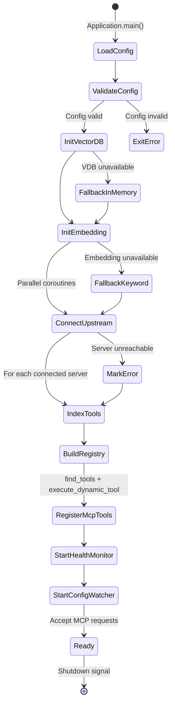

### 10.4 Rollback Strategy

Since this is a greenfield project with no existing data to migrate:

1. **Binary rollback:** Replace the JAR/distribution with the previous version
2. **Config rollback:** Restore previous `application.yml` from version control
3. **Vector DB:** Qdrant collection is rebuilt on startup — no migration needed
4. **In-memory state:** Rebuilt on startup — no persistence to roll back

### 10.5 Build & Distribution

```kotlin
// build.gradle.kts
plugins {
    kotlin("jvm") version "2.3.20"
    kotlin("plugin.serialization") version "2.3.20"
    id("io.ktor.plugin") version "3.4.0"
    application
}

application {
    mainClass.set("com.orchestrator.mcp.ApplicationKt")
}

// Distribution: ./gradlew installDist → build/install/mcp-orchestrator/
// Fat JAR: ./gradlew buildFatJar → build/libs/mcp-orchestrator-all.jar
```

**Kiro IDE Configuration (`mcp.json`):**

```json
{
  "mcpServers": {
    "mcp-orchestrator": {
      "command": "java",
      "args": ["-jar", "/path/to/mcp-orchestrator-all.jar"],
      "env": {
        "OPENAI_API_KEY": "sk-..."
      }
    }
  }
}
```

---

## 11. E2E Test Architecture

### 11.1 Framework & Language

- **Framework**: JUnit 5 + Ktor Test Host (for integration tests), manual E2E via MCP client
- **Language**: Kotlin (matches project's main language)
- **API test client**: Ktor HTTP Client (for HTTP transport tests)
- **MCP test client**: Custom `TestMcpClient` class that communicates via stdio/HTTP
- **Note**: E2E tests run against a fully started Orchestrator instance with mock upstream servers

### 11.2 E2E Test Module Structure

```
e2e-tests/
├── build.gradle.kts
├── src/test/kotlin/com/orchestrator/mcp/e2e/
│   ├── McpOrchestratorE2ETest.kt          # Main E2E test class
│   ├── FindToolsE2ETest.kt                # find_tools scenarios
│   ├── ExecuteToolE2ETest.kt              # execute_dynamic_tool scenarios
│   ├── HealthMonitorE2ETest.kt            # Health check + reconnect scenarios
│   ├── ConfigReloadE2ETest.kt             # Hot-reload scenarios
│   ├── support/
│   │   ├── TestMcpClient.kt              # MCP client for sending JSON-RPC
│   │   ├── MockUpstreamServer.kt         # Mock MCP server (stdio + HTTP)
│   │   ├── TestQdrantContainer.kt        # Testcontainers for Qdrant
│   │   └── TestConfig.kt                 # Test configuration helpers
│   └── fixtures/
│       ├── tool-definitions.json          # Sample tool definitions
│       └── test-config.yml                # Test application.yml
```

### 11.3 Reusable Components

- **TestMcpClient**: Sends JSON-RPC messages to the Orchestrator via stdio pipe or HTTP. Handles `initialize` handshake, `tools/list`, and `tools/call` methods.
- **MockUpstreamServer**: Simulates an upstream MCP server. Configurable tool definitions, response delays, and error injection. Supports both stdio and HTTP transport.
- **TestQdrantContainer**: Testcontainers wrapper for spinning up a real Qdrant instance during E2E tests.
- **TestConfig**: Generates `application.yml` with mock server configurations pointing to `MockUpstreamServer` instances.

### 11.4 E2E Test Scenarios

| ID | Scenario | Description |
|----|----------|-------------|
| E2E-01 | Full discovery flow | Start Orchestrator → index mock tools → find_tools query → verify results |
| E2E-02 | Full execution flow | find_tools → execute_dynamic_tool → verify upstream received correct call |
| E2E-03 | Keyword fallback | Start without Qdrant → find_tools → verify keyword search works |
| E2E-04 | Server disconnect/reconnect | Kill mock server → verify DISCONNECTED → restart → verify CONNECTED + re-indexed |
| E2E-05 | Config hot-reload | Modify config → verify new server connected, removed server disconnected |
| E2E-06 | Concurrent requests | Send 50 find_tools in parallel → verify all return within 500ms |
| E2E-07 | Execution timeout | Mock server with 60s delay → verify EXECUTION_TIMEOUT error |
| E2E-08 | Tool not found | execute_dynamic_tool with nonexistent tool → verify TOOL_NOT_FOUND |

---

## 12. Appendix

### 12.1 Glossary

| Term | Definition |
|------|------------|
| MCP | Model Context Protocol — open standard for AI tool communication |
| Orchestrator | The MCP Orchestration Server being designed in this document |
| Upstream Server | An external MCP Server that hosts actual tools |
| Tool Definition | Metadata describing a tool: name, description, input_schema |
| Vector DB | Vector Database for semantic similarity search (Qdrant/FAISS) |
| Embedding | Dense vector representation of text for semantic search |
| Top-K | The K most similar results from a vector search |
| JSON-RPC | JSON Remote Procedure Call — MCP wire protocol |
| ANN | Approximate Nearest Neighbor — fast vector search algorithm |
| HNSW | Hierarchical Navigable Small World — graph-based ANN index |
| Context Window | The limited token budget available to an AI model per request |

### 12.2 FSD Requirement → TDD Design Mapping

| FSD Requirement | TDD Section | Design Decision |
|----------------|-------------|-----------------|
| UC-01: find_tools | §3.2 | Semantic search via Qdrant + keyword fallback |
| UC-02: execute_dynamic_tool | §3.3 | Proxy via McpConnection interface (stdio/HTTP) |
| UC-03: Tool Registration | §5.1 (ToolIndexer) | Batch embedding + upsert on startup/config change |
| UC-04: Configuration | §5.1 (ConfigurationManager) | YAML parsing + file watcher for hot-reload |
| UC-05: Health Monitoring | §5.1 (HealthMonitor) | Coroutine-based periodic checks + state machine |
| BR-01: <500ms find_tools | §8.3 | Embedding cache + HNSW index |
| BR-05: Keyword fallback | §5.2 (KeywordSearchEngine) | In-memory TF-IDF over ToolRegistry |
| BR-08: <100ms proxy overhead | §8.3 | Direct JSON-RPC forwarding, minimal processing |
| BR-14: Incremental indexing | §6.2 (Processing Logic) | Diff-based upsert/delete |
| BR-24: Exponential backoff | §5.1 (HealthMonitor) | 1s, 2s, 4s, 8s... with max attempts |
| FSD §4: Data Model | §4 | Qdrant collection + in-memory registry |
| FSD §7: Security | §7 | Env var secrets, no auth for local stdio |
| FSD §8: NFR | §8 | Coroutine-first, caching, connection pooling |
| FSD §9: Error Handling | §5.6 | Sealed exception hierarchy with error codes |

### 12.3 Open Questions

| # | Question | Status | Answer |
|---|----------|--------|--------|
| 1 | Should we support HuggingFace local embeddings in v1.0? | Open | Deferred to v1.1 — OpenAI API is sufficient for initial release |
| 2 | Should Qdrant run as Docker container or embedded? | Resolved | Docker container for prod, FAISS for local dev |
| 3 | Maximum number of upstream servers tested? | Open | Target 50, need load testing to validate |
| 4 | Should we support MCP resources and prompts in addition to tools? | Open | Out of scope for v1.0, tools only |
| 5 | gRPC vs REST for Qdrant communication? | Resolved | REST — simpler, sufficient for <10K vectors |

### 12.4 Diagram Index

| # | Diagram | File | Section |
|---|---------|------|---------|
| 1 | Architecture Diagram | [architecture.drawio](diagrams/architecture.drawio) / [.png](diagrams/architecture.png) | §2.1 |
| 2 | Component Diagram | [component.drawio](diagrams/component.drawio) / [.png](diagrams/component.png) | §2.2 |
| 3 | Deployment Diagram | [deployment.drawio](diagrams/deployment.drawio) / [.png](diagrams/deployment.png) | §2.3 |
| 4 | API Sequence — find_tools | [api-sequence-find-tools.drawio](diagrams/api-sequence-find-tools.drawio) / [.png](diagrams/api-sequence-find-tools.png) | §3.2 |
| 5 | API Sequence — execute_dynamic_tool | [api-sequence-execute-tool.drawio](diagrams/api-sequence-execute-tool.drawio) / [.png](diagrams/api-sequence-execute-tool.png) | §3.3 |
| 6 | Database Schema | [db-schema.drawio](diagrams/db-schema.drawio) / [.png](diagrams/db-schema.png) | §4.1 |
| 7 | Class Diagram | [class-diagram.drawio](diagrams/class-diagram.drawio) / [.png](diagrams/class-diagram.png) | §5.3 |

### 12.5 NEW Dependencies (Not in Existing Project)

| Dependency | Purpose | Justification |
|-----------|---------|---------------|
| `io.qdrant:client` | Qdrant Java/Kotlin client | Primary vector DB — no existing alternative in project |
| `ch.qos.logback:logback-classic` | Logging implementation | Standard SLF4J backend for JVM applications |
| `com.charleskorn.kaml:kaml` | YAML parsing for kotlinx.serialization | Config file parsing — kotlinx.serialization doesn't support YAML natively |
| `org.testcontainers:qdrant` | Qdrant container for E2E tests | Integration testing with real Qdrant instance |
