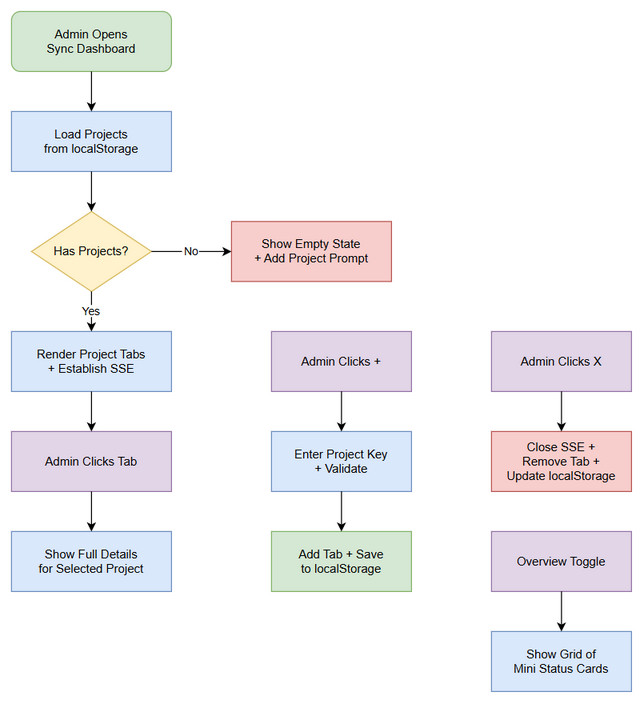

# Business Requirements Document (BRD)

## MCP Orchestrator — MTO-63: Sync Dashboard — Multi-Project Support

---

## Document Information

| Field | Value |
|-------|-------|
| Jira Ticket | MTO-63 |
| Title | Sync Dashboard — Multi-Project Support |
| Author | BA Agent |
| Version | 1.0 |
| Date | 2026-05-17 |
| Status | Draft |

---

## Author Tracking

| Role | Name - Position | Responsibility |
|------|-----------------|----------------|
| Author | BA Agent – Business Analyst | Create document |
| Peer Reviewer | SA Agent – Solution Architect | Review document |

---

## Revision History

| Version | Date | Author | Changes |
|---------|------|--------|---------|
| 1.0 | 2026-05-17 | BA Agent | Initiate document — auto-generated from Jira ticket MTO-63 |

---

## Sign-Off

| Name | Signature and date |
|------|--------------------|
| | ☐ I agree and confirm all criteria on this BRD as expected requirements |
| | ☐ I agree and confirm all criteria on this BRD as expected requirements |

---

## 1. Introduction

### 1.1 Scope

Hiện tại Sync Dashboard chỉ hỗ trợ monitor 1 project tại 1 thời điểm. Admin phải nhập project key thủ công và chỉ thấy status của project đó. Feature này mở rộng dashboard để hỗ trợ monitor nhiều projects đồng thời thông qua hệ thống tabs, cho phép admin quản lý tất cả projects từ một giao diện duy nhất.

### 1.2 Out of Scope

- Sync scheduling UI (covered by MTO-65 hoặc future ticket)
- Historical sync charts (covered by MTO-64)
- Error details modal with retry (covered by MTO-65)
- Backend sync engine changes — chỉ UI changes
- Mobile-first responsive design (covered by MTO-66)

### 1.3 Preliminary Requirement

- Sync Dashboard hiện tại đã hoạt động với single-project monitoring (MTO-21 — Done)
- SSE endpoint `/sync/live` đã available
- REST API `/sync/status/{projectKey}`, `/sync/start`, `/sync/stop` đã available
- User authentication (JWT) đã implemented (MTO-94 — Done)

---

## 2. Business Requirements

### 2.1 High Level Process Map

Admin mở Sync Dashboard → thấy danh sách project tabs đang monitor → có thể add/remove projects → click tab để xem chi tiết → mỗi project có SSE connection riêng để nhận real-time updates → trạng thái persist qua localStorage.

### 2.2 List of User Stories / Use Cases

| # | Story / Use Case | Priority | Source Ticket |
|---|------------------|----------|---------------|
| 1 | As an admin, I want to see project tabs at the top so that I can switch between projects quickly | MUST HAVE | MTO-63 |
| 2 | As an admin, I want to add a new project tab so that I can start monitoring additional projects | MUST HAVE | MTO-63 |
| 3 | As an admin, I want each tab to show sync status badge so that I can see at-a-glance which projects need attention | MUST HAVE | MTO-63 |
| 4 | As an admin, I want to click a tab to see full details so that I can investigate specific project sync status | MUST HAVE | MTO-63 |
| 5 | As an admin, I want an overview mode with mini status cards so that I can see all projects at once | SHOULD HAVE | MTO-63 |
| 6 | As an admin, I want to remove a project from monitoring so that I can declutter my dashboard | MUST HAVE | MTO-63 |
| 7 | As an admin, I want my project list persisted in localStorage so that I don't lose my setup on page reload | MUST HAVE | MTO-63 |

---

### 2.3 Details of User Stories

---

#### Business Flow

**Step 1:** Admin opens Sync Dashboard — system loads persisted project list from localStorage

**Step 2:** System renders project tabs at top of dashboard. If no projects saved, show empty state with "Add Project" prompt.

**Step 3:** For each project tab, system establishes SSE connection (or uses single connection with project filter) to receive real-time sync updates.

**Step 4:** Each tab displays: project key, sync status badge (idle/running/error), last sync time.

**Step 5:** Admin clicks a tab → dashboard content area shows full details for that project (progress bar, status cards, queue status, event log).

**Step 6:** Admin clicks "+" button → input dialog appears → admin enters project key → new tab added → SSE connection established.

**Step 7:** Admin clicks "X" on a tab → project removed from monitoring → SSE connection closed → localStorage updated.

**Step 8:** Admin clicks "Overview" toggle → grid view shows all projects as mini status cards simultaneously.

> **Note:** All state changes (add/remove project, active tab) are persisted to localStorage immediately.

---

#### STORY 1: Project Tabs Display

> As an admin, I want to see project tabs at the top so that I can switch between projects quickly.

**Requirement Details:**

1. Tab bar rendered horizontally at the top of the dashboard, below the header
2. Each tab shows: project key text (e.g., "MTO"), status indicator dot (green=idle, yellow=running, red=error)
3. Active tab is visually highlighted (different background/border)
4. Tabs are scrollable horizontally if many projects added (overflow with scroll arrows)
5. Tab order matches the order projects were added (newest on right)

**Acceptance Criteria:**

1. Given I have 3 projects monitored, when I open the dashboard, then I see 3 tabs with project keys
2. Given a project is syncing, when I look at its tab, then I see a yellow status dot
3. Given I have more tabs than fit the viewport, when I look at the tab bar, then I can scroll horizontally

**UI Specifications:**

| No. | Name | Type | Required | Description | Note |
|-----|------|------|----------|-------------|------|
| 1 | Tab Bar | Container | Yes | Horizontal scrollable container for project tabs | Below header, above content |
| 2 | Project Tab | Button | Yes | Clickable tab with project key + status dot | Active state highlighted |
| 3 | Status Dot | Indicator | Yes | 8px circle: green (idle), yellow (running), red (error) | Inside tab, left of text |
| 4 | Add Tab Button | Button | Yes | "+" icon button at end of tab bar | Opens add project dialog |

---

#### STORY 2: Add Project Tab

> As an admin, I want to add a new project tab so that I can start monitoring additional projects.

**Requirement Details:**

1. "+" button at the end of the tab bar
2. Clicking "+" shows an inline input field (not a modal) where admin types project key
3. Press Enter or click confirm → project added as new tab
4. System validates project key is not empty and not already in the list
5. After adding, the new tab becomes active and SSE connection is established
6. Project list saved to localStorage immediately

**Data Fields:**

| Field | Type | Required | Description | Example |
|-------|------|----------|-------------|---------|
| projectKey | String | Yes | Jira project key (uppercase letters) | MTO, SCRUM, KSA |

**Acceptance Criteria:**

1. Given I click "+", when I type "SCRUM" and press Enter, then a new "SCRUM" tab appears and becomes active
2. Given "MTO" tab already exists, when I try to add "MTO" again, then I see a validation error "Project already monitored"
3. Given I add a project, when I reload the page, then the project tab is still there

**Validation Rules:**

- Project key must be non-empty
- Project key must be uppercase letters only (regex: `^[A-Z][A-Z0-9_]+$`)
- Project key must not already exist in the monitored list
- Maximum 10 projects can be monitored simultaneously

**Error Handling:**

- Empty project key: Show inline error "Please enter a project key"
- Duplicate project: Show inline error "Project already monitored"
- Max projects reached: Show inline error "Maximum 10 projects. Remove one to add another."

---

#### STORY 3: Tab Status Badge

> As an admin, I want each tab to show sync status badge so that I can see at-a-glance which projects need attention.

**Requirement Details:**

1. Each tab displays a colored status indicator reflecting current sync state
2. Status updates in real-time via SSE events
3. Status states: idle (green), running (yellow/animated), error (red), disconnected (gray)
4. Last sync time shown as tooltip on hover

**Acceptance Criteria:**

1. Given project MTO is syncing, when I look at the MTO tab, then I see a yellow pulsing dot
2. Given project SCRUM had an error, when I look at the SCRUM tab, then I see a red dot
3. Given I hover over a tab, when the tooltip appears, then I see "Last sync: 10:30 AM"

---

#### STORY 4: Tab Click — Full Details View

> As an admin, I want to click a tab to see full details so that I can investigate specific project sync status.

**Requirement Details:**

1. Clicking a tab switches the main content area to show that project's details
2. Content area shows: progress bar, status cards (status, synced issues, last sync), queue badges, event log
3. Start/Stop sync buttons operate on the currently active project
4. Content area is identical to current single-project view but scoped to selected project
5. Tab switch is instant (no page reload) — data cached per project

**Acceptance Criteria:**

1. Given I have MTO and SCRUM tabs, when I click SCRUM tab, then the content area shows SCRUM's sync status
2. Given I'm viewing MTO details, when I click Start Sync, then sync starts for MTO (not other projects)
3. Given I switch from MTO to SCRUM tab, when I switch back to MTO, then MTO's data is still there (cached)

---

#### STORY 5: Overview Mode — Grid of Mini Status Cards

> As an admin, I want an overview mode with mini status cards so that I can see all projects at once.

**Requirement Details:**

1. Toggle button "Overview" / "Detail" in the header area
2. Overview mode shows a responsive grid of mini cards (one per project)
3. Each mini card shows: project key, status badge, synced count, last sync time
4. Clicking a mini card switches to detail view for that project
5. Grid layout: auto-fit, minimum 200px per card

**Data Fields (Mini Card):**

| Field | Type | Required | Description | Example |
|-------|------|----------|-------------|---------|
| projectKey | String | Yes | Project identifier | MTO |
| status | Enum | Yes | idle/running/error/disconnected | running |
| syncedIssues | Number | Yes | Count of synced issues | 42 |
| totalIssues | Number | Yes | Total issues in project | 50 |
| lastSyncAt | DateTime | No | Last completed sync timestamp | 2026-05-17T10:30:00Z |

**Acceptance Criteria:**

1. Given I have 4 projects, when I click "Overview", then I see a 2x2 grid of mini cards
2. Given I'm in overview mode, when I click a card, then I switch to detail view for that project
3. Given a project has error status, when I look at overview, then that card has red border/indicator

**UI Specifications:**

| No. | Name | Type | Required | Description | Note |
|-----|------|------|----------|-------------|------|
| 1 | View Toggle | Button | Yes | Toggle between "Overview" and "Detail" modes | In header area |
| 2 | Mini Card | Card | Yes | Compact project status card | 200px min width |
| 3 | Card Grid | Container | Yes | CSS Grid with auto-fit | Responsive columns |

---

#### STORY 6: Remove Project from Monitoring

> As an admin, I want to remove a project from monitoring so that I can declutter my dashboard.

**Requirement Details:**

1. Each tab has an "X" close button (visible on hover or always visible)
2. Clicking "X" removes the project tab
3. SSE connection for that project is closed/unsubscribed
4. localStorage updated immediately
5. If removing the active tab, switch to the next tab (or previous if last)
6. If removing the last project, show empty state

**Acceptance Criteria:**

1. Given I have 3 tabs, when I click "X" on the middle tab, then it's removed and the next tab becomes active
2. Given I remove a project, when I reload the page, then that project is no longer in my tabs
3. Given I remove the last project, when the tab bar is empty, then I see "Add a project to start monitoring"

**Error Handling:**

- Cannot remove while sync is running for that project: Show confirmation "Sync is running for {project}. Remove anyway?" (Yes/No)

---

#### STORY 7: Persist Projects in localStorage

> As an admin, I want my project list persisted in localStorage so that I don't lose my setup on page reload.

**Requirement Details:**

1. localStorage key: `sync_dashboard_projects`
2. Stored as JSON array of project objects: `[{ key: "MTO", addedAt: "..." }, ...]`
3. Active tab index also persisted: `sync_dashboard_active_tab`
4. View mode (overview/detail) persisted: `sync_dashboard_view_mode`
5. On page load: read localStorage → restore tabs → restore active tab → establish SSE connections

**Data Fields (localStorage):**

| Field | Type | Required | Description | Example |
|-------|------|----------|-------------|---------|
| sync_dashboard_projects | JSON Array | Yes | List of monitored projects | `[{"key":"MTO","addedAt":"2026-05-17"}]` |
| sync_dashboard_active_tab | Number | No | Index of active tab | 0 |
| sync_dashboard_view_mode | String | No | "overview" or "detail" | "detail" |

**Acceptance Criteria:**

1. Given I add 3 projects, when I reload the page, then all 3 tabs are restored
2. Given I'm on the 2nd tab, when I reload, then the 2nd tab is still active
3. Given I'm in overview mode, when I reload, then I'm still in overview mode
4. Given localStorage is empty (first visit), when I open dashboard, then I see empty state with "Add Project" prompt

---

## 3. Dependencies

| Dependency | Type | Related Ticket | Description |
|------------|------|----------------|-------------|
| Sync Dashboard (existing) | System | MTO-21 (Done) | Current single-project sync dashboard must be working |
| SSE endpoint `/sync/live` | System | MTO-21 (Done) | Real-time sync events via Server-Sent Events |
| REST API `/sync/status/{key}` | System | MTO-21 (Done) | Polling endpoint for sync status |
| REST API `/sync/start` | System | MTO-21 (Done) | Start sync for a project |
| REST API `/sync/stop` | System | MTO-21 (Done) | Stop sync for a project |
| JWT Authentication | System | MTO-94 (Done) | User must be authenticated to access dashboard |
| User Credentials check | System | MTO-94 (Done) | Jira credentials must be configured before syncing |

---

## 4. Stakeholders

| Role | Name / Team | Responsibility | Source |
|------|-------------|----------------|--------|
| Product Owner | Duc Nguyen | Define requirements, accept/reject | Jira reporter |
| Developer | Dev Team | Implement UI changes | — |
| QA | QA Team | Test multi-project functionality | — |

---

## 5. Risks and Assumptions

### 5.1 Risks

| Risk | Impact | Likelihood | Mitigation |
|------|--------|------------|------------|
| Multiple SSE connections may overload server | Medium | Low | Use single SSE connection with project filter, or limit max projects to 10 |
| localStorage quota exceeded with many projects | Low | Very Low | Each project entry is ~100 bytes; 10 projects = 1KB — well within 5MB limit |
| Tab switching performance with many active syncs | Medium | Low | Cache project data in memory; only active tab renders full detail |
| SSE reconnection storms when multiple projects disconnect | Medium | Medium | Implement exponential backoff per project connection |

### 5.2 Assumptions

- Backend SSE endpoint can handle multiple concurrent connections from same user (one per project)
- Alternatively, backend supports project filter parameter on single SSE connection
- All existing sync APIs work correctly for any valid project key
- Admin has Jira credentials configured for all projects they want to monitor
- Maximum 10 projects is sufficient for typical admin use case

---

## 6. Non-Functional Requirements

| Category | Requirement | Details |
|----------|-------------|---------|
| Performance | Tab switch < 100ms | Switching between project tabs must be instant (cached data) |
| Performance | Max 10 concurrent SSE connections | Limit to prevent server overload |
| Usability | Keyboard navigation | Tab/Shift+Tab to navigate between project tabs |
| Accessibility | WCAG AA compliance | Tabs must have proper ARIA roles (tablist, tab, tabpanel) |
| Storage | localStorage < 5KB | Project list + preferences must fit within reasonable storage |
| Reliability | SSE auto-reconnect | Each project connection auto-reconnects with exponential backoff |
| Compatibility | Same browser support as existing dashboard | Chrome, Firefox, Edge (latest 2 versions) |

---

## 7. Related Tickets

| Ticket Key | Summary | Status | Type | Relationship |
|------------|---------|--------|------|--------------|
| MTO-63 | Sync Dashboard — Multi-Project Support | Docs Review | Story | Main ticket |
| MTO-55 | Phase 5 — UI Enhancement & Usability Upgrade | To Do | Epic | Parent epic |
| MTO-64 | Sync Dashboard — Historical Sync Charts | To Do | Story | Related (same page) |
| MTO-65 | Sync Dashboard — Error Details & Retry UI | To Do | Story | Related (same page) |
| MTO-66 | UI Shared — Responsive Design & Mobile Support | To Do | Story | Related (responsive) |
| MTO-21 | Jira Sync Engine | Done | Story | Dependency (sync backend) |
| MTO-94 | Per-User Credentials Epic | Done | Epic | Dependency (auth) |

---

## 8. Appendix

### Glossary

| Term | Definition |
|------|------------|
| SSE | Server-Sent Events — one-way real-time communication from server to browser |
| Sync | Process of fetching Jira issues and storing them in local knowledge base |
| Project Key | Uppercase identifier for a Jira project (e.g., MTO, SCRUM) |
| localStorage | Browser-side key-value storage persisted across sessions |

### Reference Documents

| Document | Link / Location |
|----------|-----------------|
| Existing Sync Dashboard | `orchestrator-server/src/main/resources/static/sync-dashboard.html` |
| Design System | `DESIGN-SYSTEM.md` |
| MTO-55 Epic Description | Jira MTO-55 |

### Diagram Index

| # | Diagram | Image | Source (editable) |
|---|---------|-------|-------------------|
| 1 | Business Flow | [business-flow.png](diagrams/business-flow.png) | [business-flow.drawio](diagrams/business-flow.drawio) |
| 2 | Use Case Diagram | [use-case.png](diagrams/use-case.png) | [use-case.drawio](diagrams/use-case.drawio) |
