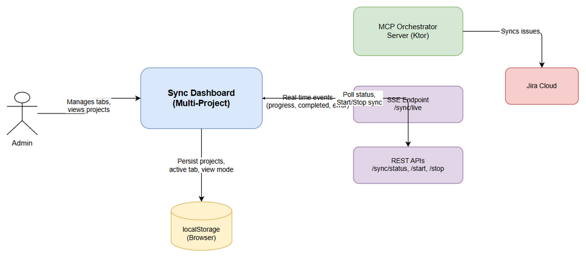
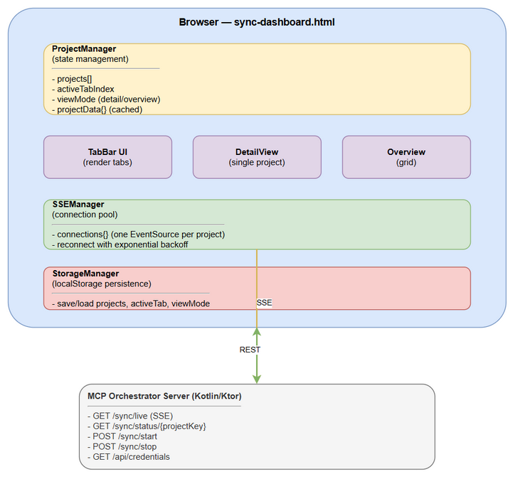
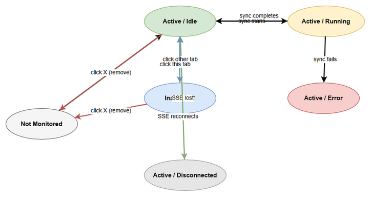
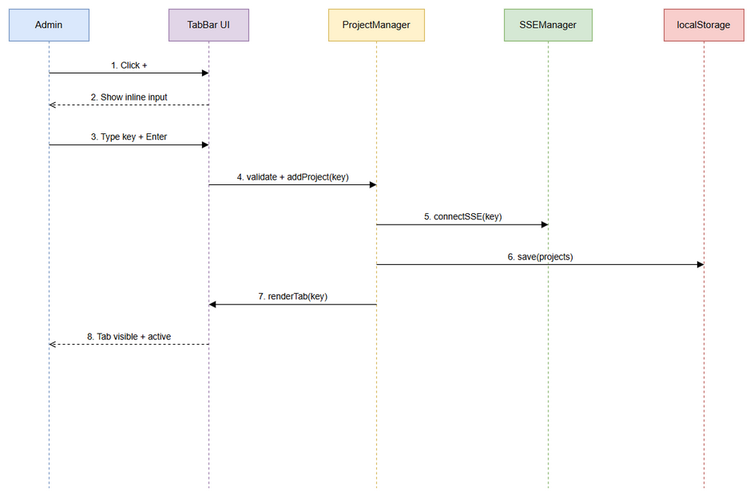

# Functional Specification Document (FSD)

## MCP Orchestrator — MTO-63: Sync Dashboard — Multi-Project Support

---

## Document Information

| Field | Value |
|-------|-------|
| Jira Ticket | MTO-63 |
| Title | Sync Dashboard — Multi-Project Support |
| Author | BA Agent + TA Agent |
| Version | 1.0 |
| Date | 2026-05-17 |
| Status | Draft |
| Related BRD | BRD-v1-MTO-63.docx |

---

## Revision History

| Version | Date | Author | Changes |
|---------|------|--------|---------|
| 1.0 | 2026-05-17 | BA Agent | Initiate document from BRD |
| 1.0 | 2026-05-17 | TA Agent | Enriched with API contracts, technical specs |

---

## 1. Introduction

### 1.1 Purpose

This FSD specifies the functional behavior of the Multi-Project Support feature for the Sync Dashboard. It transforms the current single-project dashboard into a multi-project monitoring interface with tab-based navigation, overview mode, and persistent state.

### 1.2 Scope

- Frontend-only changes to `sync-dashboard.html`
- No backend API changes required (existing APIs support any project key)
- SSE connection management for multiple projects
- localStorage-based state persistence

### 1.3 Definitions & Acronyms

| Term | Definition |
|------|------------|
| SSE | Server-Sent Events — one-way real-time server-to-browser communication |
| Tab | UI element representing a monitored project |
| Overview Mode | Grid view showing all projects simultaneously as mini cards |
| Detail Mode | Full view showing one project's complete sync status |

### 1.4 References

| Document | Location |
|----------|----------|
| BRD | BRD-v1-MTO-63.docx |
| Existing Dashboard | orchestrator-server/src/main/resources/static/sync-dashboard.html |
| Design System | DESIGN-SYSTEM.md |

---

## 2. System Overview

### 2.1 System Context Diagram

The Sync Dashboard (browser) communicates with:
- **SSE Server** (`/sync/live`) — receives real-time sync progress events
- **REST API** (`/sync/status/{key}`, `/sync/start`, `/sync/stop`) — polling and control
- **Credentials API** (`/api/credentials`) — checks if Jira credentials configured
- **localStorage** — persists project list and preferences client-side

### 2.2 System Architecture

*[Edit in draw.io](diagrams/architecture-overview.drawio)*

---

## 3. Functional Requirements

### 3.1 Feature: Project Tab Management

**Source:** BRD Stories 1, 2, 6, 7

#### 3.1.1 Description

A horizontal tab bar at the top of the dashboard allows admins to manage multiple monitored projects. Each tab represents one project and shows its current sync status. Tabs can be added, removed, and switched.

#### 3.1.2 Use Cases

**Use Case ID:** UC-01
**Name:** Add Project to Monitoring
**Actor:** Admin
**Preconditions:** Admin is authenticated, dashboard is loaded
**Postconditions:** New project tab visible, SSE connection established, localStorage updated

**Main Flow:**

| Step | Actor | System | Description |
|------|-------|--------|-------------|
| 1 | Clicks "+" button | | Admin initiates add project |
| 2 | | Shows inline input field | Input appears at end of tab bar |
| 3 | Types project key, presses Enter | | Admin enters "SCRUM" |
| 4 | | Validates input | Check non-empty, uppercase, not duplicate, max 10 |
| 5 | | Adds tab, establishes SSE | New tab rendered, connection opened |
| 6 | | Saves to localStorage | Project list persisted |
| 7 | | Activates new tab | Content area shows new project details |

**Alternative Flows:**

| ID | Condition | Steps |
|----|-----------|-------|
| AF-01 | Admin presses Escape during input | Input field hidden, no project added |
| AF-01b | Admin clicks outside input field | Input field hidden, no project added |

**Exception Flows:**

| ID | Condition | Steps |
|----|-----------|-------|
| EF-01 | Empty project key | Show inline error "Please enter a project key" |
| EF-02 | Duplicate project key | Show inline error "Project already monitored" |
| EF-03 | Max 10 projects reached | Show inline error "Maximum 10 projects. Remove one to add another." |
| EF-04 | Invalid format (lowercase, special chars) | Show inline error "Project key must be uppercase letters/numbers" |

---

**Use Case ID:** UC-02
**Name:** Remove Project from Monitoring
**Actor:** Admin
**Preconditions:** At least one project tab exists
**Postconditions:** Tab removed, SSE closed, localStorage updated

**Main Flow:**

| Step | Actor | System | Description |
|------|-------|--------|-------------|
| 1 | Clicks "X" on a tab | | Admin initiates removal |
| 2 | | Checks if sync running | If running, show confirmation |
| 3 | | Closes SSE connection | EventSource closed for that project |
| 4 | | Removes tab from UI | Tab disappears |
| 5 | | Updates localStorage | Project removed from persisted list |
| 6 | | Activates adjacent tab | Next tab (or previous if last) becomes active |

**Alternative Flows:**

| ID | Condition | Steps |
|----|-----------|-------|
| AF-02 | Removing last project | Show empty state with "Add a project to start monitoring" |
| AF-02b | Removing active tab | Activate next tab; if none, activate previous |

**Exception Flows:**

| ID | Condition | Steps |
|----|-----------|-------|
| EF-05 | Sync running for project | Show confirmation dialog "Sync is running. Remove anyway?" |
| EF-05a | User confirms removal | Proceed with removal (sync continues server-side) |
| EF-05b | User cancels | No action taken |

---

**Use Case ID:** UC-03
**Name:** Switch Active Project Tab
**Actor:** Admin
**Preconditions:** Multiple project tabs exist
**Postconditions:** Content area shows selected project details

**Main Flow:**

| Step | Actor | System | Description |
|------|-------|--------|-------------|
| 1 | Clicks a project tab | | Admin selects different project |
| 2 | | Highlights clicked tab | Visual active state applied |
| 3 | | Loads cached project data | From in-memory cache |
| 4 | | Renders detail view | Progress, cards, badges, log for selected project |
| 5 | | Saves active tab index | localStorage updated |

**Alternative Flows:**

| ID | Condition | Steps |
|----|-----------|-------|
| AF-03 | No cached data yet (just added) | Show loading state, poll /sync/status/{key} |

---

**Use Case ID:** UC-04
**Name:** Toggle Overview/Detail Mode
**Actor:** Admin
**Preconditions:** At least one project tab exists
**Postconditions:** View mode switched, localStorage updated

**Main Flow:**

| Step | Actor | System | Description |
|------|-------|--------|-------------|
| 1 | Clicks "Overview" toggle | | Admin switches view |
| 2 | | Hides detail view | Single-project content hidden |
| 3 | | Shows grid of mini cards | One card per project |
| 4 | | Saves view mode | localStorage updated |

**Alternative Flows:**

| ID | Condition | Steps |
|----|-----------|-------|
| AF-04 | Admin clicks a mini card | Switch to detail mode for that project |
| AF-04b | Admin clicks "Detail" toggle | Return to single-project detail view |

---

#### 3.1.3 Business Rules

| Rule ID | Rule | Source |
|---------|------|--------|
| BR-01 | Maximum 10 projects can be monitored simultaneously | BRD Story 2 |
| BR-02 | Project key must match pattern `^[A-Z][A-Z0-9_]+$` | BRD Story 2 |
| BR-03 | Duplicate project keys are not allowed | BRD Story 2 |
| BR-04 | Removing active tab activates adjacent tab (next preferred, then previous) | BRD Story 6 |
| BR-05 | All state changes persist to localStorage immediately | BRD Story 7 |
| BR-06 | SSE connection established per project on add, closed on remove | BRD Story 3 |
| BR-07 | Tab switch must be < 100ms (cached data) | BRD NFR |
| BR-08 | SSE reconnects with exponential backoff (1s, 2s, 4s, 8s, max 30s) | BRD NFR |

#### 3.1.4 Data Specifications

**localStorage Schema:**

| Key | Type | Default | Description |
|-----|------|---------|-------------|
| `sync_dashboard_projects` | JSON Array | `[]` | `[{ "key": "MTO", "addedAt": "2026-05-17T10:00:00Z" }]` |
| `sync_dashboard_active_tab` | Number | `0` | Index of active tab |
| `sync_dashboard_view_mode` | String | `"detail"` | `"detail"` or `"overview"` |

**In-Memory Project Data Cache:**

| Field | Type | Description |
|-------|------|-------------|
| projectKey | String | Project identifier |
| status | String | "IDLE" / "RUNNING" / "COMPLETED" / "FAILED" |
| syncedIssues | Number | Count of synced issues |
| totalIssues | Number | Total issues in project |
| percentage | Number | Progress percentage (0-100) |
| lastSyncAt | String (ISO) | Last completed sync timestamp |
| events | Array | Recent event log entries (max 50) |
| sseConnection | EventSource | Active SSE connection reference |
| reconnectAttempts | Number | Current reconnect attempt count |

#### 3.1.5 UI Specifications

**Screen: Sync Dashboard — Multi-Project**

| No. | Element | Type | Required | Behavior | Validation |
|-----|---------|------|----------|----------|------------|
| 1 | Tab Bar | Container | Yes | Horizontal, scrollable, below header | — |
| 2 | Project Tab | Button | Yes | Click → switch active project. Shows key + status dot | — |
| 3 | Status Dot | Indicator | Yes | 8px circle. Green=idle, Yellow=running (pulse animation), Red=error, Gray=disconnected | — |
| 4 | Add Button (+) | Button | Yes | Click → show inline input | Disabled if 10 projects |
| 5 | Close Button (X) | Button | Yes | Click → remove project. Visible on hover | Confirm if sync running |
| 6 | Inline Input | Text Input | Conditional | Shown when + clicked. Enter=confirm, Esc=cancel | Non-empty, uppercase, not duplicate |
| 7 | View Toggle | Button | Yes | Toggle "Overview" ↔ "Detail" | — |
| 8 | Overview Grid | Container | Conditional | CSS Grid, auto-fit, min 200px. Shows mini cards | Only in overview mode |
| 9 | Mini Card | Card | Conditional | Shows: key, status badge, synced/total, last sync | Click → detail mode |
| 10 | Detail Content | Container | Conditional | Existing dashboard content scoped to active project | Only in detail mode |
| 11 | Empty State | Container | Conditional | "Add a project to start monitoring" + large + button | Only when no projects |

**Tab States:**

| State | Visual | Trigger |
|-------|--------|---------|
| Active | Highlighted background, bold text | User clicks tab |
| Inactive | Default background | Another tab is active |
| Running | Yellow pulsing dot | SSE progress event received |
| Error | Red dot | SSE error event received |
| Idle | Green dot | SSE completed event or no active sync |
| Disconnected | Gray dot | SSE connection lost |

#### 3.1.6 API Contracts (Functional View)

**Endpoint:** `GET /sync/status/{projectKey}`
**Purpose:** Poll current sync status for a specific project

**Input Parameters:**

| Parameter | Type | Required | Business Rule | Description |
|-----------|------|----------|---------------|-------------|
| projectKey | Path String | Yes | BR-02 | Jira project key |

**Output Data:**

| Field | Type | Description |
|-------|------|-------------|
| status | String | "IDLE" / "RUNNING" / "COMPLETED" / "FAILED" |
| projectKey | String | Echo of requested project key |
| syncedIssues | Number | Issues synced so far |
| totalIssues | Number | Total issues to sync |
| percentage | Number | Progress 0-100 |
| lastSyncAt | String (ISO) | Last completed sync time |

**Business Error Scenarios:**

| Scenario | User Message | Trigger Condition |
|----------|-------------|-------------------|
| Project not found | No error shown; card shows "No data" | Project never synced before |
| Auth expired | Redirect to login | JWT token expired |

---

**Endpoint:** `GET /sync/live` (SSE)
**Purpose:** Real-time sync progress events

**SSE Event Data:**

| Field | Type | Description |
|-------|------|-------------|
| type | String | "progress" / "completed" / "error" / "attachment_processed" |
| projectKey | String | Which project this event belongs to |
| message | String | Human-readable event description |
| syncedIssues | Number | (progress) Current synced count |
| totalIssues | Number | (progress) Total count |
| percentage | Number | (progress) Progress percentage |

**Multi-Project Filtering:**
- Current SSE endpoint sends events for ALL projects the user has access to
- Client-side filtering: match `event.projectKey` to monitored projects list
- Events for non-monitored projects are ignored

---

**Endpoint:** `POST /sync/start`
**Purpose:** Start sync for a specific project

**Input:**

| Field | Type | Required | Description |
|-------|------|----------|-------------|
| projectKey | String | Yes | Project to sync |
| fullSync | Boolean | No | Force full re-sync (default: false) |

**Output:**

| Field | Type | Description |
|-------|------|-------------|
| message | String | Confirmation message |
| status | String | "started" / "already_running" |

---

**Endpoint:** `POST /sync/stop`
**Purpose:** Stop sync for a specific project

**Input:**

| Field | Type | Required | Description |
|-------|------|----------|-------------|
| projectKey | String | Yes | Project to stop |

**Output:**

| Field | Type | Description |
|-------|------|-------------|
| message | String | Confirmation message |

---

## 4. Data Model

### 4.1 Client-Side Data (No Database Changes)

This feature is entirely client-side. No database schema changes required.

**localStorage Entities:**

| Entity | Key | Structure |
|--------|-----|-----------|
| Project List | `sync_dashboard_projects` | `[{ key: String, addedAt: String(ISO) }]` |
| Active Tab | `sync_dashboard_active_tab` | `Number (index)` |
| View Mode | `sync_dashboard_view_mode` | `String ("detail" \| "overview")` |

**In-Memory State:**

| Entity | Lifecycle | Description |
|--------|-----------|-------------|
| ProjectData | Per session | Cached sync status per project (lost on reload) |
| SSE Connections | Per session | EventSource instances per project |

---

## 5. Integration Specifications

### 5.1 External System: SSE Server

| Attribute | Value |
|-----------|-------|
| Purpose | Real-time sync progress updates |
| Direction | Inbound (server → browser) |
| Data Format | JSON (SSE event data) |
| Frequency | Real-time (event-driven) |

**Connection Management:**

| Scenario | Behavior |
|----------|----------|
| Project added | Open new EventSource to `/sync/live` |
| Project removed | Close EventSource |
| Connection lost | Reconnect with exponential backoff (1s, 2s, 4s, 8s, max 30s) |
| Page reload | Re-establish all connections from localStorage project list |

**Note:** Single SSE connection receives events for all projects. Client filters by `projectKey`.

### 5.2 External System: REST API

| Attribute | Value |
|-----------|-------|
| Purpose | Poll status and control sync |
| Direction | Bidirectional |
| Data Format | JSON |
| Frequency | On-demand (user action) + polling every 10s for active project |

---

## 6. Processing Logic

### 6.1 Page Initialization

**Trigger:** DOMContentLoaded event
**Input:** localStorage data
**Output:** Rendered tabs, established connections

**Processing Steps:**

| Step | Description | Error Handling |
|------|-------------|----------------|
| 1 | Read `sync_dashboard_projects` from localStorage | If null/invalid → empty array |
| 2 | Read `sync_dashboard_active_tab` from localStorage | If null/invalid → 0 |
| 3 | Read `sync_dashboard_view_mode` from localStorage | If null/invalid → "detail" |
| 4 | Render tab bar with project tabs | — |
| 5 | Establish SSE connection (single) | On error → retry with backoff |
| 6 | Poll `/sync/status/{key}` for each project | On 404 → show "No data" |
| 7 | Activate saved tab index | If index out of bounds → activate 0 |
| 8 | Render appropriate view (detail/overview) | — |
| 9 | Check Jira credentials | If missing → show warning banner |

### 6.2 SSE Event Processing

**Trigger:** SSE message received
**Input:** Event data with projectKey
**Output:** Updated UI for matching project

**Processing Steps:**

| Step | Description | Error Handling |
|------|-------------|----------------|
| 1 | Parse event JSON | On parse error → log and ignore |
| 2 | Check if `event.projectKey` is in monitored list | If not → ignore event |
| 3 | Update in-memory cache for that project | — |
| 4 | Update tab status dot for that project | — |
| 5 | If that project is active tab → update detail view | — |
| 6 | If in overview mode → update mini card for that project | — |
| 7 | Add event to project's event log (max 50 entries) | — |

### 6.3 Tab Switch

**Trigger:** User clicks a project tab
**Input:** Tab index
**Output:** Content area updated

**Processing Steps:**

| Step | Description | Error Handling |
|------|-------------|----------------|
| 1 | Set activeTabIndex = clicked index | — |
| 2 | Update tab bar visual state | — |
| 3 | Load cached data for selected project | If no cache → show loading |
| 4 | Render detail view with cached data | — |
| 5 | Save activeTabIndex to localStorage | On storage error → ignore |

---

## 7. Security Requirements

### 7.1 Authentication & Authorization

| Role | Permissions | Screens/Features |
|------|-------------|-------------------|
| Admin (authenticated) | Full access | All dashboard features |
| Unauthenticated | No access | Redirect to login |

### 7.2 Data Sensitivity

| Data Type | Classification | Business Requirement |
|-----------|---------------|---------------------|
| Project keys | Internal | Not sensitive — just identifiers |
| Sync status | Internal | Operational data, no PII |
| localStorage data | Internal | Stored client-side, no secrets |

---

## 8. Non-Functional Requirements

| Category | Business Requirement | Acceptance Criteria |
|----------|---------------------|---------------------|
| Performance | Tab switch instant | < 100ms response time |
| Performance | SSE events processed without lag | < 50ms per event processing |
| Scalability | Support up to 10 projects | No degradation with 10 tabs |
| Reliability | SSE auto-reconnect | Reconnects within 30s max |
| Accessibility | WCAG AA | Proper ARIA roles on tabs |
| Storage | Minimal localStorage usage | < 5KB total |

---

## 9. Error Handling (User-Facing)

### 9.1 Error Scenarios

| Scenario | Severity | User Message | Expected Behavior |
|----------|----------|-------------|-------------------|
| SSE connection lost | Warning | Yellow "Reconnecting..." badge on affected tab | Auto-reconnect with backoff |
| All SSE connections lost | Warning | "Connection lost. Reconnecting..." banner | Auto-reconnect all |
| Invalid project key input | Info | Inline error below input | User corrects input |
| Max projects reached | Info | "Maximum 10 projects" inline error | User removes one first |
| localStorage full | Warning | Console warning only | Graceful degradation (state not persisted) |
| API 401 (token expired) | Critical | Redirect to login | User re-authenticates |
| API 404 (project not found) | Info | "No sync data" in detail view | User can still monitor (will show data when sync starts) |

---

## 10. Testing Considerations

### 10.1 Test Scenarios

| ID | Scenario | Input | Expected Output | Priority |
|----|----------|-------|-----------------|----------|
| TC-01 | Add first project | Click +, type "MTO", Enter | Tab appears, SSE connected | High |
| TC-02 | Add duplicate project | Add "MTO" when "MTO" exists | Error "Project already monitored" | High |
| TC-03 | Add 11th project | 10 projects exist, click + | Error "Maximum 10 projects" | Medium |
| TC-04 | Remove project | Click X on tab | Tab removed, SSE closed | High |
| TC-05 | Remove active tab | Click X on active tab | Next tab becomes active | High |
| TC-06 | Remove last project | Only 1 tab, click X | Empty state shown | Medium |
| TC-07 | Switch tabs | Click inactive tab | Content switches instantly | High |
| TC-08 | Overview mode | Click "Overview" toggle | Grid of mini cards shown | Medium |
| TC-09 | Persist on reload | Add projects, reload page | Same tabs restored | High |
| TC-10 | SSE reconnect | Kill SSE connection | Auto-reconnects, dot turns gray then green | Medium |
| TC-11 | Real-time update | Start sync on project | Tab dot turns yellow, progress updates | High |
| TC-12 | Remove while syncing | Click X on running project | Confirmation dialog shown | Medium |

---

## 11. Appendix

### State Diagram — Tab Lifecycle

*[Edit in draw.io](diagrams/tab-state.drawio)*

### Sequence Diagram — Add Project Flow

*[Edit in draw.io](diagrams/sequence-add-project.drawio)*

### Diagram Index

| # | Diagram | Image | Source (editable) |
|---|---------|-------|-------------------|
| 1 | System Context | [system-context.png](diagrams/system-context.png) | [system-context.drawio](diagrams/system-context.drawio) |
| 2 | Architecture Overview | [architecture-overview.png](diagrams/architecture-overview.png) | [architecture-overview.drawio](diagrams/architecture-overview.drawio) |
| 3 | Tab State Diagram | [tab-state.png](diagrams/tab-state.png) | [tab-state.drawio](diagrams/tab-state.drawio) |
| 4 | Sequence — Add Project | [sequence-add-project.png](diagrams/sequence-add-project.png) | [sequence-add-project.drawio](diagrams/sequence-add-project.drawio) |

### Change Log from BRD

- Clarified SSE strategy: single connection with client-side filtering (not multiple connections)
- Added exponential backoff parameters: 1s, 2s, 4s, 8s, max 30s
- Added empty state UI specification
- Added confirmation dialog for removing project with active sync
