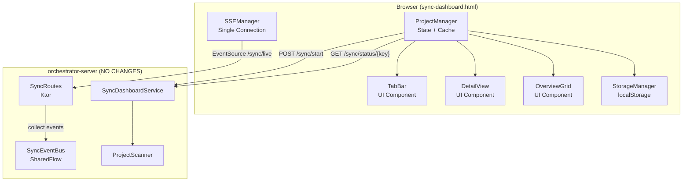
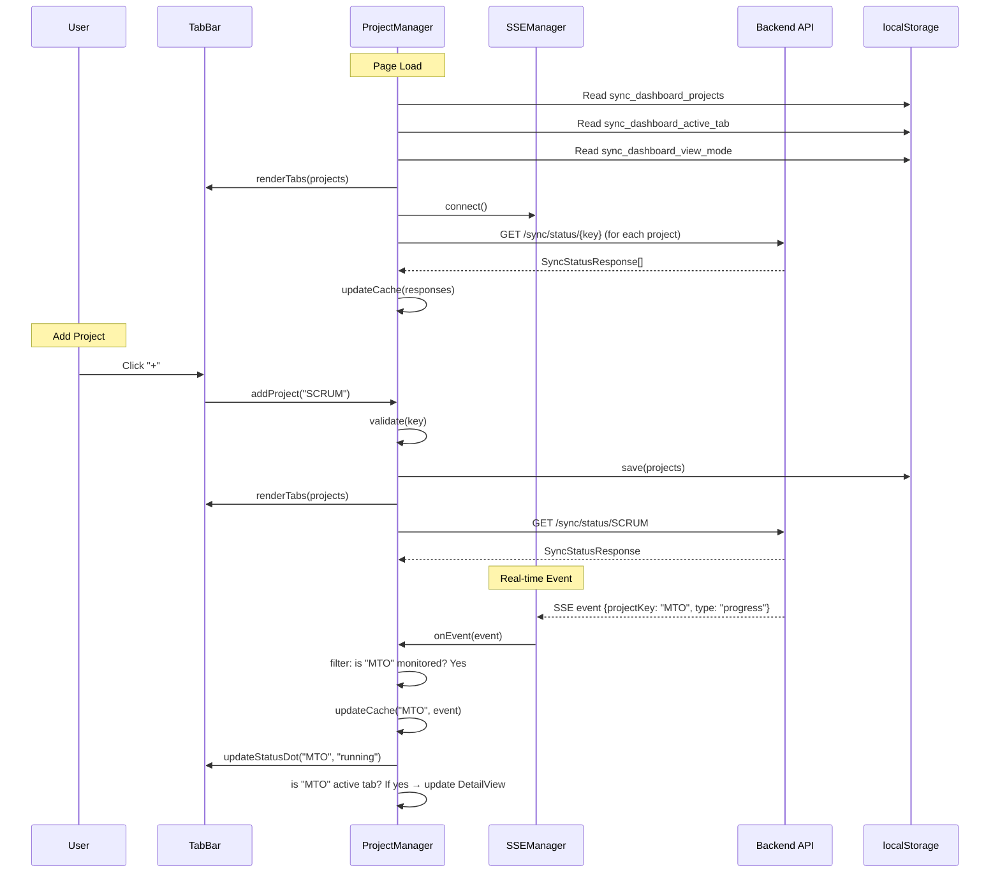
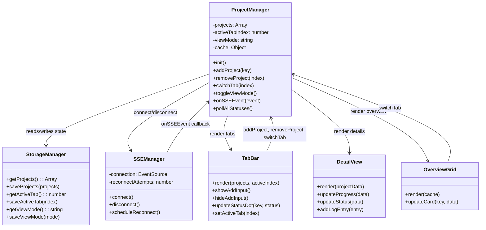
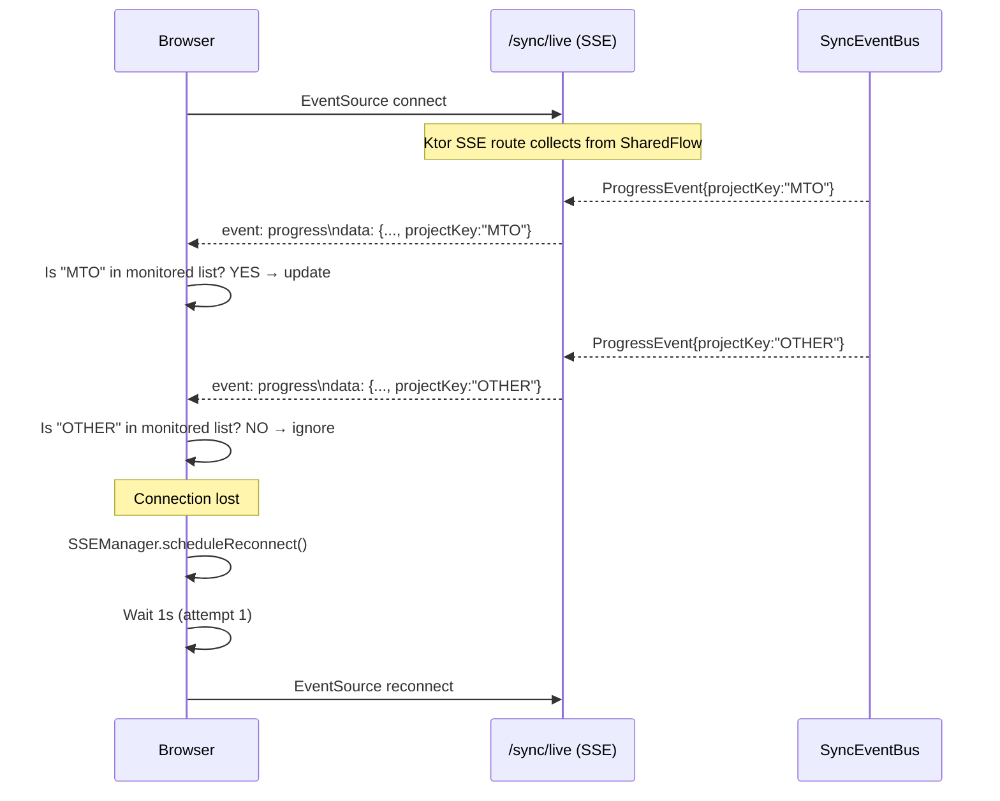
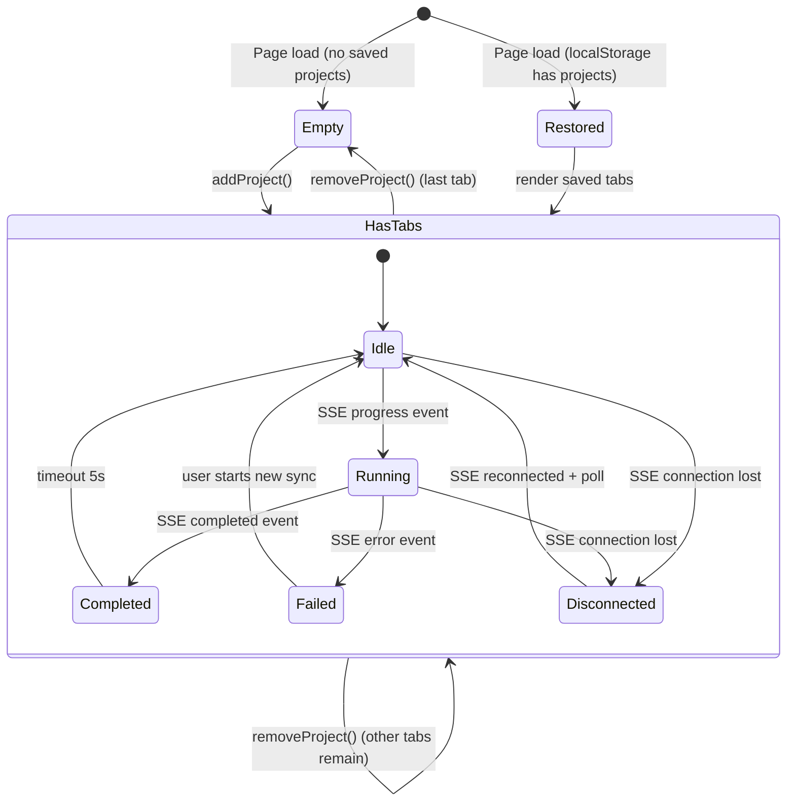

# Technical Design Document (TDD)

## MCP Orchestrator — MTO-63: Sync Dashboard — Multi-Project Support

---

## Document Information

| Field | Value |
|-------|-------|
| Jira Ticket | MTO-63 |
| Title | Sync Dashboard — Multi-Project Support |
| Author | SA Agent |
| Version | 1.0 |
| Date | 2026-07-06 |
| Status | Draft |
| Related BRD | BRD-v1-MTO-63.docx |
| Related FSD | FSD-v1-MTO-63.docx |

---

## Revision History

| Version | Date | Author | Changes |
|---------|------|--------|---------|
| 1.0 | 2026-07-06 | SA Agent | Initial TDD — frontend architecture for multi-project tabs |

---

## 1. Introduction

### 1.1 Purpose

This TDD specifies the technical implementation of multi-project support for the Sync Dashboard. The feature transforms the existing single-project dashboard (`sync-dashboard.html`) into a tab-based multi-project monitoring interface with persistent state and real-time SSE updates.

### 1.2 Scope

- **Frontend-only changes** to `orchestrator-server/src/main/resources/static/sync-dashboard.html`
- No backend API changes — existing APIs already support multi-project (verified via code analysis)
- Client-side state management, SSE filtering, and localStorage persistence

### 1.3 Design Principles

1. **Zero backend changes** — Backend SSE (`SyncEventBus` SharedFlow) already emits events with `projectKey`; client filters
2. **Single SSE connection** — One `EventSource` to `/sync/live`, client-side filtering by `projectKey`
3. **In-memory cache** — Per-project data cached in JS objects; lost on reload (re-fetched via polling)
4. **Immediate persistence** — All state changes (tabs, active index, view mode) saved to localStorage synchronously
5. **Progressive enhancement** — Existing single-project UX preserved as "detail mode" for one tab

### 1.4 Technology Stack

| Layer | Technology | Version |
|-------|-----------|---------|
| Frontend | Vanilla JavaScript (ES6+) | — |
| Real-time | Server-Sent Events (EventSource API) | — |
| Persistence | localStorage | — |
| Styling | CSS Custom Properties (existing design system) | — |
| Backend (unchanged) | Kotlin + Ktor 3.4.0 | — |
| SSE Backend (unchanged) | SyncEventBus (SharedFlow) | — |

### 1.5 References

| Document | Location |
|----------|----------|
| BRD | `documents/MTO-63/BRD.md` |
| FSD | `documents/MTO-63/FSD.md` |
| Current Dashboard | `orchestrator-server/src/main/resources/static/sync-dashboard.html` |
| SyncEventBus | `orchestrator-server/.../dashboard/SyncEventBus.kt` |
| SyncRoutes (SSE) | `orchestrator-server/.../dashboard/SyncRoutes.kt` |

---

## 2. System Architecture

### 2.1 Architecture Overview

No backend changes. The existing architecture already supports multi-project:

- **SSE endpoint** (`GET /sync/live`) streams ALL sync events with `projectKey` field
- **Status endpoint** (`GET /sync/status/{projectKey}`) returns per-project status
- **Batch status** (`GET /sync/status?projects=MTO,SCRUM`) returns multiple statuses
- **Start/Stop** (`POST /sync/start`, `POST /sync/stop`) operate per-project

The frontend refactoring introduces a component-based architecture within the single HTML file.




### 2.2 Component Responsibilities

| Component | Responsibility | Implements |
|-----------|---------------|------------|
| `ProjectManager` | Central state: project list, active tab, view mode, per-project cache | UC-01 to UC-04 |
| `TabBar` | Render tabs, handle click/add/remove, status dots | UC-01, UC-02, UC-03 |
| `DetailView` | Render full project details (progress, cards, badges, log) | UC-03 |
| `OverviewGrid` | Render mini-card grid for all projects | UC-04 |
| `SSEManager` | Single EventSource connection, reconnect logic, event dispatch | BR-06, BR-08 |
| `StorageManager` | Read/write localStorage, validation, migration | BR-05 |

### 2.3 Data Flow



---

## 3. API Design

### 3.1 Existing APIs (No Changes Required)

All APIs already support multi-project. Verified against `SyncRoutes.kt` and `SyncDashboardService.kt`.

#### GET /sync/status/{projectKey}

**Already exists.** Returns sync status for a single project.

```json
// Response 200
{
  "projectKey": "MTO",
  "status": "RUNNING",
  "syncedIssues": 42,
  "totalIssues": 100,
  "percentage": 42,
  "lastSyncAt": "2026-07-06T10:30:00Z",
  "errorMessage": null
}
```

#### GET /sync/status?projects=MTO,SCRUM,KSA

**Already exists** (`handleGetAllStatuses` in `SyncRoutes.kt`). Returns batch status.

```json
// Response 200
{
  "projects": [
    { "projectKey": "MTO", "status": "IDLE", ... },
    { "projectKey": "SCRUM", "status": "RUNNING", ... }
  ],
  "totalProjects": 2
}
```

#### GET /sync/live (SSE)

**Already exists.** Single SSE stream emitting ALL project events. Client filters by `projectKey`.

```
event: progress
data: {"type":"progress","projectKey":"MTO","timestamp":1720000000,"syncedIssues":42,"totalIssues":100,"percentage":42}

event: completed
data: {"type":"completed","projectKey":"SCRUM","timestamp":1720000001,"totalSynced":50,"durationMs":30000}

event: error
data: {"type":"error","projectKey":"KSA","timestamp":1720000002,"message":"Auth failed","phase":"fetch"}
```

#### POST /sync/start

```json
// Request
{ "projectKey": "MTO", "fullSync": false }
// Response 200
{ "success": true, "message": "Sync started for MTO", "projectKey": "MTO" }
```

#### POST /sync/stop

```json
// Request
{ "projectKey": "MTO" }
// Response 200
{ "success": true, "message": "Sync cancelled for MTO", "projectKey": "MTO" }
```

### 3.2 No New Backend Endpoints Needed

The existing `getAllStatuses` endpoint covers the batch polling use case. The SSE endpoint already broadcasts all project events. No new backend code required.

---

## 4. Database Design

**No database changes.** This feature is entirely client-side. All persistence uses browser localStorage.

### 4.1 localStorage Schema

| Key | Type | Max Size | Description |
|-----|------|----------|-------------|
| `sync_dashboard_projects` | JSON Array | ~1KB | `[{"key":"MTO","addedAt":"2026-07-06T10:00:00Z"}]` |
| `sync_dashboard_active_tab` | Number (string) | 2B | Index of active tab (e.g., `"0"`) |
| `sync_dashboard_view_mode` | String | 7B | `"detail"` or `"overview"` |

**Total localStorage usage:** < 2KB for 10 projects (well within 5MB browser limit).

### 4.2 In-Memory Cache Schema

```javascript
// ProjectManager.cache structure
{
  "MTO": {
    projectKey: "MTO",
    status: "RUNNING",       // IDLE | RUNNING | COMPLETED | FAILED
    syncedIssues: 42,
    totalIssues: 100,
    percentage: 42,
    lastSyncAt: "2026-07-06T10:30:00Z",
    errorMessage: null,
    events: [                // Ring buffer, max 50 entries
      { time: "10:30:05", type: "progress", message: "..." }
    ],
    sseStatus: "connected"   // connected | reconnecting | disconnected
  },
  "SCRUM": { ... }
}
```

---

## 5. Class/Module Design

### 5.1 JavaScript Module Structure

All code lives in a single `<script>` block within `sync-dashboard.html` (matching existing pattern). Organized as IIFE with internal modules:

```javascript
(function() {
    'use strict';
    const basePath = window.__MCP_BASE || '';

    // ─── StorageManager ───
    const StorageManager = { ... };

    // ─── SSEManager ───
    const SSEManager = { ... };

    // ─── TabBar ───
    const TabBar = { ... };

    // ─── DetailView ───
    const DetailView = { ... };

    // ─── OverviewGrid ───
    const OverviewGrid = { ... };

    // ─── ProjectManager (orchestrator) ───
    const ProjectManager = { ... };

    document.addEventListener('DOMContentLoaded', () => ProjectManager.init());
})();
```

### 5.2 StorageManager

```javascript
const StorageManager = {
    KEYS: {
        PROJECTS: 'sync_dashboard_projects',
        ACTIVE_TAB: 'sync_dashboard_active_tab',
        VIEW_MODE: 'sync_dashboard_view_mode'
    },

    getProjects() {
        // Returns: [{key: "MTO", addedAt: "..."}] or []
        // Handles: null, invalid JSON, non-array → returns []
    },

    saveProjects(projects) {
        // Saves immediately. Catches QuotaExceededError silently.
    },

    getActiveTab() {
        // Returns: number (0-based index), default 0
        // Validates: if >= projects.length → returns 0
    },

    saveActiveTab(index) { ... },

    getViewMode() {
        // Returns: "detail" or "overview", default "detail"
    },

    saveViewMode(mode) { ... }
};
```

### 5.3 SSEManager

```javascript
const SSEManager = {
    connection: null,        // Single EventSource instance
    reconnectAttempts: 0,
    reconnectTimer: null,
    MAX_RECONNECT_DELAY: 30000,  // 30s cap

    connect() {
        // Opens EventSource to basePath + '/sync/live'
        // Sets onmessage, onerror, onopen handlers
    },

    disconnect() {
        // Closes EventSource, clears reconnect timer
    },

    handleMessage(event) {
        // Parse JSON → dispatch to ProjectManager.onSSEEvent(parsed)
    },

    handleError() {
        // Set status disconnected → schedule reconnect
    },

    handleOpen() {
        // Reset reconnectAttempts → set status connected
    },

    scheduleReconnect() {
        // Exponential backoff: delay = min(1000 * 2^attempts, 30000)
        // Increments reconnectAttempts
        // Calls connect() after delay
    }
};
```

**Reconnect backoff sequence:** 1s → 2s → 4s → 8s → 16s → 30s → 30s → ...

### 5.4 ProjectManager

```javascript
const ProjectManager = {
    projects: [],          // [{key, addedAt}] — source of truth from localStorage
    activeTabIndex: 0,
    viewMode: 'detail',
    cache: {},             // {projectKey: ProjectData}

    init() {
        // 1. Load state from StorageManager
        // 2. Render TabBar
        // 3. Connect SSE
        // 4. Poll initial status for all projects
        // 5. Activate saved tab
        // 6. Render appropriate view
        // 7. Check Jira credentials
        // 8. Start polling interval (10s)
    },

    addProject(key) {
        // Validate: non-empty, uppercase pattern, not duplicate, max 10
        // Add to projects[], save to localStorage
        // Initialize cache entry
        // Poll status for new project
        // Activate new tab
        // Re-render TabBar
    },

    removeProject(index) {
        // If sync running → show confirmation
        // Remove from projects[], cache
        // Save to localStorage
        // Adjust activeTabIndex (BR-04)
        // Re-render TabBar + content
    },

    switchTab(index) {
        // Set activeTabIndex, save to localStorage
        // Re-render TabBar active state
        // Render DetailView with cached data
    },

    toggleViewMode() {
        // Switch detail ↔ overview
        // Save to localStorage
        // Render appropriate view
    },

    onSSEEvent(event) {
        // Filter: is event.projectKey in our monitored list?
        // Update cache for that project
        // Update TabBar status dot
        // If active tab → update DetailView
        // If overview mode → update mini card
    },

    pollAllStatuses() {
        // GET /sync/status?projects=MTO,SCRUM,...
        // Update cache for each response
        // Update UI
    }
};
```

### 5.5 TabBar

```javascript
const TabBar = {
    render(projects, activeIndex) {
        // Render horizontal tab bar with:
        // - Project tabs (key + status dot + close button)
        // - Add button (+)
        // - Bind click handlers
    },

    showAddInput() {
        // Replace + button with inline input
        // Focus input
        // Bind Enter (confirm), Escape (cancel), blur (cancel)
    },

    hideAddInput() { ... },

    updateStatusDot(projectKey, status) {
        // Update dot color without full re-render
        // green=IDLE/COMPLETED, yellow=RUNNING (pulse), red=FAILED, gray=disconnected
    },

    setActiveTab(index) {
        // Update visual active state (CSS class)
    }
};
```

### 5.6 DetailView

```javascript
const DetailView = {
    render(projectData) {
        // Render: progress bar, status cards, queue badges, event log
        // Bind: Start/Stop buttons scoped to active project
        // Identical to current single-project view
    },

    updateProgress(data) { ... },
    updateStatus(data) { ... },
    addLogEntry(entry) { ... },
    showLoading() { ... },
    showNoData() { ... }
};
```

### 5.7 OverviewGrid

```javascript
const OverviewGrid = {
    render(cache) {
        // CSS Grid of mini cards (auto-fit, min 200px)
        // Each card: project key, status badge, synced/total, last sync
        // Click card → ProjectManager.switchTab(index) + set detail mode
    },

    updateCard(projectKey, data) {
        // Update single card without full re-render
    }
};
```

### 5.8 Class Diagram



---

## 6. Integration Design

### 6.1 SSE Connection Strategy

**Single connection, client-side filtering** (confirmed by FSD and backend analysis):



### 6.2 Polling Strategy

| Trigger | Endpoint | Frequency |
|---------|----------|-----------|
| Page load | `GET /sync/status?projects=...` | Once |
| Add project | `GET /sync/status/{key}` | Once |
| Background poll | `GET /sync/status?projects=...` | Every 10s |
| SSE reconnect | `GET /sync/status?projects=...` | Once after reconnect |

### 6.3 Authentication

All API calls use existing `authFetch()` helper (adds `Authorization: Bearer {token}` from localStorage). SSE connection does NOT require auth header (EventSource API limitation) — backend uses session cookie fallback for SSE.

### 6.4 Error Handling — Integration

| Scenario | Detection | Recovery |
|----------|-----------|----------|
| SSE connection lost | `EventSource.onerror` | Exponential backoff reconnect |
| API 401 (token expired) | `authFetch` response check | Redirect to login |
| API 404 (project not found) | Status response | Show "No data" in detail view |
| API 500 (server error) | Fetch catch | Log to console, retry on next poll |
| Network offline | `navigator.onLine` check | Pause polling, show banner |

---

## 7. Security Design

### 7.1 No New Security Concerns

- **Authentication:** Existing JWT-based auth (MTO-94) — no changes
- **Authorization:** All users with valid JWT can access dashboard — no role-based restrictions on this page
- **Data sensitivity:** Project keys and sync status are non-sensitive operational data
- **localStorage:** Contains only project keys and UI preferences — no secrets, no PII
- **XSS prevention:** Project keys validated against `^[A-Z][A-Z0-9_]+$` before rendering — no user-generated HTML

### 7.2 Input Validation (Client-Side)

| Input | Validation | Sanitization |
|-------|-----------|--------------|
| Project key (add) | Regex `^[A-Z][A-Z0-9_]+$` | `trim().toUpperCase()` |
| localStorage data | JSON.parse with try/catch | Fallback to defaults on invalid |
| SSE event data | JSON.parse with try/catch | Ignore malformed events |

---

## 8. Performance & Scalability

### 8.1 Performance Targets

| Metric | Target | Implementation |
|--------|--------|----------------|
| Tab switch | < 100ms | In-memory cache, no API call on switch |
| SSE event processing | < 50ms | Direct DOM updates, no full re-render |
| Page load (10 projects) | < 2s | Batch status poll, parallel |
| Memory (10 projects) | < 5MB | Max 50 events per project in cache |

### 8.2 Optimization Strategies

1. **Minimal DOM updates** — Update only changed elements (status dot, progress bar), not full re-render
2. **Event log ring buffer** — Max 50 entries per project, oldest dropped
3. **Batch polling** — Single `GET /sync/status?projects=...` instead of N individual calls
4. **CSS animations** — Pulse animation on status dot via CSS (no JS timer)
5. **Debounced localStorage writes** — Not needed (writes are < 1ms for < 2KB)

### 8.3 SSE Connection Efficiency

- **Single connection** for all projects (not N connections)
- **Client-side filtering** — O(1) lookup via `Set` of monitored project keys
- **No server-side changes** — Backend already broadcasts all events to all SSE clients

### 8.4 Scalability Limits

| Dimension | Limit | Rationale |
|-----------|-------|-----------|
| Max projects | 10 | BR-01; prevents UI clutter and excessive polling |
| Max events in cache | 50 per project | Memory cap: 10 × 50 = 500 events max |
| Polling interval | 10s | Balance between freshness and server load |
| SSE reconnect max delay | 30s | Prevent thundering herd on server recovery |

---

## 9. Monitoring & Observability

### 9.1 Client-Side Logging

| Event | Log Level | Format |
|-------|-----------|--------|
| SSE connected | info | `[SSE] Connected` |
| SSE disconnected | warn | `[SSE] Disconnected, reconnecting in {delay}ms` |
| SSE reconnect attempt | info | `[SSE] Reconnect attempt {n}` |
| Project added | info | `[Project] Added: {key}` |
| Project removed | info | `[Project] Removed: {key}` |
| Invalid project key | warn | `[Validation] Invalid key: {input}` |
| localStorage error | error | `[Storage] Write failed: {error}` |
| API error | error | `[API] {method} {url} → {status}` |

All logs use `console.log/warn/error` — no external logging service for frontend.

### 9.2 Visual Status Indicators

| Indicator | Location | States |
|-----------|----------|--------|
| SSE connection dot | Header (existing) | Green (connected) / Red (disconnected) |
| Tab status dot | Each tab | Green/Yellow(pulse)/Red/Gray |
| Reconnecting banner | Below header | Shown during SSE reconnect |

---

## 10. Deployment

### 10.1 Deployment Strategy

- **Single file change:** `sync-dashboard.html` — no build step, no bundling
- **Zero-downtime:** Static file served by Ktor; update file → next page load gets new version
- **No migration:** localStorage schema is new keys; existing users get empty state (first visit behavior)
- **Rollback:** Revert single file to previous version

### 10.2 Feature Flags

No feature flags needed. The multi-project UI replaces the single-project UI entirely. If no projects are saved in localStorage, the empty state prompts the user to add a project — functionally equivalent to the old "type project key" UX.

### 10.3 Browser Compatibility

| Browser | Minimum Version | Notes |
|---------|----------------|-------|
| Chrome | 90+ | Full EventSource + localStorage support |
| Firefox | 90+ | Full support |
| Edge | 90+ | Full support |
| Safari | 14+ | Full support |

---

## 11. Implementation Details

### 11.1 HTML Structure Changes

Replace the existing header and add tab bar + view toggle:

```html
<!-- NEW: Tab Bar (below header, above content) -->
<nav class="tab-bar" id="tab-bar" role="tablist" aria-label="Project tabs">
    <!-- Dynamically rendered tabs -->
</nav>

<!-- NEW: View Toggle -->
<div class="view-toggle">
    <button id="btn-view-detail" class="active" aria-pressed="true">Detail</button>
    <button id="btn-view-overview" aria-pressed="false">Overview</button>
</div>

<!-- EXISTING: Detail content (wrapped in tabpanel) -->
<div id="detail-content" role="tabpanel" aria-labelledby="tab-{activeKey}">
    <!-- Existing: progress-section, status-cards, queue-status, error-log -->
</div>

<!-- NEW: Overview Grid (hidden by default) -->
<div id="overview-content" role="tabpanel" style="display:none;">
    <div class="overview-grid" id="overview-grid"></div>
</div>

<!-- NEW: Empty State -->
<div id="empty-state" style="display:none;">
    <p>Add a project to start monitoring</p>
    <button id="btn-add-first">+ Add Project</button>
</div>
```

### 11.2 Tab HTML Template

```html
<!-- Single tab template (rendered by TabBar.render) -->
<button class="project-tab" role="tab"
        id="tab-{key}" aria-controls="detail-content"
        aria-selected="{isActive}" tabindex="{isActive ? 0 : -1}">
    <span class="status-dot {statusClass}"></span>
    <span class="tab-label">{key}</span>
    <span class="tab-close" aria-label="Remove {key}" title="Remove {key}">×</span>
</button>

<!-- Add button (always last in tab bar) -->
<button class="tab-add" id="btn-add-tab" aria-label="Add project" title="Add project">+</button>

<!-- Inline input (shown when + clicked) -->
<input class="tab-input" id="tab-input" type="text"
       placeholder="PROJECT_KEY" maxlength="20"
       pattern="[A-Z][A-Z0-9_]+" aria-label="Enter project key">
```

### 11.3 CSS Additions

```css
/* Tab Bar */
.tab-bar {
    display: flex;
    gap: 4px;
    padding: 8px 0;
    margin-bottom: 16px;
    overflow-x: auto;
    scrollbar-width: thin;
}

.project-tab {
    display: flex;
    align-items: center;
    gap: 6px;
    padding: 8px 12px;
    border-radius: var(--radius);
    border: 1px solid transparent;
    background: var(--surface);
    color: var(--text);
    cursor: pointer;
    white-space: nowrap;
    font-size: 0.85rem;
    transition: background 0.15s;
}

.project-tab[aria-selected="true"] {
    background: var(--card);
    border-color: var(--accent);
    font-weight: 600;
}

.project-tab:hover { background: var(--card); }

.status-dot {
    width: 8px;
    height: 8px;
    border-radius: 50%;
    background: var(--muted);
}
.status-dot.idle { background: var(--success); }
.status-dot.running { background: var(--warning); animation: pulse 1.5s infinite; }
.status-dot.error { background: var(--accent); }
.status-dot.disconnected { background: var(--muted); }

@keyframes pulse {
    0%, 100% { opacity: 1; }
    50% { opacity: 0.4; }
}

.tab-close {
    margin-left: 4px;
    opacity: 0.5;
    font-size: 1rem;
    line-height: 1;
}
.tab-close:hover { opacity: 1; color: var(--accent); }

.tab-add {
    padding: 8px 14px;
    border-radius: var(--radius);
    border: 1px dashed var(--muted);
    background: transparent;
    color: var(--muted);
    cursor: pointer;
    font-size: 1rem;
}
.tab-add:hover { border-color: var(--text); color: var(--text); }

.tab-input {
    padding: 6px 10px;
    border-radius: var(--radius);
    border: 1px solid var(--accent);
    background: var(--surface);
    color: var(--text);
    font-size: 0.85rem;
    width: 120px;
    text-transform: uppercase;
}

/* View Toggle */
.view-toggle {
    display: flex;
    gap: 4px;
    margin-bottom: 16px;
}
.view-toggle button {
    padding: 6px 14px;
    border-radius: var(--radius);
    border: 1px solid var(--muted);
    background: transparent;
    color: var(--muted);
    cursor: pointer;
    font-size: 0.8rem;
}
.view-toggle button.active {
    background: var(--card);
    color: var(--text);
    border-color: var(--accent);
}

/* Overview Grid */
.overview-grid {
    display: grid;
    grid-template-columns: repeat(auto-fit, minmax(200px, 1fr));
    gap: 12px;
}

.mini-card {
    background: var(--surface);
    border-radius: var(--radius);
    padding: 16px;
    cursor: pointer;
    border-left: 4px solid var(--muted);
    transition: transform 0.1s;
}
.mini-card:hover { transform: translateY(-2px); }
.mini-card.idle { border-left-color: var(--success); }
.mini-card.running { border-left-color: var(--warning); }
.mini-card.error { border-left-color: var(--accent); }

.mini-card .mc-key { font-weight: 700; font-size: 1rem; margin-bottom: 8px; }
.mini-card .mc-status { font-size: 0.8rem; color: var(--muted); }
.mini-card .mc-progress { font-size: 0.85rem; margin-top: 4px; }
.mini-card .mc-time { font-size: 0.75rem; color: var(--muted); margin-top: 4px; }

/* Empty State */
#empty-state {
    text-align: center;
    padding: 60px 20px;
    color: var(--muted);
}
#empty-state p { font-size: 1.1rem; margin-bottom: 16px; }
#btn-add-first {
    padding: 12px 24px;
    border-radius: var(--radius);
    border: 2px dashed var(--muted);
    background: transparent;
    color: var(--text);
    cursor: pointer;
    font-size: 1rem;
}
#btn-add-first:hover { border-color: var(--accent); }
```

### 11.4 Accessibility (WCAG AA)

| Element | ARIA Role | Attributes |
|---------|-----------|------------|
| Tab bar | `tablist` | `aria-label="Project tabs"` |
| Project tab | `tab` | `aria-selected`, `aria-controls`, `tabindex` |
| Detail content | `tabpanel` | `aria-labelledby="tab-{key}"` |
| Close button | — | `aria-label="Remove {key}"` |
| Add button | — | `aria-label="Add project"` |
| Status dot | — | `aria-hidden="true"` (decorative, status conveyed by tab label) |

**Keyboard navigation:**
- `Tab` / `Shift+Tab` — Move focus between tab bar and content
- `ArrowLeft` / `ArrowRight` — Navigate between tabs (within tablist)
- `Enter` / `Space` — Activate focused tab
- `Delete` — Remove focused tab (with confirmation if syncing)

### 11.5 State Diagram — Tab Lifecycle



---

## 12. Error Handling

### 12.1 Error Scenarios & Recovery

| Scenario | Detection | User Feedback | Recovery |
|----------|-----------|---------------|----------|
| SSE connection lost | `EventSource.onerror` | Tab dots → gray; header dot → red | Auto-reconnect with backoff |
| SSE reconnect success | `EventSource.onopen` | Dots restore; header dot → green | Poll all statuses to catch up |
| Invalid project key | Regex validation | Inline error below input | User corrects input |
| Duplicate project | Array.includes check | Inline error "Already monitored" | User enters different key |
| Max 10 projects | Array.length check | Inline error "Maximum 10" | User removes one first |
| localStorage full | try/catch on setItem | Console warning only | Graceful degradation |
| API 401 | authFetch response | Redirect to login | User re-authenticates |
| API 404 (no sync data) | Status response | "No data yet" in detail view | Normal — data appears when sync starts |
| Malformed SSE event | JSON.parse try/catch | None (silent) | Event ignored, next event processed |

### 12.2 Confirmation Dialogs

Only one confirmation dialog exists:

```javascript
// When removing a project that has RUNNING status
if (cache[key].status === 'RUNNING') {
    const confirmed = confirm(
        `Sync is running for ${key}. Remove from monitoring anyway?\n` +
        `(Sync will continue server-side)`
    );
    if (!confirmed) return;
}
```

---

## 13. Migration from Single-Project to Multi-Project

### 13.1 Backward Compatibility

- **First visit (no localStorage):** Empty state shown → user adds projects manually
- **Existing users:** No `sync_dashboard_projects` key exists → treated as empty → empty state
- **No data loss:** Old dashboard had no persistent state (project key was typed each time)

### 13.2 File Changes Summary

| File | Change Type | Description |
|------|-------------|-------------|
| `orchestrator-server/src/main/resources/static/sync-dashboard.html` | Modified | Complete frontend rewrite (HTML + CSS + JS) |

**No other files modified.** Backend is unchanged.

---

## 14. Requirement Traceability

| FSD Requirement | TDD Section | Implementation |
|-----------------|-------------|----------------|
| UC-01: Add Project | §5.4 ProjectManager.addProject | Validate → add to array → save localStorage → poll status → render tab |
| UC-02: Remove Project | §5.4 ProjectManager.removeProject | Confirm if running → remove → adjust active → save → re-render |
| UC-03: Switch Tab | §5.4 ProjectManager.switchTab | Set index → save → render detail from cache |
| UC-04: Toggle View | §5.4 ProjectManager.toggleViewMode | Switch mode → save → render detail or overview |
| BR-01: Max 10 | §5.4 addProject validation | `projects.length >= 10` check |
| BR-02: Key pattern | §5.4 addProject validation | Regex `^[A-Z][A-Z0-9_]+$` |
| BR-03: No duplicates | §5.4 addProject validation | `projects.some(p => p.key === key)` |
| BR-04: Adjacent tab | §5.4 removeProject | `activeTabIndex = Math.min(index, projects.length - 1)` |
| BR-05: Persist immediately | §5.2 StorageManager | Every mutation calls save*() |
| BR-06: SSE per project | §6.1 SSE Strategy | Single connection, client-side filter |
| BR-07: Tab switch < 100ms | §8.1 Performance | In-memory cache, no API call |
| BR-08: Exponential backoff | §5.3 SSEManager | `min(1000 * 2^n, 30000)` |

---

## 15. Appendix

### 15.1 Existing Backend Code Verified (No Changes Needed)

| File | Relevant Feature | Status |
|------|-----------------|--------|
| `SyncEventBus.kt` | SharedFlow broadcasts all events with `projectKey` | ✅ Already supports multi-project |
| `SyncRoutes.kt` | SSE `/sync/live` streams all events | ✅ No filtering needed server-side |
| `SyncDashboardService.kt` | `getAllStatuses(keys)` batch endpoint | ✅ Already exists |
| `SyncStatusResponse.kt` | `AllSyncStatusResponse` DTO | ✅ Already exists |
| `SyncEvent.kt` | All events have `projectKey` field | ✅ Client can filter |

### 15.2 Estimated Implementation Effort

| Component | Lines (approx) | Complexity |
|-----------|---------------|------------|
| HTML structure | ~50 | Low |
| CSS (new styles) | ~120 | Low |
| StorageManager | ~40 | Low |
| SSEManager | ~50 | Medium |
| TabBar | ~80 | Medium |
| DetailView | ~60 | Low (mostly existing code refactored) |
| OverviewGrid | ~50 | Low |
| ProjectManager | ~100 | Medium |
| **Total** | **~550** | **Medium** |

**Note:** The single HTML file will be ~700 lines total (HTML + CSS + JS). This exceeds the 200-line code standard but is acceptable for a self-contained dashboard page (no build tooling, no module system). The JS portion is organized into clearly separated module objects.

