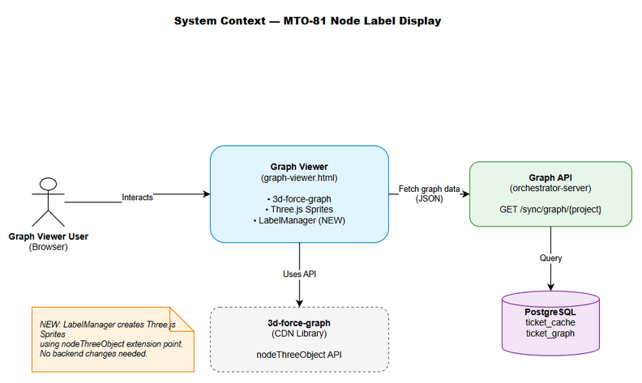

# Functional Specification Document (FSD)

## MCPOrchestration — MTO-81: [Graph] Hiển thị ticket key labels trực tiếp trên nodes

---

## Document Information

| Field | Value |
|-------|-------|
| Jira Ticket | MTO-81 |
| Title | [Graph] Hiển thị ticket key labels trực tiếp trên nodes |
| Author | BA Agent |
| Version | 1.0 |
| Date | 2026-05-11 |
| Status | Draft |
| Related BRD | documents/MTO-81/BRD.md |

---

## Revision History

| Version | Date | Author | Changes |
|---------|------|--------|---------|
| 1.0 | 2026-05-11 | BA Agent | Initiate document — auto-generated from BRD and Jira ticket MTO-81 |

---

## 1. Introduction

### 1.1 Purpose

This FSD specifies the functional behavior of the **Node Label Display** feature for the 3D Graph Viewer. It details HOW the system renders ticket key labels on graph nodes, manages visibility based on zoom level, and prevents label overlap.

### 1.2 Scope

- Frontend-only change to `graph-viewer.html`
- Uses existing 3d-force-graph library's `nodeThreeObject` extension API
- No backend API changes required (existing `GraphResponse` model already provides all needed data)
- Affects both `orchestrator-server` and `kb-server` graph viewer instances

### 1.3 Definitions & Acronyms

| Term | Definition |
|------|------------|
| Billboard/Sprite | A 2D element in 3D space that always faces the camera |
| Apparent Size | Perceived size of a node = `nodeSize / cameraDistance` |
| Culling | Hiding labels that are too small to read at current zoom |
| Hysteresis | Using different show/hide thresholds to prevent flickering |
| LOD | Level of Detail — showing different content at different zoom levels |
| nodeThreeObject | 3d-force-graph API to replace default node rendering with custom Three.js objects |

### 1.4 References

| Document | Location |
|----------|----------|
| BRD | documents/MTO-81/BRD.md |
| 3d-force-graph API | https://github.com/vasturiano/3d-force-graph |
| Three.js Sprite | https://threejs.org/docs/#api/en/objects/Sprite |
| Current graph-viewer.html | orchestrator-server/src/main/resources/static/graph-viewer.html |

---

## 2. System Overview

### 2.1 System Context Diagram



The Graph Viewer is a client-side HTML/JS application that:
- Fetches graph data from the backend API (`GET /sync/graph/{projectKey}`)
- Renders nodes and edges using 3d-force-graph (Three.js)
- **NEW:** Renders text labels as Three.js Sprites attached to each node
- Manages label visibility based on camera distance (zoom level)

### 2.2 System Architecture

```
┌─────────────────────────────────────────────────────┐
│ Browser (graph-viewer.html)                          │
│                                                      │
│  ┌──────────────┐    ┌──────────────────────────┐   │
│  │ Controls     │    │ 3D Scene (Three.js)       │   │
│  │ - Project    │    │  ├─ Nodes (spheres)       │   │
│  │ - View Mode  │    │  ├─ Labels (sprites) ←NEW │   │
│  │ - Search     │    │  ├─ Edges (lines)         │   │
│  └──────────────┘    │  └─ Camera + Lights       │   │
│                       └──────────────────────────┘   │
│  ┌──────────────┐    ┌──────────────────────────┐   │
│  │ Legend        │    │ LabelManager ←NEW         │   │
│  │ Details Panel │    │  - createLabel(node)      │   │
│  │ Stats Bar     │    │  - updateVisibility()     │   │
│  └──────────────┘    └──────────────────────────┘   │
└─────────────────────────────────────────────────────┘
         │
         │ GET /sync/graph/{projectKey}?view={mode}
         ▼
┌─────────────────────────────────────────────────────┐
│ Backend (orchestrator-server / kb-server)             │
│  GraphService → GraphDataRepository → DB             │
└─────────────────────────────────────────────────────┘
```

---

## 3. Functional Requirements

### 3.1 Feature: Node Label Rendering

**Source:** BRD Story 1, Story 2

#### 3.1.1 Description

Each node in the 3D graph displays a persistent text label rendered as a Three.js Sprite (canvas-based texture). The label content varies by node type:
- **Epic nodes:** `{key}\n{summary (≤30 chars)}`
- **All other nodes:** `{key}`

Labels are positioned above the node sphere and always face the camera (billboard behavior).

#### 3.1.2 Use Case

**Use Case ID:** UC-01
**Actor:** Graph Viewer User
**Preconditions:** Graph data loaded successfully, nodes rendered in 3D scene
**Postconditions:** All nodes display appropriate text labels

**Main Flow:**

| Step | Actor | System | Description |
|------|-------|--------|-------------|
| 1 | | System | Graph data received from API with nodes array |
| 2 | | System | For each node, determine label content based on `node.type` |
| 3 | | System | Create canvas element, draw text with appropriate font size |
| 4 | | System | Create Three.js Sprite from canvas texture |
| 5 | | System | Position sprite above node sphere (y-offset = nodeRadius + padding) |
| 6 | | System | Add sprite to node's Three.js group object |
| 7 | User | | User sees labels on all nodes at default zoom |

**Alternative Flows:**

| ID | Condition | Steps |
|----|-----------|-------|
| AF-1 | Node has no label (empty summary) | Display key only, even for Epics |
| AF-2 | Summary exactly 30 chars | Display full summary without ellipsis |

**Exception Flows:**

| ID | Condition | Steps |
|----|-----------|-------|
| EF-1 | Canvas creation fails (memory) | Skip label for that node, log warning to console |
| EF-2 | Node type is unknown | Default to key-only label |

#### 3.1.3 Business Rules

| Rule ID | Rule | Source |
|---------|------|--------|
| BR-01 | Epic nodes display `key + summary (truncated at 30 chars)` | BRD Story 2 |
| BR-02 | Non-Epic nodes display key only | BRD Story 2 |
| BR-03 | Summary truncation adds `...` when > 30 chars | BRD Story 2 |
| BR-04 | Label font size is proportional to node size | BRD Story 1 |
| BR-05 | Epic label font is 25% larger than Story/Task font | BRD Story 2 |
| BR-06 | Labels always face camera (billboard) | BRD Story 1 |
| BR-07 | Labels positioned above node, not overlapping sphere | BRD Story 1 |

#### 3.1.4 Data Specifications

**Input Data (from API):**

| Field | Type | Required | Validation | Description |
|-------|------|----------|------------|-------------|
| node.id | String | Y | Non-empty, matches `[A-Z]+-\d+` | Ticket key (e.g., "MTO-81") |
| node.label | String | Y | Non-empty | Ticket summary |
| node.type | String | Y | One of: Epic, Story, Task, Bug, Sub-task | Issue type |
| node.size | Number | Y | > 0 | Node sphere radius multiplier |

**Output Data (rendered):**

| Field | Type | Description |
|-------|------|-------------|
| labelText | String | Computed label text based on BR-01/BR-02 |
| fontSize | Number | Computed font size based on node.size and type |
| spriteScale | Vector3 | Sprite dimensions in 3D space |
| spritePosition | Vector3 | Position offset above node |

#### 3.1.5 UI Specifications

**Screen: Graph Viewer — Node with Label**

| No. | Element | Type | Required | Behavior | Validation |
|-----|---------|------|----------|----------|------------|
| 1 | Node Sphere | 3D Object | Y | Existing sphere with color based on view mode | — |
| 2 | Label Sprite | 3D Sprite | Y | Text rendered on canvas, billboard orientation | Text must be readable at default zoom |
| 3 | Label Text | Canvas Text | Y | White text, font: bold sans-serif | Contrast ratio ≥ 4.5:1 against background |

**Visual Specifications:**

| Property | Value |
|----------|-------|
| Font Family | Arial, sans-serif |
| Font Weight | Bold |
| Font Color | `#ffffff` (white) |
| Text Shadow | 1px black shadow for readability |
| Background | Transparent (no background box) |
| Position Offset | `y = nodeRadius * 1.5 + 4` above node center |
| Sprite Scale | `width = textWidth * 0.015`, `height = fontSize * 0.02` |

---

### 3.2 Feature: Zoom-Responsive Label Visibility

**Source:** BRD Story 3

#### 3.2.1 Description

Labels automatically show/hide based on the camera's distance to each node. When zoomed out far, labels that would be too small to read are hidden with a smooth opacity transition.

#### 3.2.2 Use Case

**Use Case ID:** UC-02
**Actor:** Graph Viewer User
**Preconditions:** Labels rendered on nodes, user interacting with camera
**Postconditions:** Only readable labels are visible

**Main Flow:**

| Step | Actor | System | Description |
|------|-------|--------|-------------|
| 1 | User | | User zooms out (scroll wheel or pinch) |
| 2 | | System | On each render frame, calculate distance from camera to each node |
| 3 | | System | Compute `apparentSize = node.size / distance` for each node |
| 4 | | System | Compare apparentSize against threshold for node type |
| 5 | | System | If below hide threshold → animate opacity to 0 (300ms) |
| 6 | | System | If above show threshold → animate opacity to 1 (300ms) |
| 7 | User | | User sees only readable labels; cluttered labels are hidden |

**Alternative Flows:**

| ID | Condition | Steps |
|----|-----------|-------|
| AF-1 | User zooms in | Labels that were hidden become visible again |
| AF-2 | Camera orbits (same distance) | No visibility change |

#### 3.2.3 Business Rules

| Rule ID | Rule | Source |
|---------|------|--------|
| BR-08 | Labels hide when `apparentSize < hideThreshold` | BRD Story 3 |
| BR-09 | Labels show when `apparentSize >= showThreshold` | BRD Story 3 |
| BR-10 | Hysteresis: `showThreshold > hideThreshold` to prevent flicker | BRD Story 3 |
| BR-11 | Epic labels have lower threshold (visible longer) | BRD Story 3 |
| BR-12 | Opacity transition duration = 300ms | BRD Story 3 |
| BR-13 | Maximum 50 visible labels at any time (performance) | BRD NFR |

**Threshold Configuration:**

| Node Type | Show Threshold | Hide Threshold | Priority |
|-----------|---------------|----------------|----------|
| Epic | 0.8 | 0.6 | 1 (highest) |
| Story | 1.2 | 1.0 | 2 |
| Task | 1.2 | 1.0 | 3 |
| Bug | 1.2 | 1.0 | 4 |
| Sub-task | 1.5 | 1.3 | 5 (lowest) |

#### 3.2.4 Processing Logic

**Visibility Update Algorithm (per frame):**

```
function updateLabelVisibility(camera, nodes):
    visibleCount = 0
    
    // Sort nodes by priority (Epic first) then by distance (closest first)
    sortedNodes = nodes.sortBy(n => [n.typePriority, distanceTo(camera, n)])
    
    for each node in sortedNodes:
        distance = camera.position.distanceTo(node.position)
        apparentSize = node.size / distance * SCALE_FACTOR
        threshold = getThreshold(node.type)
        
        if apparentSize >= threshold.show AND visibleCount < MAX_VISIBLE:
            node.label.targetOpacity = 1.0
            visibleCount++
        elif apparentSize < threshold.hide:
            node.label.targetOpacity = 0.0
        // else: maintain current state (hysteresis zone)
    
    // Animate opacity transitions
    for each node in nodes:
        node.label.opacity = lerp(node.label.opacity, node.label.targetOpacity, 0.1)
```

---

### 3.3 Feature: Anti-Overlap Strategy

**Source:** BRD Story 4

#### 3.3.1 Description

When multiple nodes are close together, their labels should not overlap. The primary mechanism is zoom-based culling (Section 3.2). As a secondary measure, the system limits total visible labels and prioritizes by node type.

#### 3.3.2 Business Rules

| Rule ID | Rule | Source |
|---------|------|--------|
| BR-14 | Max 50 labels visible simultaneously | BRD Story 4 |
| BR-15 | Priority order: Epic > Story > Task > Bug > Sub-task | BRD Story 4 |
| BR-16 | When max reached, lower-priority labels hidden first | BRD Story 4 |

#### 3.3.3 Processing Logic

The anti-overlap is achieved through the visibility algorithm in Section 3.2.4:
1. Nodes sorted by priority ensures Epics always get label slots first
2. The `MAX_VISIBLE = 50` cap prevents overcrowding
3. Distance-based sorting within same priority ensures closest nodes are labeled first

No pixel-level collision detection is needed — the combination of zoom culling + priority + max cap provides sufficient anti-overlap behavior.

---

## 4. Data Model

> **Note:** No new data entities required. The feature uses existing `GraphNode` data from the API.

### 4.1 Existing Data Used

#### Entity: GraphNode (from API response)

| Attribute | Type | Required | Business Rule | Description |
|-----------|------|----------|---------------|-------------|
| id | String | Y | BR-01, BR-02 | Ticket key used as label text |
| label | String | Y | BR-01 | Summary used for Epic labels |
| type | String | Y | BR-01, BR-02, BR-11 | Determines label format and threshold |
| size | Number | Y | BR-04, BR-08 | Used for font size and visibility calculation |
| color | String | Y | — | Node sphere color (unchanged) |

### 4.2 New Client-Side State

| Attribute | Type | Description |
|-----------|------|-------------|
| labelSprite | THREE.Sprite | The rendered text sprite |
| labelOpacity | Number (0-1) | Current opacity (animated) |
| targetOpacity | Number (0-1) | Target opacity for animation |
| typePriority | Number (1-5) | Visibility priority based on type |

---

## 5. Integration Specifications

> **Note:** No new integrations. Uses existing Graph API.

### 5.1 External System: Graph API (Existing)

| Attribute | Value |
|-----------|-------|
| Purpose | Provide node data for label rendering |
| Direction | Inbound (API → Frontend) |
| Data Format | JSON |
| Frequency | On-demand (page load + view mode change) |

**Data Exchange:**

| Our Data | External Data | Direction | Business Rule |
|----------|--------------|-----------|---------------|
| labelText | node.id + node.label | Receive | BR-01, BR-02 compute label from these |
| visibility | node.type + node.size | Receive | BR-08 through BR-13 use for thresholds |

---

## 6. Processing Logic

### 6.1 Label Creation Process

**Trigger:** Graph data loaded from API
**Input:** Array of GraphNode objects
**Output:** Three.js Sprite attached to each node

**Processing Steps:**

| Step | Description | Error Handling |
|------|-------------|----------------|
| 1 | For each node, compute labelText based on type (BR-01/BR-02) | Default to node.id if type unknown |
| 2 | Create off-screen canvas (256x128 for Epic, 256x64 for others) | Skip node if canvas creation fails |
| 3 | Set font: bold, size proportional to node.size | Use fallback font size 14px |
| 4 | Draw text centered on canvas with white color + black shadow | — |
| 5 | Create THREE.CanvasTexture from canvas | Skip node on texture error |
| 6 | Create THREE.SpriteMaterial with texture, transparent=true | — |
| 7 | Create THREE.Sprite, set scale based on text dimensions | — |
| 8 | Position sprite above node (y-offset) | — |
| 9 | Store sprite reference on node object for visibility updates | — |

### 6.2 Visibility Update Process

**Trigger:** Every animation frame (requestAnimationFrame via 3d-force-graph)
**Input:** Camera position, all node positions, label sprites
**Output:** Updated label opacities

**Processing Steps:**

| Step | Description | Error Handling |
|------|-------------|----------------|
| 1 | Get camera world position | Skip frame if camera unavailable |
| 2 | For each node, calculate distance to camera | — |
| 3 | Compute apparentSize = node.size / distance * SCALE_FACTOR | — |
| 4 | Apply threshold logic with hysteresis (BR-08 through BR-12) | — |
| 5 | Enforce MAX_VISIBLE cap (BR-13, BR-14) | — |
| 6 | Lerp current opacity toward target (smooth transition) | — |
| 7 | Update sprite material opacity | — |
| 8 | Hide sprite completely if opacity < 0.01 (performance) | — |

---

## 7. Security Requirements

> No security changes required. This is a frontend-only visual enhancement with no authentication, data mutation, or sensitive data exposure.

---

## 8. Non-Functional Requirements

| Category | Business Requirement | Acceptance Criteria |
|----------|---------------------|---------------------|
| Performance | Graph remains interactive with labels | ≥ 30fps with 200 nodes, ≥ 60fps with 50 nodes |
| Performance | Label visibility updates are smooth | No visible frame drops during zoom |
| Performance | Memory usage acceptable | < 50MB additional memory for 500 node labels |
| Usability | Labels readable at default zoom | Font apparent size ≥ 10px at default camera distance |
| Usability | Smooth transitions | Opacity fade completes in 300ms, no flickering |
| Accessibility | Text contrast | White on dark background ≥ 4.5:1 ratio (WCAG AA) |
| Compatibility | Browser support | Chrome 90+, Firefox 88+, Edge 90+ (WebGL required) |

---

## 9. Error Handling (User-Facing)

### 9.1 Error Scenarios

| Scenario | Severity | User Message | Expected Behavior |
|----------|----------|-------------|-------------------|
| WebGL not supported | Critical | "WebGL required for 3D graph" | Existing error handling (no change) |
| Canvas creation fails for some nodes | Warning | None (silent) | Affected nodes show without labels; others work normally |
| Performance drops below 30fps | Warning | None | System auto-reduces MAX_VISIBLE to 25 |

### 9.2 Graceful Degradation

If label rendering causes performance issues:
1. Reduce MAX_VISIBLE from 50 to 25
2. If still slow, increase all thresholds by 50% (fewer labels visible)
3. If still slow, disable labels entirely and fall back to hover-only (existing behavior)

---

## 10. Testing Considerations

### 10.1 Test Scenarios

| ID | Scenario | Input | Expected Output | Priority |
|----|----------|-------|-----------------|----------|
| TC-01 | Epic node shows key + summary | Epic node with summary "Graph Viewer - UX Improvements" | Label: "MTO-79\nGraph Viewer - UX Impro..." | High |
| TC-02 | Story node shows key only | Story node MTO-81 | Label: "MTO-81" | High |
| TC-03 | Summary truncation at 30 chars | Epic with 50-char summary | Truncated at 30 + "..." | High |
| TC-04 | Summary exactly 30 chars | Epic with 30-char summary | Full summary, no ellipsis | Medium |
| TC-05 | Labels visible at default zoom | Load graph, no zoom change | All labels visible | High |
| TC-06 | Labels hide on zoom out | Zoom out significantly | Story/Task labels disappear first | High |
| TC-07 | Labels reappear on zoom in | Zoom out then zoom in | Labels fade back in | High |
| TC-08 | No flickering at threshold | Zoom slowly at threshold boundary | No rapid show/hide | High |
| TC-09 | Max 50 labels visible | Graph with 200 nodes, medium zoom | ≤ 50 labels visible | Medium |
| TC-10 | Epic labels persist longest | Zoom out with mixed types | Epic labels visible after others hide | Medium |
| TC-11 | Performance with 200 nodes | Load 200-node graph | ≥ 30fps maintained | High |
| TC-12 | Billboard behavior | Rotate camera 360° | Labels always face camera | Medium |

---

## 11. Appendix

### Diagrams

| Diagram | File |
|---------|------|
| System Context | [system-context.png](diagrams/system-context.png) |
| Sequence Diagram — Label Creation | [sequence-label-creation.png](diagrams/sequence-label-creation.png) |
| State Diagram — Label Visibility | [state-label-visibility.png](diagrams/state-label-visibility.png) |

### Change Log from BRD

- No deviations from BRD. All requirements mapped to functional specifications.
- Added graceful degradation strategy (not in BRD) for performance edge cases.
- Clarified canvas size and sprite scale calculations (implementation detail).
