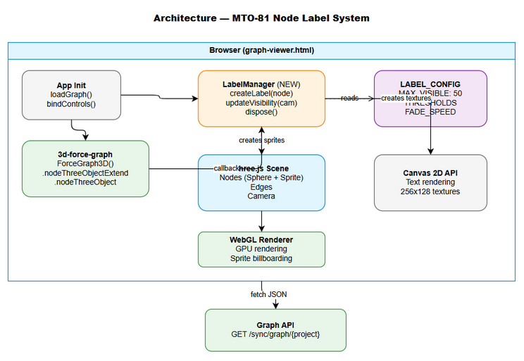
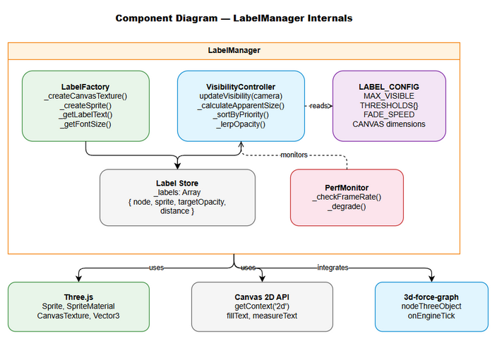
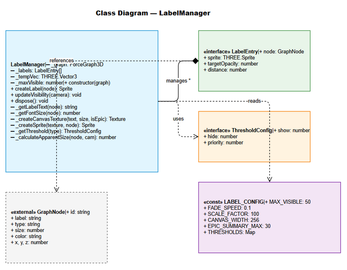
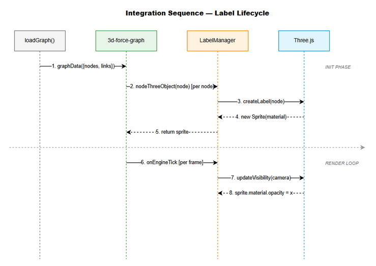

# Technical Design Document (TDD)

## MCPOrchestration — MTO-81: [Graph] Hiển thị ticket key labels trực tiếp trên nodes

---

## Document Information

| Field | Value |
|-------|-------|
| Jira Ticket | MTO-81 |
| Title | [Graph] Hiển thị ticket key labels trực tiếp trên nodes |
| Author | SA Agent |
| Version | 1.0 |
| Date | 2026-05-11 |
| Status | Draft |
| Related BRD | documents/MTO-81/BRD.md |
| Related FSD | documents/MTO-81/FSD.md |

---

## Author Tracking

| Role | Name - Position | Responsibility |
|------|-----------------|----------------|
| Author | SA Agent – Solution Architect | Create document |
| Peer Reviewer | Duc Nguyen – Project Lead | Review document |

---

## Revision History

| Version | Date | Author | Changes |
|---------|------|--------|---------|
| 1.0 | 2026-05-11 | SA Agent | Initiate document — auto-generated from BRD and FSD |

---

## Sign-Off

| Name | Signature and date |
|------|--------------------|
| | ☐ I agree and confirm the technical design in this TDD |
| | ☐ I agree and confirm the technical design in this TDD |

---

## 1. Introduction

> **Scope Boundary:** This TDD specifies HOW to implement the node label display feature. Refer to FSD for functional requirements, business rules, and use cases.

### 1.1 Purpose

This TDD specifies the technical implementation of persistent ticket key labels on 3D graph nodes in the Graph Viewer. The implementation is entirely client-side (JavaScript/Three.js) with no backend changes.

### 1.2 Scope

- Modification of `graph-viewer.html` (both orchestrator-server and kb-server copies)
- Addition of a `LabelManager` JavaScript module (inline in HTML)
- Three.js Sprite-based text rendering using Canvas API
- Per-frame visibility management with performance optimization

### 1.3 Technology Stack

| Layer | Technology | Version |
|-------|-----------|---------|
| Language | JavaScript (ES2020+) | — |
| 3D Library | Three.js (bundled with 3d-force-graph) | r150+ |
| Graph Library | 3d-force-graph | 1.x |
| Rendering | WebGL 2.0 via Three.js | — |
| Text Rendering | HTML5 Canvas 2D API | — |
| Build Tool | None (inline script in HTML) | — |

### 1.4 Design Principles

- **Single Responsibility** — LabelManager handles all label logic; graph init code unchanged
- **Performance First** — Minimize per-frame allocations; use object pooling for sprites
- **Progressive Enhancement** — Labels enhance UX but graph works without them if rendering fails
- **Configuration over Code** — Thresholds and limits are constants, easily tunable

### 1.5 Constraints

- No external dependencies beyond what 3d-force-graph already bundles (Three.js)
- Must work in single HTML file (no module bundler)
- Canvas texture size limited to power-of-2 dimensions for GPU efficiency
- Maximum ~500 sprites before WebGL draw call overhead becomes significant

### 1.6 References

| Document | Location |
|----------|----------|
| BRD | documents/MTO-81/BRD.md |
| FSD | documents/MTO-81/FSD.md |
| 3d-force-graph API | https://github.com/vasturiano/3d-force-graph |
| Three.js Sprite | https://threejs.org/docs/#api/en/objects/Sprite |

---

## 2. System Architecture

### 2.1 Architecture Overview

This is a frontend-only enhancement. The architecture adds a `LabelManager` layer between the 3d-force-graph library and the Three.js scene.



```
┌─────────────────────────────────────────────────────────────┐
│ graph-viewer.html                                            │
│                                                              │
│  ┌─────────────────┐     ┌──────────────────────────────┐  │
│  │ App Init        │────▶│ 3d-force-graph               │  │
│  │ (loadGraph)     │     │  .nodeThreeObjectExtend(true) │  │
│  └─────────────────┘     │  .nodeThreeObject(fn)         │  │
│          │                └──────────────────────────────┘  │
│          │                         │                         │
│          ▼                         ▼                         │
│  ┌─────────────────┐     ┌──────────────────────────────┐  │
│  │ LabelManager    │     │ Three.js Scene               │  │
│  │  .createLabel() │────▶│  ├─ Node Group (sphere+label)│  │
│  │  .updateAll()   │     │  ├─ Edges                    │  │
│  │  .dispose()     │     │  └─ Camera + Lights          │  │
│  └─────────────────┘     └──────────────────────────────┘  │
│          │                                                   │
│          │ per frame                                         │
│          ▼                                                   │
│  ┌─────────────────┐                                        │
│  │ VisibilityCalc  │                                        │
│  │  - distance     │                                        │
│  │  - threshold    │                                        │
│  │  - priority     │                                        │
│  └─────────────────┘                                        │
└─────────────────────────────────────────────────────────────┘
```

### 2.2 Component Diagram



| Component | Responsibility | Technology |
|-----------|---------------|------------|
| LabelManager | Create, update, dispose label sprites | JS class |
| LabelFactory | Create canvas textures and sprites | Canvas 2D + Three.js |
| VisibilityController | Per-frame visibility calculations | JS (requestAnimationFrame) |
| LabelConfig | Constants and thresholds | JS object |

### 2.3 Deployment Architecture

No deployment changes. The modified `graph-viewer.html` is served as a static file by both:
- `orchestrator-server` at `/static/graph-viewer.html`
- `kb-server` at `/static/graph-viewer.html`

Both files must be identical. Changes are deployed with the next server JAR build.

### 2.4 Communication Patterns

| From | To | Protocol | Pattern | Description |
|------|----|----------|---------|-------------|
| graph-viewer.html | Graph API | HTTP GET | Sync (fetch) | Load graph data (existing, unchanged) |
| LabelManager | Three.js Scene | Direct API | Sync | Add/remove sprites from scene |
| 3d-force-graph | LabelManager | Callback | Per-frame | nodeThreeObject callback on each node |

---

## 3. API Design

> **No new API endpoints.** This feature uses the existing Graph API unchanged.

### 3.1 API Overview (Existing — No Changes)

| # | Endpoint | Method | Description | Change |
|---|----------|--------|-------------|--------|
| 1 | `/sync/graph/{projectKey}` | GET | Get graph data | None |
| 2 | `/sync/graph/{projectKey}/{issueKey}` | GET | Get subgraph | None |

### 3.2 Graph API Response (Used by LabelManager)

The existing response already provides all fields needed:

```json
{
  "nodes": [
    {
      "id": "MTO-81",
      "label": "[Graph] Hiển thị ticket key labels trực tiếp trên nodes",
      "type": "Story",
      "status": "Docs Review",
      "priority": "High",
      "group": "Story",
      "color": "#58a6ff",
      "size": 5
    }
  ],
  "edges": [...],
  "metadata": { "nodeCount": 50, "edgeCount": 80, "viewMode": "hierarchy" }
}
```

**Fields used by LabelManager:**

| Field | Usage |
|-------|-------|
| `node.id` | Label text (ticket key) |
| `node.label` | Epic summary text (truncated) |
| `node.type` | Determines label format + visibility threshold |
| `node.size` | Font size scaling + apparent size calculation |

---

## 4. Database Design

> **No database changes.** This is a frontend-only feature.

---

## 5. Class / Module Design

### 5.1 Module Structure (Inline in HTML)

Since graph-viewer.html is a single-file application, all code is inline. Logical modules are organized as JavaScript classes/objects within the IIFE:

```javascript
(function() {
    'use strict';
    
    // Configuration constants
    const LABEL_CONFIG = { ... };
    
    // LabelManager class
    class LabelManager { ... }
    
    // Existing graph initialization (modified)
    function init() { ... }
    
    // Existing functions (unchanged)
    function loadGraph() { ... }
    function showDetails() { ... }
    // ...
})();
```

### 5.2 Key Classes

#### LabelConfig (Constants Object)

```javascript
const LABEL_CONFIG = {
    MAX_VISIBLE: 50,
    FADE_SPEED: 0.1,           // lerp factor per frame
    SCALE_FACTOR: 100,         // converts distance to apparent size
    FONT_FAMILY: 'Arial, sans-serif',
    FONT_COLOR: '#ffffff',
    SHADOW_COLOR: '#000000',
    SHADOW_BLUR: 3,
    CANVAS_WIDTH: 256,
    CANVAS_HEIGHT_EPIC: 128,
    CANVAS_HEIGHT_NORMAL: 64,
    EPIC_SUMMARY_MAX: 30,
    POSITION_Y_OFFSET: 1.5,    // multiplier of node radius
    THRESHOLDS: {
        Epic:     { show: 0.8, hide: 0.6, priority: 1 },
        Story:    { show: 1.2, hide: 1.0, priority: 2 },
        Task:     { show: 1.2, hide: 1.0, priority: 3 },
        Bug:      { show: 1.2, hide: 1.0, priority: 4 },
        'Sub-task': { show: 1.5, hide: 1.3, priority: 5 }
    },
    DEFAULT_THRESHOLD: { show: 1.2, hide: 1.0, priority: 3 }
};
```

#### LabelManager Class

```javascript
class LabelManager {
    constructor(graph) { ... }
    
    // Public API
    createLabel(node): THREE.Sprite
    updateVisibility(camera): void
    dispose(): void
    
    // Private methods
    _getLabelText(node): string
    _getFontSize(node): number
    _createCanvasTexture(text, fontSize, isEpic): THREE.CanvasTexture
    _createSprite(texture, node): THREE.Sprite
    _getThreshold(nodeType): { show, hide, priority }
    _calculateApparentSize(node, camera): number
}
```

### 5.3 Design Patterns

| Pattern | Where Used | Rationale |
|---------|-----------|-----------|
| Strategy | Threshold lookup by node type | Different visibility rules per type |
| Object Pool | Canvas reuse (optional optimization) | Reduce GC pressure |
| Observer | 3d-force-graph tick callback | React to camera changes |
| Facade | LabelManager public API | Simple interface hiding Three.js complexity |

### 5.4 Implementation Details

#### 5.4.1 nodeThreeObject Integration

```javascript
graph.nodeThreeObjectExtend(true)  // extend default sphere, don't replace
     .nodeThreeObject(node => labelManager.createLabel(node));
```

Using `nodeThreeObjectExtend(true)` means:
- The default sphere is still rendered
- Our sprite is ADDED to the node's Three.js group
- No need to recreate the sphere ourselves

#### 5.4.2 Label Text Computation

```javascript
_getLabelText(node) {
    if (node.type === 'Epic') {
        const summary = node.label.length > LABEL_CONFIG.EPIC_SUMMARY_MAX
            ? node.label.substring(0, LABEL_CONFIG.EPIC_SUMMARY_MAX) + '...'
            : node.label;
        return `${node.id}\n${summary}`;
    }
    return node.id;
}
```

#### 5.4.3 Canvas Texture Creation

```javascript
_createCanvasTexture(text, fontSize, isEpic) {
    const canvas = document.createElement('canvas');
    canvas.width = LABEL_CONFIG.CANVAS_WIDTH;
    canvas.height = isEpic ? LABEL_CONFIG.CANVAS_HEIGHT_EPIC : LABEL_CONFIG.CANVAS_HEIGHT_NORMAL;
    
    const ctx = canvas.getContext('2d');
    ctx.font = `bold ${fontSize}px ${LABEL_CONFIG.FONT_FAMILY}`;
    ctx.textAlign = 'center';
    ctx.textBaseline = 'middle';
    
    // Shadow for readability
    ctx.shadowColor = LABEL_CONFIG.SHADOW_COLOR;
    ctx.shadowBlur = LABEL_CONFIG.SHADOW_BLUR;
    ctx.fillStyle = LABEL_CONFIG.FONT_COLOR;
    
    const lines = text.split('\n');
    const lineHeight = fontSize * 1.3;
    const startY = (canvas.height - lines.length * lineHeight) / 2 + fontSize / 2;
    
    lines.forEach((line, i) => {
        ctx.fillText(line, canvas.width / 2, startY + i * lineHeight);
    });
    
    const texture = new THREE.CanvasTexture(canvas);
    texture.needsUpdate = true;
    return texture;
}
```

#### 5.4.4 Visibility Update (Per Frame)

```javascript
updateVisibility(camera) {
    let visibleCount = 0;
    
    // Sort by priority then distance
    const sorted = this._labels.sort((a, b) => {
        const pa = this._getThreshold(a.node.type).priority;
        const pb = this._getThreshold(b.node.type).priority;
        if (pa !== pb) return pa - pb;
        return a.distance - b.distance;
    });
    
    for (const entry of sorted) {
        const distance = camera.position.distanceTo(entry.sprite.getWorldPosition(this._tempVec));
        entry.distance = distance;
        const apparent = (entry.node.size || 5) / distance * LABEL_CONFIG.SCALE_FACTOR;
        const threshold = this._getThreshold(entry.node.type);
        
        if (apparent >= threshold.show && visibleCount < LABEL_CONFIG.MAX_VISIBLE) {
            entry.targetOpacity = 1.0;
            visibleCount++;
        } else if (apparent < threshold.hide) {
            entry.targetOpacity = 0.0;
        }
        // Hysteresis zone: no change
        
        // Lerp opacity
        const current = entry.sprite.material.opacity;
        const target = entry.targetOpacity;
        entry.sprite.material.opacity = current + (target - current) * LABEL_CONFIG.FADE_SPEED;
        entry.sprite.visible = entry.sprite.material.opacity > 0.01;
    }
}
```

### 5.5 Class Diagram



---

## 6. Integration Design

> **No new integrations.** Uses existing Graph API.

### 6.1 3d-force-graph Integration

| Attribute | Value |
|-----------|-------|
| Protocol | JavaScript API (in-process) |
| Integration Point | `nodeThreeObject` + `nodeThreeObjectExtend` |
| Callback Frequency | Once per node on graph load |
| Tick Hook | `graph.onEngineTick(() => labelManager.updateVisibility(camera))` |

**Sequence Diagram:**



---

## 7. Security Design

> **No security changes.** Frontend-only visual enhancement. No new data exposure, no authentication changes, no user input processing.

---

## 8. Performance & Scalability

### 8.1 Performance Budget

| Metric | Target | Measurement |
|--------|--------|-------------|
| Frame rate (50 nodes) | ≥ 60fps | Chrome DevTools Performance |
| Frame rate (200 nodes) | ≥ 30fps | Chrome DevTools Performance |
| Frame rate (500 nodes) | ≥ 20fps | Chrome DevTools Performance |
| Memory overhead per label | < 100KB | Canvas (256x128) + Sprite |
| Total memory (200 labels) | < 20MB | Chrome Task Manager |
| Visibility update time | < 2ms/frame | performance.now() measurement |

### 8.2 Optimization Strategies

| Strategy | Description | Impact |
|----------|-------------|--------|
| MAX_VISIBLE cap | Never render more than 50 labels simultaneously | Prevents GPU draw call explosion |
| Sprite.visible = false | Hidden sprites skip GPU rendering entirely | Major perf gain at far zoom |
| Reuse Vector3 | Single `_tempVec` for distance calculations | Eliminates per-frame GC |
| Canvas power-of-2 | 256x128 / 256x64 dimensions | GPU texture optimization |
| Sort once per frame | Single sort for priority + distance | O(n log n) vs O(n²) |
| Opacity threshold | Hide sprite when opacity < 0.01 | Avoids rendering near-invisible sprites |

### 8.3 Graceful Degradation

If performance drops below 30fps (detected via frame time > 33ms):
1. Reduce `MAX_VISIBLE` from 50 to 25
2. If still slow, increase all thresholds by 50%
3. If still slow, disable labels entirely (set all `visible = false`)

---

## 9. Monitoring & Observability

### 9.1 Console Logging

| Log Event | Level | When |
|-----------|-------|------|
| Labels initialized | info | After createLabels completes |
| Performance degradation | warn | When fps drops below 30 |
| Label creation failed | error | Canvas or sprite creation error |
| Labels disabled (perf) | warn | When graceful degradation triggers |

### 9.2 Debug Mode

Add `?debug=labels` query parameter to enable:
- FPS counter overlay
- Visible label count display
- Threshold visualization (colored rings around nodes)

---

## 10. Deployment Considerations

### 10.1 File Changes

| File | Change | Impact |
|------|--------|--------|
| `orchestrator-server/src/main/resources/static/graph-viewer.html` | Add LabelManager code | Primary |
| `kb-server/src/main/resources/static/graph-viewer.html` | Same changes (keep in sync) | Secondary |

### 10.2 Feature Flags

| Flag | Default | Description |
|------|---------|-------------|
| `?labels=off` | labels ON | URL param to disable labels |
| `?maxLabels=N` | 50 | Override MAX_VISIBLE |
| `?debug=labels` | off | Enable debug overlay |

### 10.3 Rollback Strategy

Since this is a frontend-only change in a static HTML file:
1. Revert the `graph-viewer.html` file to previous version
2. Rebuild and redeploy JAR
3. No database migration, no state to clean up

### 10.4 Testing in Production

- Deploy to staging first
- Load a large project graph (100+ nodes)
- Verify labels render correctly
- Check performance with Chrome DevTools
- Verify zoom in/out behavior

---

## 11. Appendix

### Glossary

| Term | Definition |
|------|------------|
| Sprite | Three.js object that renders a 2D texture always facing the camera |
| Billboard | Same as Sprite — always faces camera |
| Apparent Size | `nodeSize / cameraDistance * SCALE_FACTOR` — perceived size on screen |
| Lerp | Linear interpolation: `current + (target - current) * factor` |
| Hysteresis | Different show/hide thresholds to prevent flickering |
| nodeThreeObjectExtend | 3d-force-graph API to add custom objects to existing node rendering |

### Open Questions

| # | Question | Status | Answer |
|---|----------|--------|--------|
| 1 | Should labels have a background box for better readability? | Resolved | No — text shadow is sufficient, background would clutter |
| 2 | Should we use CSS2DRenderer instead of Sprites? | Resolved | No — Sprites are more performant for 3D scenes with many labels |
| 3 | Should label font scale with zoom? | Resolved | No — fixed sprite size, visibility controlled by show/hide |
