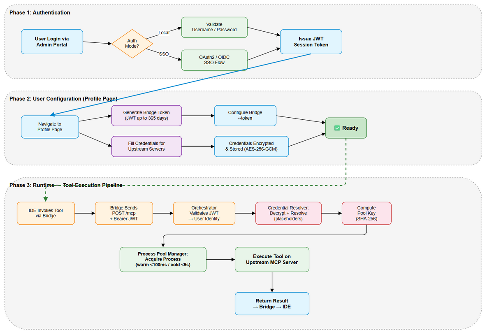
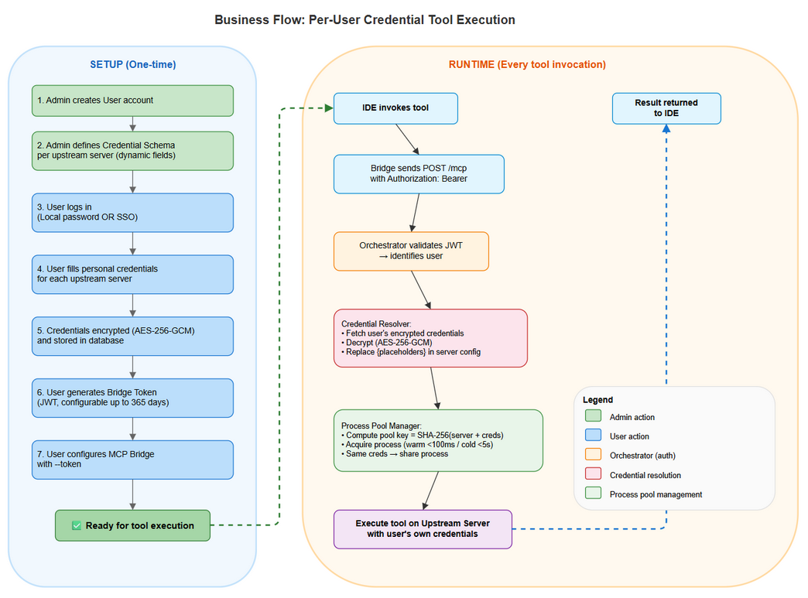
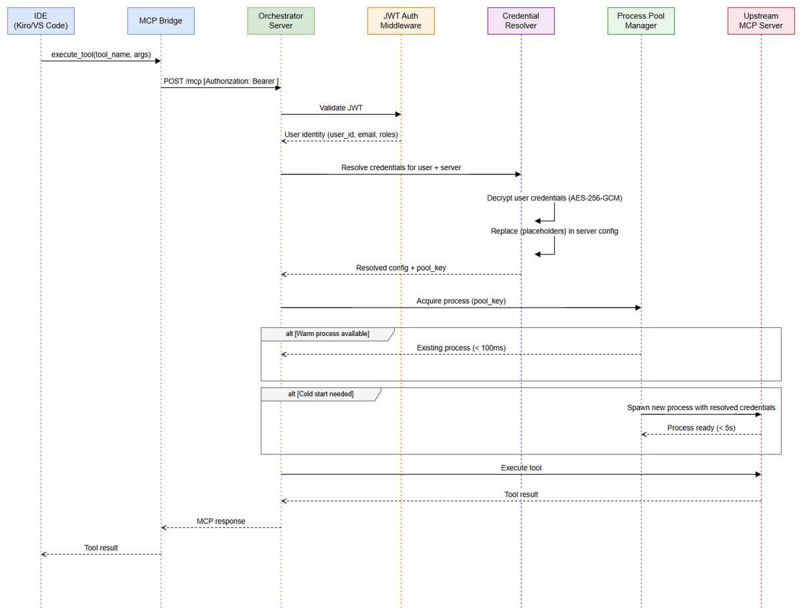
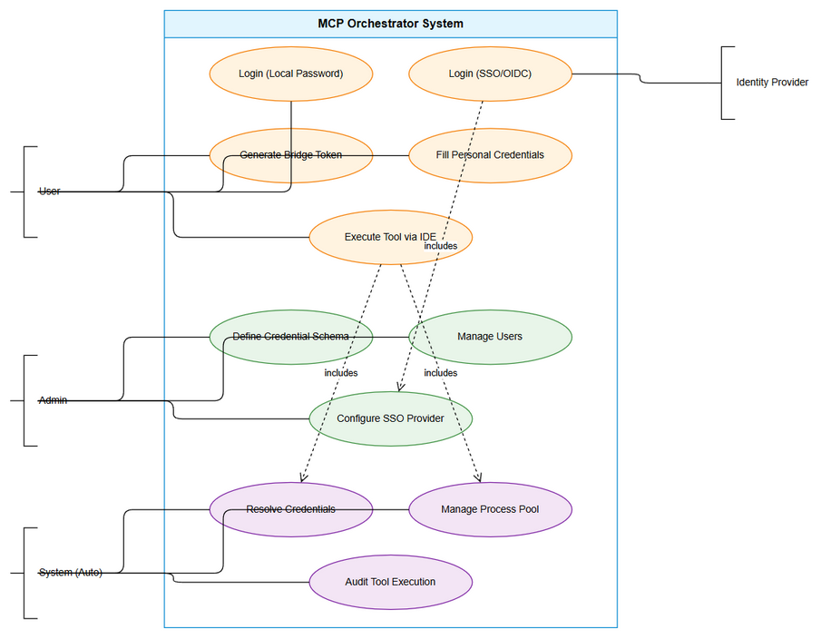

# Business Requirements Document (BRD)

## MCP Orchestrator — MTO-94: Per-User Credentials + Scalable Process Pool for MCP Orchestrator

---

## Document Information

| Field | Value |
|-------|-------|
| Jira Ticket | MTO-94 |
| Title | Per-User Credentials + Scalable Process Pool for MCP Orchestrator |
| Author | BA Agent |
| Version | 1.0 |
| Date | 2026-05-11 |
| Status | Draft |

---

## Author Tracking

| Role | Name - Position | Responsibility |
|------|-----------------|----------------|
| Author | BA Agent – Business Analyst | Create document |
| Peer Reviewer | SA Agent – Solution Architect | Review document |

---

## Revision History

| Version | Date | Author | Changes |
|---------|------|--------|---------|
| 1.0 | 2026-05-11 | BA Agent | Initiate document — auto-generated from Jira Epic MTO-94 and linked stories MTO-95 through MTO-101 |

---

## Sign-Off

| Name | Signature and date |
|------|--------------------|
| | ☐ I agree and confirm all criteria on this BRD as expected requirements |
| | ☐ I agree and confirm all criteria on this BRD as expected requirements |

---

## 1. Introduction

### 1.1 Scope

This BRD defines the business requirements for implementing **per-user credential management** and a **scalable process pool** in the MCP Orchestrator system. The current system uses a single shared set of credentials (Jira URL, username, API token) for all users when communicating with upstream MCP servers. This creates security, auditability, and reliability concerns that must be addressed.

The scope includes:

1. **User Authentication & Authorization** — JWT-based authentication for bridge clients, supporting both local password and SSO (OAuth2/OIDC) login methods
2. **Dynamic Credential Schema** — Admin-configurable credential field definitions per upstream MCP server
3. **Per-User Credential Storage** — Encrypted storage of individual user credentials for each upstream server
4. **Credential Resolution** — Runtime placeholder resolution using user-specific credentials during tool execution
5. **Scalable Process Pool** — Dynamic process pool management replacing the current single-process-per-server model
6. **MCP Bridge Update** — Adding JWT token support to the bridge client for multi-user server mode

### 1.2 Out of Scope

- Migration of existing shared credentials to per-user model (manual migration by admin)
- Multi-factor authentication (MFA) — may be added in future iteration
- Credential rotation automation (scheduled key rotation)
- Rate limiting per user on upstream servers
- User self-registration (admin creates users)
- Mobile client support
- Credential sharing between users (each user manages their own)

### 1.3 Preliminary Requirement

- PostgreSQL database with existing `users` table (already exists in `usermanagement` module)
- `TokenEncryptionService` (AES-256-GCM) already available for credential encryption
- `AdminAuthMiddleware` currently validates `X-User-Email` header — will be replaced by JWT
- Upstream MCP server configurations stored in `mcp_servers` table
- Bridge client (`orchestrator-bridge`) already supports HTTP Streamable transport to orchestrator

---

## 2. Business Requirements

### 2.1 High Level Process Map

The following diagram illustrates the end-to-end flow from user authentication through credential resolution to tool execution:

*[Edit in draw.io](diagrams/high-level-process.drawio)*

*[Edit in draw.io](diagrams/business-flow.drawio)*

### 2.2 List of User Stories / Use Cases

| # | Story / Use Case | Priority | Source Ticket |
|---|------------------|----------|---------------|
| 1 | As a **user**, I want to authenticate via username/password or SSO so that I can access the MCP Orchestrator securely | MUST HAVE | MTO-95 |
| 2 | As a **user**, I want to generate a JWT bridge token from my profile so that my IDE bridge client can authenticate on my behalf | MUST HAVE | MTO-95 |
| 3 | As an **admin**, I want to define credential fields for each upstream MCP server so that users know what credentials to provide | MUST HAVE | MTO-96 |
| 4 | As a **user**, I want to fill my personal credentials for each upstream server so that tool executions use my identity | MUST HAVE | MTO-97 |
| 5 | As the **system**, I want to resolve credential placeholders at runtime so that each user's tools execute with their own credentials | MUST HAVE | MTO-98 |
| 6 | As the **system**, I want to manage a scalable process pool so that multiple users can execute tools concurrently without resource exhaustion | MUST HAVE | MTO-99 |
| 7 | As a **user**, I want my bridge client to send my JWT token with every request so that the orchestrator knows my identity | MUST HAVE | MTO-100 |
| 8 | As an **admin**, I want to configure SSO (OAuth2/OIDC) as an authentication option so that users can use corporate identity providers | SHOULD HAVE | MTO-101 |

---

### 2.3 Details of User Stories

---

#### Business Flow

**Step 1:** Admin configures the system — defines credential schemas for upstream servers and creates user accounts

**Step 2:** User logs into Admin Portal (local password or SSO) and receives a session JWT

**Step 3:** User navigates to Profile page, generates a long-lived Bridge Token (JWT with configurable expiry: up to 365 days)

**Step 4:** User fills their personal credentials for each upstream server they need access to (e.g., Jira URL, email, API token for the Atlassian server)

**Step 5:** User configures their IDE bridge client with `--token <bridge_token>`

**Step 6:** When user invokes a tool via IDE, bridge sends POST /mcp with `Authorization: Bearer <jwt>` header

**Step 7:** Orchestrator validates JWT, resolves user identity, fetches user's encrypted credentials for the target upstream server

**Step 8:** Orchestrator resolves placeholders in server config (e.g., `--jira-token={jira_token}`) with user's decrypted credential values

**Step 9:** ProcessPoolManager acquires a process instance from the pool (keyed by serverName + resolvedCredentials hash)

**Step 10:** Tool executes on the upstream server process, result returns through the chain to the IDE

> **Note:** If user has not filled credentials for a required upstream server, the system returns a clear error message indicating which credentials are missing. Servers without credential schemas continue to use the shared process (backward compatible).

---

#### STORY 1: JWT Auth Middleware + Login API + Bridge Token Header

> As a **user**, I want to authenticate via username/password and generate a JWT bridge token so that my IDE bridge client can securely identify me to the orchestrator.

**Source:** MTO-95

**Requirement Details:**

1. Implement JWT-based authentication replacing the current `X-User-Email` header approach
2. Login endpoint accepts username/password, validates against stored bcrypt hash, returns JWT session token
3. JWT session token used for Admin Portal web sessions (short-lived, e.g., 1-4 hours)
4. Bridge Token is a separate long-lived JWT (configurable: up to 365 days) generated from Profile page
5. Bridge Token contains: user_id, email, roles, issued_at, expiry
6. JWT signed with HS256 (configurable to RS256 for enterprise deployments)
7. `AdminAuthMiddleware` upgraded to validate JWT from `Authorization: Bearer` header
8. Backward compatibility: if no JWT present, fall back to `X-User-Email` header (deprecated, logged as warning)

**Data Fields:**

| Field | Type | Required | Description | Example |
|-------|------|----------|-------------|---------|
| username | text | Yes | User login identifier | `john.doe` |
| password | secret | Yes | Bcrypt-hashed password | `$2b$12$...` |
| jwt_secret | secret | Yes (config) | HS256 signing key | `your-256-bit-secret` |
| bridge_token_expiry_days | integer | Yes (config) | Bridge token validity period (max 365) | `30` |
| session_token_expiry_hours | integer | Yes (config) | Session token validity period | `4` |

**Acceptance Criteria:**

1. User can login with username/password and receive a JWT session token
2. User can generate a Bridge Token from profile page with configurable expiry (1-365 days)
3. All API endpoints validate JWT from `Authorization: Bearer` header
4. Invalid/expired JWT returns HTTP 401 with clear error message
5. Bridge Token contains user_id, email, roles claims
6. JWT signing algorithm is configurable (HS256 default, RS256 optional)
7. Existing `X-User-Email` header still works but logs deprecation warning
8. Audit log records login events (success and failure)

**Validation Rules:**

- Username: non-empty, alphanumeric + dots/underscores, max 100 chars
- Password: minimum 8 characters (validation at creation time)
- Bridge token expiry: must be between 1 and 365 days
- JWT must contain `exp`, `iat`, `sub` (user_id), `email`, `roles` claims

**Error Handling:**

- Invalid credentials → HTTP 401 `{"error": "INVALID_CREDENTIALS", "message": "Invalid username or password"}`
- Expired JWT → HTTP 401 `{"error": "TOKEN_EXPIRED", "message": "Token has expired. Please login again or regenerate bridge token"}`
- Malformed JWT → HTTP 401 `{"error": "INVALID_TOKEN", "message": "Token is malformed or signature verification failed"}`
- User account disabled → HTTP 403 `{"error": "ACCOUNT_DISABLED", "message": "Account is disabled. Contact administrator"}`

---

#### STORY 2: Credential Schema CRUD — Admin API + UI

> As an **admin**, I want to define credential fields for each upstream MCP server via Web UI so that users know exactly what credentials to provide.

**Source:** MTO-96

**Requirement Details:**

1. Admin can create/read/update/delete credential schemas for upstream MCP servers
2. Each schema defines a list of fields with: key, label, type, required flag, description, placeholder
3. Field types supported: `url`, `email`, `secret`, `text`, `number`
4. Schema is linked to a server by `server_name` (matches `mcp_servers.name`)
5. Web UI follows existing Admin Portal pattern (vanilla JS, fetch API, dark theme)
6. Changes to schema do NOT invalidate existing user credentials (additive changes only)
7. Removing a required field from schema triggers validation warning

**Data Fields:**

| Field | Type | Required | Description | Example |
|-------|------|----------|-------------|---------|
| id | UUID | Yes (auto) | Schema entry ID | `550e8400-e29b-41d4-a716-446655440000` |
| server_name | text | Yes | Upstream server identifier | `atlassian` |
| field_key | text | Yes | Credential field key (used in placeholders) | `jira_token` |
| field_label | text | Yes | Human-readable label | `Jira API Token` |
| field_type | enum | Yes | Input type | `secret` |
| field_required | boolean | Yes | Whether field is mandatory | `true` |
| field_description | text | No | Help text for user | `Generate from Atlassian account settings` |
| field_placeholder | text | No | Input placeholder | `ATATT3x...` |
| display_order | integer | No | Field display order | `1` |

**Acceptance Criteria:**

1. Admin can create a credential schema for any registered upstream server
2. Admin can define multiple fields per server (e.g., Atlassian needs: jira_url, jira_email, jira_token)
3. Each field has key, label, type (url/email/secret/text/number), required flag
4. Admin can edit existing schema fields (label, type, required, description)
5. Admin can delete a schema field (with confirmation warning if users have filled it)
6. Admin can reorder fields via display_order
7. Schema changes are reflected immediately in user's credential fill page
8. Web UI provides CRUD interface consistent with existing admin pages

**UI Specifications:**

| No. | Name | Type | Required | Description | Note |
|-----|------|------|----------|-------------|------|
| 1 | Server Selector | Dropdown | Yes | Select upstream server to configure | Populated from `mcp_servers` table |
| 2 | Field Key | Input (text) | Yes | Unique key for placeholder resolution | Auto-slugified from label |
| 3 | Field Label | Input (text) | Yes | Display label for users | |
| 4 | Field Type | Dropdown | Yes | url / email / secret / text / number | |
| 5 | Required Toggle | Checkbox | Yes | Whether field is mandatory | Default: true |
| 6 | Description | Input (text) | No | Help text shown to users | |
| 7 | Placeholder | Input (text) | No | Example value shown in input | |
| 8 | Add Field Button | Button | — | Add new field to schema | |
| 9 | Save Schema Button | Button | — | Persist schema changes | |
| 10 | Delete Field Button | Button | — | Remove field (with confirmation) | Shows warning if users have data |

**Validation Rules:**

- `field_key`: lowercase alphanumeric + underscores only, unique per server, max 50 chars
- `field_label`: non-empty, max 100 chars
- `server_name`: must exist in `mcp_servers` table
- At least one field required per schema
- Cannot have duplicate `field_key` within same server

**Error Handling:**

- Server not found → HTTP 404 `{"error": "SERVER_NOT_FOUND", "message": "Upstream server '{name}' not registered"}`
- Duplicate field key → HTTP 409 `{"error": "DUPLICATE_FIELD_KEY", "message": "Field key '{key}' already exists for server '{name}'"}`
- Delete field with user data → HTTP 200 with warning `{"warning": "FIELD_HAS_DATA", "affected_users": 5}`

---

#### STORY 3: User Credential CRUD — Profile API + UI

> As a **user**, I want to fill my personal credentials for each upstream server at my profile page so that tool executions use my own identity and permissions.

**Source:** MTO-97

**Requirement Details:**

1. User's Profile page shows all upstream servers that have credential schemas defined
2. For each server, user sees the required/optional fields as defined by admin
3. User fills in their personal credential values (e.g., their own Jira API token)
4. Credentials are encrypted at rest using existing `TokenEncryptionService` (AES-256-GCM)
5. Stored in `user_credentials` table as encrypted JSONB
6. Secret-type fields are masked in UI after save (show only last 4 chars)
7. User can update or clear their credentials at any time
8. Credential completeness indicator shows which servers are fully configured

**Data Fields:**

| Field | Type | Required | Description | Example |
|-------|------|----------|-------------|---------|
| id | UUID | Yes (auto) | Credential entry ID | `550e8400-...` |
| user_id | UUID | Yes (FK) | Reference to users table | `user-uuid` |
| server_name | text | Yes | Upstream server identifier | `atlassian` |
| credentials | JSONB (encrypted) | Yes | Encrypted credential values | `{"jira_url": "...", "jira_token": "..."}` |
| created_at | timestamp | Yes (auto) | Creation timestamp | `2026-05-11T10:00:00Z` |
| updated_at | timestamp | Yes (auto) | Last update timestamp | `2026-05-11T10:00:00Z` |

**Acceptance Criteria:**

1. User can view all servers with credential schemas on their profile page
2. User can fill credential values for each server's defined fields
3. Credentials are encrypted with AES-256-GCM before storage (using existing TokenEncryptionService)
4. Secret-type fields display masked after save (e.g., `****ABCD`)
5. User can update individual field values without re-entering all fields
6. User can clear all credentials for a specific server
7. Completeness indicator shows: ✅ (all required filled), ⚠️ (partial), ❌ (none)
8. Validation enforces required fields and type-specific formats (URL format, email format)

**UI Specifications:**

| No. | Name | Type | Required | Description | Note |
|-----|------|------|----------|-------------|------|
| 1 | Server Card | Card | — | One card per server with schema | Shows server name + status icon |
| 2 | Credential Input | Input (varies) | Per schema | Dynamic input based on field_type | type=password for secrets |
| 3 | Status Badge | Badge | — | ✅ / ⚠️ / ❌ completeness | |
| 4 | Save Button | Button | — | Save credentials for this server | Per-server save |
| 5 | Clear Button | Button | — | Clear all credentials for server | With confirmation dialog |
| 6 | Bridge Token Section | Section | — | Generate/view bridge token | Shows expiry date |
| 7 | Generate Token Button | Button | — | Generate new bridge token | Invalidates previous token |
| 8 | Copy Token Button | Button | — | Copy token to clipboard | Shows "Copied!" feedback |

**Validation Rules:**

- URL fields: must be valid URL format (https:// preferred)
- Email fields: must be valid email format
- Secret fields: non-empty, no whitespace trimming
- Required fields: must be non-empty before save
- JSONB payload max size: 10KB per server per user

**Error Handling:**

- Missing required field → Client-side validation error, prevent save
- Encryption failure → HTTP 500 `{"error": "ENCRYPTION_ERROR", "message": "Failed to encrypt credentials. Contact administrator"}`
- Server schema not found → HTTP 404 (server card not shown)

---

#### STORY 4: Credential Resolver — Placeholder Resolution

> As the **system**, I want to resolve credential placeholders in upstream server configurations at runtime so that each user's tool executions use their personal credentials.

**Source:** MTO-98

**Requirement Details:**

1. Upstream server configs use placeholder syntax: `{field_key}` (e.g., `--jira-token={jira_token}`)
2. When a tool execution is requested, the system identifies the target upstream server
3. System fetches the requesting user's encrypted credentials for that server
4. System decrypts credentials and resolves all `{placeholder}` values in the server's command/args/env
5. If any required placeholder cannot be resolved (user hasn't filled it), return clear error
6. Resolved credentials are NEVER logged or stored in plain text (only used transiently in memory)
7. Resolution result is used as the pool key (hash of serverName + resolved values)

**Data Fields:**

| Field | Type | Required | Description | Example |
|-------|------|----------|-------------|---------|
| server_command | text | Yes | Server launch command with placeholders | `npx @anthropic/jira-mcp --token={jira_token}` |
| server_args | text[] | No | Additional args with placeholders | `["--url={jira_url}", "--email={jira_email}"]` |
| server_env | map | No | Environment variables with placeholders | `{"JIRA_TOKEN": "{jira_token}"}` |

**Acceptance Criteria:**

1. Placeholders in format `{field_key}` are resolved from user's stored credentials
2. Resolution works in command, args, and environment variables
3. Missing required credential → clear error with field name and server name
4. Resolved values are held only in memory, never persisted or logged
5. Resolution is performed per-request (no caching of decrypted values beyond request scope)
6. Servers without any placeholders in config continue to work unchanged (backward compatible)
7. Hash of resolved credentials used as process pool key for instance sharing

**Validation Rules:**

- Placeholder format: `{[a-z_]+}` — lowercase letters and underscores only
- All placeholders in server config must have corresponding schema fields
- Circular placeholder references are not supported (no `{field_a}` referencing `{field_b}`)

**Error Handling:**

- Missing credential for required placeholder → HTTP 400 `{"error": "MISSING_CREDENTIAL", "message": "Credential '{field_key}' not configured for server '{server_name}'. Please fill it in your profile.", "server_name": "...", "missing_fields": [...]}`
- Decryption failure → HTTP 500 `{"error": "DECRYPTION_ERROR", "message": "Failed to decrypt credentials. They may be corrupted. Please re-enter."}`
- Invalid placeholder in config → Logged as warning at server startup, placeholder left unresolved

---

#### STORY 5: Process Pool Manager — Scalable Process Pool

> As the **system**, I want to manage a scalable pool of upstream server processes so that multiple users can execute tools concurrently without resource exhaustion or credential conflicts.

**Source:** MTO-99

**Requirement Details:**

1. Replace current single-process-per-server model with a process pool
2. Pool key = `hash(serverName + resolvedCredentials)` — users with same credentials share a process
3. Pool scales up when: response time exceeds `slowResponseThresholdMs` (default: 10s) AND pool hasn't reached `maxInstancesPerServer`
4. Pool scales down when: process idle time exceeds `idleTimeoutMs` (default: 5 min)
5. New layer: `ProcessPoolManager` wraps existing `UpstreamServerManager`
6. Configuration per server: `maxInstancesPerServer`, `maxTotalInstances`, `idleTimeoutMs`, `slowResponseThresholdMs`
7. Process crash → auto-restart (existing HealthMonitor behavior preserved)
8. Metrics exposed: active processes, idle processes, pool utilization, average response time

**Data Fields:**

| Field | Type | Required | Description | Example |
|-------|------|----------|-------------|---------|
| maxInstancesPerServer | integer | Yes (config) | Max processes per server type | `5` |
| maxTotalInstances | integer | Yes (config) | Max total processes across all servers | `50` |
| idleTimeoutMs | long | Yes (config) | Kill process after idle duration | `300000` (5 min) |
| slowResponseThresholdMs | long | Yes (config) | Trigger scale-up threshold | `10000` (10s) |
| pool_key | text | Internal | Hash of server + credentials | `sha256(atlassian+resolved_creds)` |

**Acceptance Criteria:**

1. Process pool acquires a warm process in < 100ms
2. Cold start (new process spawn) completes in < 5 seconds
3. Pool scales up automatically when response time exceeds threshold
4. Pool scales down automatically when processes are idle beyond timeout
5. Users with identical resolved credentials share process instances
6. Users with different credentials get separate process instances
7. Process crash triggers auto-restart without affecting other pool instances
8. Total process count never exceeds `maxTotalInstances` (system-wide limit)
9. Backward compatible: servers without credential schemas use a single shared process (pool size 1)
10. Pool metrics available via API for monitoring

**Validation Rules:**

- `maxInstancesPerServer`: minimum 1, maximum 20
- `maxTotalInstances`: minimum 1, maximum 100
- `idleTimeoutMs`: minimum 30000 (30s), maximum 3600000 (1 hour)
- `slowResponseThresholdMs`: minimum 1000 (1s), maximum 60000 (60s)

**Error Handling:**

- Pool exhausted (max instances reached) → Queue request, return after timeout or HTTP 503 `{"error": "POOL_EXHAUSTED", "message": "All process instances are busy. Please retry."}`
- Process spawn failure → Retry up to 3 times with exponential backoff, then return HTTP 503
- System resource limit → Log critical warning, reject new spawn requests gracefully

---

#### STORY 6: Bridge Client Update — --token + Authorization Header

> As a **user**, I want my bridge client to accept a `--token` CLI argument and send it as an Authorization header so that the orchestrator can identify me.

**Source:** MTO-100

**Requirement Details:**

1. Add `--token <jwt>` CLI argument to bridge client startup
2. Bridge includes `Authorization: Bearer <jwt>` header in every POST /mcp request to orchestrator
3. Only applies to HTTP Streamable mode (multi-user server mode)
4. If `--token` not provided in multi-user mode, bridge logs warning and requests proceed without auth (backward compatible)
5. Token is stored in memory only (not written to disk or logs)
6. Bridge validates token format (3-part base64 JWT) before sending — does NOT validate signature (server does that)

**Data Fields:**

| Field | Type | Required | Description | Example |
|-------|------|----------|-------------|---------|
| --token | CLI arg | No | JWT bridge token | `eyJhbGciOiJIUzI1NiIs...` |
| Authorization | HTTP header | Conditional | Bearer token header | `Bearer eyJhbGciOiJIUzI1NiIs...` |

**Acceptance Criteria:**

1. Bridge accepts `--token <jwt>` CLI argument
2. Every HTTP request to orchestrator includes `Authorization: Bearer <jwt>` header when token is configured
3. Token is not logged or written to any file
4. Missing token in multi-user mode → warning log, requests proceed without auth header
5. Invalid token format (not 3-part base64) → error log at startup, bridge refuses to start
6. Token can also be provided via environment variable `MCP_BRIDGE_TOKEN` (CLI takes precedence)

**Validation Rules:**

- Token format: three base64url segments separated by dots (JWT structure)
- Token must not be empty string
- CLI arg `--token` takes precedence over env var `MCP_BRIDGE_TOKEN`

**Error Handling:**

- Invalid token format at startup → Log error, exit with code 1 and message "Invalid token format. Expected JWT (header.payload.signature)"
- Orchestrator returns 401 → Bridge logs "Authentication failed. Token may be expired. Regenerate from profile page." and propagates error to IDE

---

#### STORY 7: SSO Integration — OAuth2/OIDC

> As an **admin**, I want to configure SSO (OAuth2/OIDC) as an authentication option so that users can authenticate using their corporate identity provider.

**Source:** MTO-101

**Requirement Details:**

1. Admin can configure OAuth2/OIDC provider settings (issuer URL, client ID, client secret, scopes)
2. Auth mode configurable per user: `local` (username/password) or `sso`
3. SSO login flow: redirect to IdP → callback with auth code → exchange for tokens → create/update local user → issue JWT
4. User provisioning: first SSO login auto-creates local user record (JIT provisioning)
5. Claims mapping: map IdP claims to local user fields (email, name, roles)
6. Support standard OIDC providers: Azure AD, Google Workspace, Okta, Keycloak

**Data Fields:**

| Field | Type | Required | Description | Example |
|-------|------|----------|-------------|---------|
| sso_enabled | boolean | Yes (config) | Global SSO toggle | `true` |
| issuer_url | url | Yes (if SSO) | OIDC issuer URL | `https://login.microsoftonline.com/{tenant}/v2.0` |
| client_id | text | Yes (if SSO) | OAuth2 client ID | `app-client-id` |
| client_secret | secret | Yes (if SSO) | OAuth2 client secret | `app-secret` |
| scopes | text | Yes (if SSO) | Requested scopes | `openid profile email` |
| callback_url | url | Yes (if SSO) | OAuth2 callback URL | `https://orchestrator.local/auth/callback` |
| claims_mapping | JSON | No | Map IdP claims to local fields | `{"email": "preferred_username"}` |
| user_auth_mode | enum | Yes | Per-user auth mode | `local` or `sso` |

**Acceptance Criteria:**

1. Admin can configure OIDC provider settings via Admin Portal
2. Users with `auth_mode=sso` are redirected to IdP login page
3. Successful SSO login creates/updates local user and issues JWT session token
4. Bridge token generation works the same regardless of auth mode (local or SSO)
5. JIT provisioning: first-time SSO user gets auto-created with default role
6. Claims mapping correctly maps IdP claims to local user fields
7. SSO configuration errors (invalid issuer, wrong client_id) show clear error messages
8. Fallback: if SSO provider is unreachable, admin can switch user to local auth

**Validation Rules:**

- Issuer URL: must be valid HTTPS URL
- Client ID: non-empty
- Client secret: non-empty
- Scopes: must include `openid`
- Callback URL: must match registered redirect URI in IdP

**Error Handling:**

- IdP unreachable → HTTP 503 `{"error": "SSO_PROVIDER_UNAVAILABLE", "message": "Identity provider is not responding. Try again or contact admin."}`
- Invalid auth code → HTTP 401 `{"error": "SSO_AUTH_FAILED", "message": "Authentication failed. Please try again."}`
- Claims mapping failure → Log warning, use email from token as fallback
- User not authorized in IdP → HTTP 403 `{"error": "SSO_UNAUTHORIZED", "message": "Your account is not authorized to access this application."}`

---

## 3. Dependencies

| Dependency | Type | Related Ticket | Description |
|------------|------|----------------|-------------|
| PostgreSQL Database | Infrastructure | N/A | Existing database with `users` table, `mcp_servers` table. New tables: `credential_schemas`, `user_credentials` |
| TokenEncryptionService | System | N/A | Existing AES-256-GCM encryption service for credential storage |
| AdminAuthMiddleware | System | MTO-95 | Existing middleware to be upgraded from X-User-Email to JWT validation |
| UpstreamServerManager | System | MTO-99 | Existing interface to be wrapped by new ProcessPoolManager |
| MCP Bridge (orchestrator-bridge) | System | MTO-100 | Existing bridge client to be updated with --token support |
| OAuth2/OIDC Identity Provider | External | MTO-101 | External IdP (Azure AD, Okta, etc.) for SSO integration |
| JWT Library | System | MTO-95 | JWT signing/verification library (e.g., java-jwt or kotlinx equivalent) |
| Bcrypt Library | System | MTO-95 | Password hashing library for local auth |

---

## 4. Stakeholders

| Role | Name / Team | Responsibility | Source |
|------|-------------|----------------|--------|
| Product Owner | MTO Project Lead | Approve requirements, prioritize stories | Epic owner |
| Solution Architect | SA Agent | Technical design, review FSD | Peer reviewer |
| Development Team | DEV Agent | Implementation of all stories | Assignees |
| QA Team | QA Agent | Test planning and execution | Verification |
| System Admin | Admin users | Configure credential schemas, manage users, SSO setup | End user (admin) |
| End Users | Bridge client users | Fill credentials, use tools via IDE | End user |
| Security Team | Security reviewer | Review encryption, JWT, auth implementation | Compliance |

---

## 5. Risks and Assumptions

### 5.1 Risks

| Risk | Impact | Likelihood | Mitigation |
|------|--------|------------|------------|
| JWT secret key compromise | High — all tokens invalidated | Low | Use strong key (256-bit), store in environment variable, support key rotation |
| Credential decryption key loss | High — all stored credentials unrecoverable | Low | Backup encryption key securely, document key management procedure |
| Process pool resource exhaustion | Medium — users experience delays | Medium | Configure conservative limits, implement request queuing, monitor metrics |
| SSO provider outage | Medium — SSO users cannot login | Low | Maintain local auth as fallback, allow admin to switch user auth mode |
| Backward compatibility break | High — existing integrations fail | Low | Maintain X-User-Email fallback (deprecated), shared process for servers without schemas |
| Credential exposure in logs | High — security breach | Low | Never log decrypted credentials, use structured logging with field exclusions |
| Process pool key collision (hash) | Low — wrong credentials used | Very Low | Use SHA-256 full hash (collision probability negligible) |

### 5.2 Assumptions

- Existing `users` table and `UserService` in `usermanagement` module are stable and can be extended
- `TokenEncryptionService` (AES-256-GCM) is performant enough for per-request decryption (< 1ms)
- Upstream MCP servers support being launched with different credentials via command-line args or env vars
- PostgreSQL is the only supported database (no need for multi-DB abstraction)
- Bridge client is always the latest version when using multi-user mode (no version negotiation)
- Admin manually creates initial user accounts (no self-registration in v1.0)
- Maximum 20 concurrent users is sufficient for initial deployment
- Each upstream server process consumes approximately 50-200MB RAM

---

## 6. Non-Functional Requirements

| Category | Requirement | Details |
|----------|-------------|---------|
| Performance | Process pool acquire (warm) | < 100ms to acquire an existing idle process |
| Performance | Process pool acquire (cold) | < 5 seconds to spawn a new process |
| Performance | Credential resolution | < 10ms per request (decrypt + resolve placeholders) |
| Performance | JWT validation | < 5ms per request |
| Security | Credential encryption | AES-256-GCM at rest (existing TokenEncryptionService) |
| Security | Password hashing | Bcrypt with cost factor 12 |
| Security | JWT signing | HS256 (default) or RS256 (configurable) |
| Security | Credential in-memory only | Decrypted credentials never persisted, logged, or cached beyond request scope |
| Security | Audit trail | All auth events (login, token generation, credential changes) logged |
| Scalability | Concurrent users | Support 20+ concurrent users with configurable pool limits |
| Scalability | Process pool limits | Configurable: maxInstancesPerServer (default 5), maxTotalInstances (default 50) |
| Availability | Process crash recovery | Auto-restart crashed processes (existing HealthMonitor) |
| Availability | JWT expiry handling | Clear error message to bridge client, user can regenerate token |
| Availability | Graceful degradation | If pool exhausted, queue requests rather than immediate failure |
| Compatibility | Backward compatible | Servers without credential schemas use shared process (existing behavior) |
| Compatibility | Deprecated header | X-User-Email header still accepted with deprecation warning |

---

## 7. Related Tickets

| Ticket Key | Summary | Status | Type | Relationship |
|------------|---------|--------|------|--------------|
| MTO-94 | Per-User Credentials + Scalable Process Pool for MCP Orchestrator | Open | Epic | Main ticket |
| MTO-95 | JWT Auth Middleware + Login API + Bridge Token Header | Open | Story | Child of MTO-94 |
| MTO-96 | Credential Schema CRUD — Admin API + UI | Open | Story | Child of MTO-94 |
| MTO-97 | User Credential CRUD — Profile API + UI | Open | Story | Child of MTO-94 |
| MTO-98 | Credential Resolver — Placeholder Resolution | Open | Story | Child of MTO-94 |
| MTO-99 | Process Pool Manager — Scalable Process Pool | Open | Story | Child of MTO-94 |
| MTO-100 | Bridge Client Update — --token + Authorization header | Open | Story | Child of MTO-94 |
| MTO-101 | SSO Integration — OAuth2/OIDC | Open | Story | Child of MTO-94 |

---

## 8. Appendix

### Glossary

| Term | Definition |
|------|------------|
| JWT | JSON Web Token — a compact, URL-safe token format for securely transmitting claims between parties |
| Bridge Token | A long-lived JWT (configurable up to 365 days) used by the MCP Bridge client to authenticate with the orchestrator |
| Session Token | A short-lived JWT (1-4 hours) used for Admin Portal web sessions |
| Credential Schema | Admin-defined set of fields that describe what credentials a user needs to provide for an upstream server |
| Upstream Server | An external MCP server that provides tools (e.g., Jira MCP, GitHub MCP) |
| Process Pool | A managed collection of OS processes for upstream servers, dynamically scaled based on demand |
| Pool Key | A hash of server name + resolved credentials, used to determine which processes can be shared |
| Placeholder | A `{field_key}` pattern in server configuration that gets replaced with user's credential value at runtime |
| AES-256-GCM | Advanced Encryption Standard with 256-bit key in Galois/Counter Mode — authenticated encryption |
| OIDC | OpenID Connect — an identity layer on top of OAuth 2.0 for user authentication |
| JIT Provisioning | Just-In-Time user provisioning — creating a local user record on first SSO login |
| IdP | Identity Provider — the external system that authenticates users (e.g., Azure AD, Okta) |
| RLS | Row-Level Security — PostgreSQL feature for multi-tenant data isolation |

### Reference Documents

| Document | Link / Location |
|----------|-----------------|
| MCP Orchestrator Project Structure | `.analysis/code-intelligence/project-structure.md` |
| Orchestrator Server Module Analysis | `.analysis/code-intelligence/modules/orchestrator-server.md` |
| Orchestrator Client Module Analysis | `.analysis/code-intelligence/modules/orchestrator-client.md` |
| Orchestrator Bridge Module Analysis | `.analysis/code-intelligence/modules/orchestrator-bridge.md` |
| Existing UserService | `orchestrator-server/src/.../usermanagement/` |
| Existing TokenEncryptionService | `orchestrator-server/src/.../usermanagement/TokenEncryptionService.kt` |
| Existing UpstreamServerManager | `orchestrator-client/src/.../upstream/UpstreamServerManager.kt` |
| Existing AdminAuthMiddleware | `orchestrator-server/src/.../usermanagement/AdminAuthMiddleware.kt` |

### Sequence Diagram — Tool Execution with Per-User Credentials

*[Edit in draw.io](diagrams/sequence-tool-execution.drawio)*

### Use Case Diagram

*[Edit in draw.io](diagrams/use-case.drawio)*

