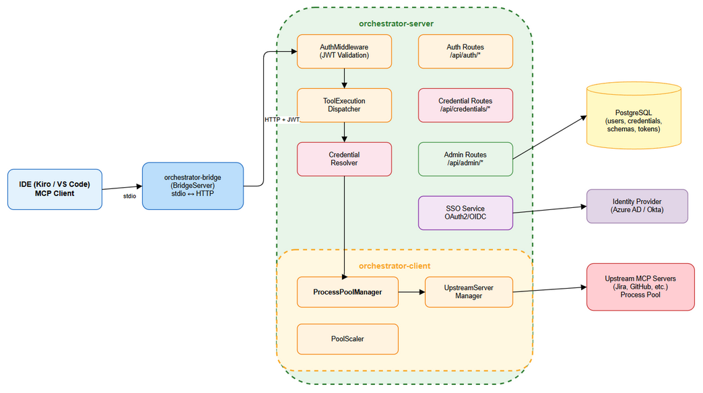
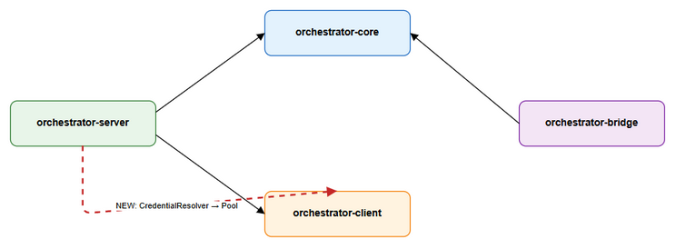
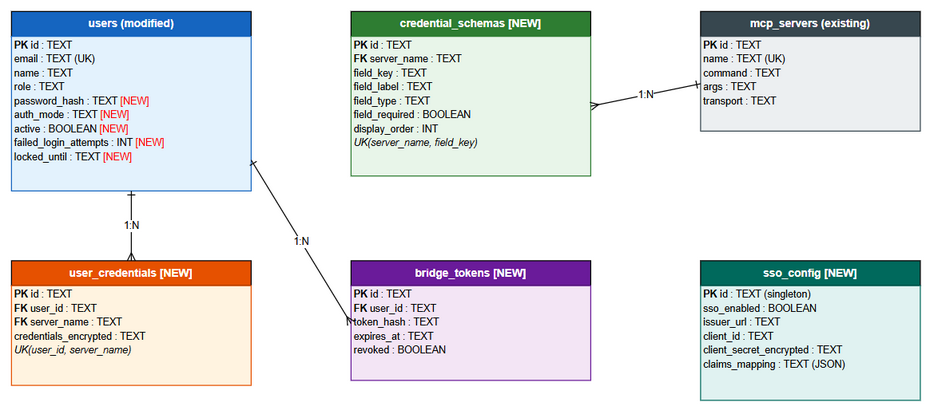
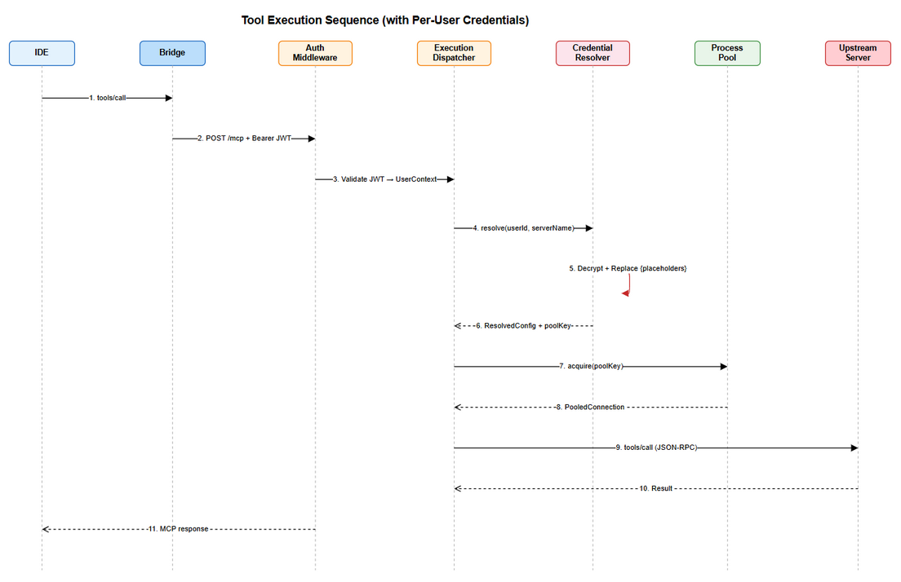
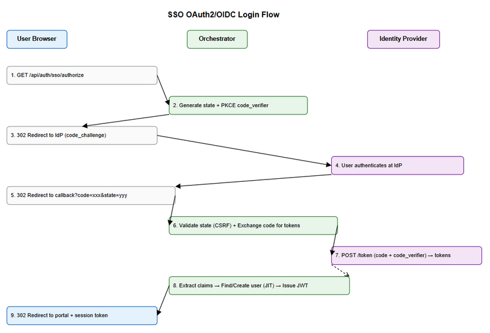
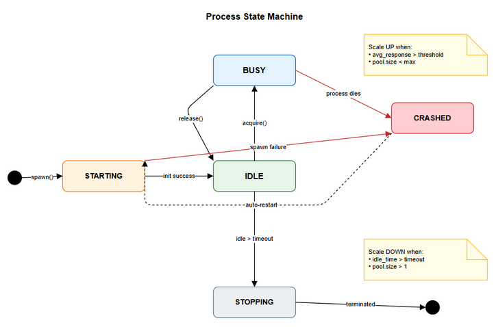
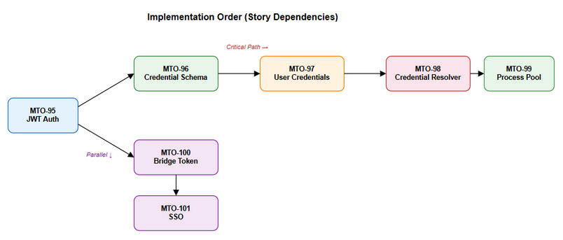

# Technical Design Document (TDD)

## MCP Orchestrator — MTO-94: Per-User Credentials + Scalable Process Pool

---

## Document Information

| Field | Value |
|-------|-------|
| Jira Ticket | MTO-94 |
| Title | Per-User Credentials + Scalable Process Pool for MCP Orchestrator |
| Author | SA Agent (Solution Architect) |
| Version | 1.0 |
| Date | 2026-07-06 |
| Status | Draft |
| Related BRD | documents/MTO-94/BRD.md |
| Related FSD | documents/MTO-94/FSD.md |

---

## Revision History

| Version | Date | Author | Changes |
|---------|------|--------|---------|
| 1.0 | 2026-07-06 | SA Agent | Initial TDD — full technical design from BRD + FSD + codebase analysis |

---

## 1. Introduction

### 1.1 Purpose

This TDD provides the complete technical design for implementing per-user credential management and a scalable process pool in the MCP Orchestrator. It specifies exact file paths, class structures, database DDL, API implementations, and configuration needed for DEV agents to implement without additional clarification.

### 1.2 Scope

| Story | Feature | Module(s) Affected |
|-------|---------|-------------------|
| MTO-95 | JWT Auth Middleware + Login API + Bridge Token | orchestrator-server |
| MTO-96 | Credential Schema CRUD — Admin API + UI | orchestrator-server |
| MTO-97 | User Credential CRUD — Profile API + UI | orchestrator-server |
| MTO-98 | Credential Resolver — Placeholder Resolution | orchestrator-server |
| MTO-99 | Process Pool Manager — Scalable Process Pool | orchestrator-client |
| MTO-100 | Bridge Client Update — --token + Authorization header | orchestrator-bridge |
| MTO-101 | SSO Integration — OAuth2/OIDC | orchestrator-server |

### 1.3 Technology Stack

| Category | Technology | Version | Notes |
|----------|-----------|---------|-------|
| Language | Kotlin | 2.3.20 | Existing |
| Platform | JVM | 21 | Existing |
| Framework | Ktor | 3.4.0 | Existing |
| DI | Koin | 4.1.1 | Existing |
| Serialization | kotlinx.serialization | 1.8.1 | Existing |
| Database | PostgreSQL | 16+ | Existing |
| Connection Pool | HikariCP | — | Existing |
| JWT | com.auth0:java-jwt | 4.4.0 | **NEW DEPENDENCY** |
| Password Hashing | at.favre.lib:bcrypt | 0.10.2 | **NEW DEPENDENCY** |
| Coroutines | kotlinx.coroutines | 1.10.2 | Existing |
| Testing | Kotest + MockK | 5.9.1 / 1.14.2 | Existing |
| Logging | Logback Classic | 1.5.18 | Existing |

### 1.4 Design Principles

1. **Interface/Impl pattern** — All services use interface + implementation (existing convention)
2. **Sealed exception hierarchy** — Extend existing `McpOrchestratorException` pattern
3. **Koin DI modules** — One module per feature area (existing convention)
4. **Backward compatibility** — `X-User-Email` header still works (deprecated), no-schema servers unchanged
5. **Security by default** — Credentials encrypted at rest, decrypted only in memory per-request
6. **Reuse existing code** — `TokenEncryptionService` for AES-256-GCM, `UserRepository` for user queries

### 1.5 Key Technical Decisions

| Decision | Choice | Rationale |
|----------|--------|-----------|
| JWT library | com.auth0:java-jwt | Mature, well-maintained, supports HS256/RS256, no Spring dependency |
| Password hashing | at.favre.lib:bcrypt | Pure Java, no native deps, configurable cost factor |
| Pool concurrency | ConcurrentHashMap + AtomicReference | Lock-free for hot path, coroutine-safe |
| Credential encryption | Reuse TokenEncryptionService | Already proven AES-256-GCM implementation |
| Pool key | SHA-256(serverName + sorted creds) | Deterministic, collision-resistant |
| DB column types | TEXT (not UUID) | Match existing `users.id` and `mcp_servers.id` column types |

---

## 2. System Architecture

### 2.1 High-Level Architecture


*[Edit in draw.io](diagrams/tdd-high-level-architecture.drawio)*

### 2.2 Module Placement

| Component | Module | Package | New/Modified |
|-----------|--------|---------|--------------|
| JwtAuthService | orchestrator-server | `com.orchestrator.mcp.auth` | NEW |
| AuthMiddleware | orchestrator-server | `com.orchestrator.mcp.auth` | NEW |
| AuthRoutes | orchestrator-server | `com.orchestrator.mcp.auth` | NEW |
| SsoService | orchestrator-server | `com.orchestrator.mcp.auth.sso` | NEW |
| SsoRoutes | orchestrator-server | `com.orchestrator.mcp.auth.sso` | NEW |
| CredentialSchemaService | orchestrator-server | `com.orchestrator.mcp.credentials` | NEW |
| CredentialSchemaRepository | orchestrator-server | `com.orchestrator.mcp.credentials` | NEW |
| CredentialSchemaRoutes | orchestrator-server | `com.orchestrator.mcp.credentials` | NEW |
| UserCredentialService | orchestrator-server | `com.orchestrator.mcp.credentials` | NEW |
| UserCredentialRepository | orchestrator-server | `com.orchestrator.mcp.credentials` | NEW |
| UserCredentialRoutes | orchestrator-server | `com.orchestrator.mcp.credentials` | NEW |
| CredentialResolver | orchestrator-server | `com.orchestrator.mcp.credentials` | NEW |
| ProcessPoolManager | orchestrator-client | `com.orchestrator.mcp.client.pool` | NEW |
| PooledConnection | orchestrator-client | `com.orchestrator.mcp.client.pool` | NEW |
| PoolScaler | orchestrator-client | `com.orchestrator.mcp.client.pool` | NEW |
| PoolMetrics | orchestrator-client | `com.orchestrator.mcp.client.pool` | NEW |
| HttpStreamableClient | orchestrator-bridge | `com.orchestrator.mcp.bridge` | MODIFIED |
| BridgeConfig | orchestrator-bridge | `com.orchestrator.mcp.bridge` | MODIFIED |
| AdminAuthMiddleware | orchestrator-server | `com.orchestrator.mcp.usermanagement.routes` | DEPRECATED |
| ToolExecutionDispatcher | orchestrator-server | `com.orchestrator.mcp.execution` | MODIFIED |

### 2.3 Inter-Module Dependencies (Updated)


*[Edit in draw.io](diagrams/tdd-module-dependencies.drawio)*

---

## 3. API Design

### 3.1 Authentication APIs (MTO-95)

#### POST /api/auth/login

**File:** `orchestrator-server/src/main/kotlin/com/orchestrator/mcp/auth/AuthRoutes.kt`

```kotlin
// Route definition
fun Route.authRoutes(authService: JwtAuthService, auditService: AuditService) {
    route("/api/auth") {
        post("/login") { /* ... */ }
        post("/bridge-token") { /* ... */ }
        post("/refresh") { /* ... */ }
        post("/logout") { /* ... */ }
    }
}
```

**Request:**
```json
{
  "username": "john.doe",
  "password": "securePassword123"
}
```

**Response (200):**
```json
{
  "token": "eyJhbGciOiJIUzI1NiIs...",
  "expires_at": "2026-07-06T18:00:00Z",
  "user": {
    "id": "550e8400-e29b-41d4-a716-446655440000",
    "email": "john.doe@company.com",
    "name": "John Doe",
    "roles": ["developer"]
  }
}
```

**Error Responses:**

| HTTP | Code | Message |
|------|------|---------|
| 401 | INVALID_CREDENTIALS | Invalid username or password |
| 403 | ACCOUNT_DISABLED | Account is disabled. Contact administrator |
| 423 | ACCOUNT_LOCKED | Account locked. Try again in {minutes} minutes |
| 503 | SERVICE_UNAVAILABLE | Authentication service temporarily unavailable |

#### POST /api/auth/bridge-token

**Auth Required:** Session JWT

**Request:**
```json
{
  "expiry_days": 30
}
```

**Response (200):**
```json
{
  "bridge_token": "eyJhbGciOiJIUzI1NiIs...",
  "expires_at": "2026-08-05T14:00:00Z",
  "token_id": "a1b2c3d4-e5f6-7890-abcd-ef1234567890"
}
```

#### POST /api/auth/refresh

**Auth Required:** Session JWT (within last 30 min of validity)

**Response (200):**
```json
{
  "token": "eyJhbGciOiJIUzI1NiIs...",
  "expires_at": "2026-07-06T22:00:00Z"
}
```

### 3.2 Credential Schema APIs (MTO-96)

#### GET /api/admin/credential-schemas

**Auth Required:** Admin role (system_owner, leader)

**Response (200):**
```json
{
  "schemas": [
    {
      "server_name": "atlassian",
      "field_count": 3,
      "users_configured": 5,
      "updated_at": "2026-07-01T10:00:00Z"
    }
  ]
}
```

#### GET /api/admin/credential-schemas/{serverName}

**Response (200):**
```json
{
  "server_name": "atlassian",
  "fields": [
    {
      "id": "550e8400-e29b-41d4-a716-446655440000",
      "field_key": "jira_url",
      "field_label": "Jira Instance URL",
      "field_type": "url",
      "field_required": true,
      "field_description": "Your Jira Cloud or Server URL",
      "field_placeholder": "https://your-domain.atlassian.net",
      "display_order": 1
    }
  ],
  "created_at": "2026-07-01T10:00:00Z",
  "updated_at": "2026-07-01T10:00:00Z"
}
```

#### PUT /api/admin/credential-schemas/{serverName}

**Request:**
```json
{
  "fields": [
    {
      "field_key": "jira_url",
      "field_label": "Jira Instance URL",
      "field_type": "url",
      "field_required": true,
      "field_description": "Your Jira Cloud or Server URL",
      "field_placeholder": "https://your-domain.atlassian.net",
      "display_order": 1
    }
  ]
}
```

#### DELETE /api/admin/credential-schemas/{serverName}/{fieldKey}

**Query:** `?confirm=true` (required if users have data)

### 3.3 User Credential APIs (MTO-97)

#### GET /api/credentials/servers

**Auth Required:** Any authenticated user

**Response (200):**
```json
{
  "servers": [
    {
      "server_name": "atlassian",
      "server_label": "Atlassian (Jira/Confluence)",
      "status": "COMPLETE",
      "required_fields": 3,
      "filled_fields": 3,
      "updated_at": "2026-07-05T10:00:00Z"
    }
  ]
}
```

#### GET /api/credentials/{serverName}

**Response (200):**
```json
{
  "server_name": "atlassian",
  "status": "COMPLETE",
  "fields": [
    {
      "field_key": "jira_token",
      "field_label": "Jira API Token",
      "field_type": "secret",
      "field_required": true,
      "has_value": true,
      "masked_value": "****3xFg"
    }
  ],
  "updated_at": "2026-07-05T10:00:00Z"
}
```

#### PUT /api/credentials/{serverName}

**Request:**
```json
{
  "credentials": {
    "jira_url": "https://mycompany.atlassian.net",
    "jira_email": "john@company.com",
    "jira_token": "ATATT3xFgA..."
  }
}
```

#### DELETE /api/credentials/{serverName}

Clears all user credentials for the specified server.

### 3.4 Credential Validation API (MTO-98)

#### GET /api/credentials/{serverName}/validate

**Response (200):**
```json
{
  "server_name": "atlassian",
  "valid": true,
  "resolved_placeholders": ["jira_url", "jira_email", "jira_token"],
  "missing_placeholders": []
}
```

### 3.5 Pool Management APIs (MTO-99)

#### GET /api/admin/pool/metrics

**Auth Required:** Admin role

**Response (200):**
```json
{
  "total_processes": 12,
  "max_total_instances": 50,
  "utilization_percent": 24.0,
  "pools": [
    {
      "pool_key": "a1b2c3d4...",
      "server_name": "atlassian",
      "active_count": 2,
      "idle_count": 1,
      "max_instances": 5,
      "avg_response_ms": 3200,
      "total_requests": 1547
    }
  ]
}
```

#### POST /api/admin/pool/scale

**Request:**
```json
{
  "server_name": "atlassian",
  "pool_key": "a1b2c3d4...",
  "action": "scale_up",
  "target_count": 3
}
```

### 3.6 SSO APIs (MTO-101)

#### GET /api/auth/sso/authorize

Redirects to IdP authorization URL (HTTP 302).

#### GET /api/auth/sso/callback

OAuth2 callback — exchanges code for tokens, creates session.

#### GET /api/admin/sso/config

Returns current SSO configuration (admin only).

#### PUT /api/admin/sso/config

Creates/updates SSO configuration (admin only).

---


## 4. Database Design

### 4.1 Discrepancy Notes (Actual DB vs FSD)

| Item | FSD Describes | Actual Database | Impact |
|------|--------------|-----------------|--------|
| users.id | UUID | TEXT | Use TEXT type for new FKs referencing users.id |
| users columns | active, created_at, updated_at | Not present | Must add via ALTER TABLE |
| users.password_hash | VARCHAR(255) | Not present | Must add via ALTER TABLE |
| mcp_servers.name | VARCHAR(100), PK | TEXT, separate `id` TEXT PK | FK references must use `mcp_servers.name` (not PK) or use `id` |
| mcp_servers PK | name | id (TEXT) | credential_schemas.server_name references mcp_servers.name (unique but not PK) |

**Decision:** Use `mcp_servers.name` as the logical FK for credential_schemas and user_credentials since it's the human-readable identifier used throughout the system. Add a UNIQUE constraint on `mcp_servers.name` if not already present.

### 4.2 Migration Scripts

**File:** `orchestrator-server/src/main/kotlin/com/orchestrator/mcp/auth/migration/AuthMigration.kt`

#### Migration V1: Alter users table

```sql
-- V1__auth_add_user_columns.sql
-- Add authentication columns to existing users table

ALTER TABLE users ADD COLUMN IF NOT EXISTS password_hash TEXT;
ALTER TABLE users ADD COLUMN IF NOT EXISTS auth_mode TEXT NOT NULL DEFAULT 'local';
ALTER TABLE users ADD COLUMN IF NOT EXISTS failed_login_attempts INTEGER NOT NULL DEFAULT 0;
ALTER TABLE users ADD COLUMN IF NOT EXISTS locked_until TEXT;
ALTER TABLE users ADD COLUMN IF NOT EXISTS active BOOLEAN NOT NULL DEFAULT true;
ALTER TABLE users ADD COLUMN IF NOT EXISTS created_at TEXT NOT NULL DEFAULT to_char(NOW(), 'YYYY-MM-DD"T"HH24:MI:SS"Z"');
ALTER TABLE users ADD COLUMN IF NOT EXISTS updated_at TEXT NOT NULL DEFAULT to_char(NOW(), 'YYYY-MM-DD"T"HH24:MI:SS"Z"');

-- Add unique constraint on name for FK references
CREATE UNIQUE INDEX IF NOT EXISTS idx_mcp_servers_name ON mcp_servers(name);
```

#### Migration V2: Create credential_schemas table

```sql
-- V2__create_credential_schemas.sql

CREATE TABLE IF NOT EXISTS credential_schemas (
    id TEXT PRIMARY KEY,
    server_name TEXT NOT NULL,
    field_key TEXT NOT NULL,
    field_label TEXT NOT NULL,
    field_type TEXT NOT NULL DEFAULT 'text',
    field_required BOOLEAN NOT NULL DEFAULT true,
    field_description TEXT,
    field_placeholder TEXT,
    display_order INTEGER NOT NULL DEFAULT 0,
    created_at TEXT NOT NULL DEFAULT to_char(NOW(), 'YYYY-MM-DD"T"HH24:MI:SS"Z"'),
    updated_at TEXT NOT NULL DEFAULT to_char(NOW(), 'YYYY-MM-DD"T"HH24:MI:SS"Z"'),

    CONSTRAINT uq_credential_schemas_server_key UNIQUE (server_name, field_key),
    CONSTRAINT chk_field_type CHECK (field_type IN ('url', 'email', 'secret', 'text', 'number'))
);

CREATE INDEX idx_credential_schemas_server ON credential_schemas(server_name);
```

#### Migration V3: Create user_credentials table

```sql
-- V3__create_user_credentials.sql

CREATE TABLE IF NOT EXISTS user_credentials (
    id TEXT PRIMARY KEY,
    user_id TEXT NOT NULL,
    server_name TEXT NOT NULL,
    credentials_encrypted TEXT NOT NULL,
    created_at TEXT NOT NULL DEFAULT to_char(NOW(), 'YYYY-MM-DD"T"HH24:MI:SS"Z"'),
    updated_at TEXT NOT NULL DEFAULT to_char(NOW(), 'YYYY-MM-DD"T"HH24:MI:SS"Z"'),

    CONSTRAINT uq_user_credentials_user_server UNIQUE (user_id, server_name)
);

CREATE INDEX idx_user_credentials_user ON user_credentials(user_id);
CREATE INDEX idx_user_credentials_server ON user_credentials(server_name);
```

#### Migration V4: Create bridge_tokens table

```sql
-- V4__create_bridge_tokens.sql

CREATE TABLE IF NOT EXISTS bridge_tokens (
    id TEXT PRIMARY KEY,
    user_id TEXT NOT NULL,
    token_hash TEXT NOT NULL,
    expires_at TEXT NOT NULL,
    revoked BOOLEAN NOT NULL DEFAULT false,
    created_at TEXT NOT NULL DEFAULT to_char(NOW(), 'YYYY-MM-DD"T"HH24:MI:SS"Z"')
);

CREATE INDEX idx_bridge_tokens_hash ON bridge_tokens(token_hash);
CREATE INDEX idx_bridge_tokens_user ON bridge_tokens(user_id);
CREATE INDEX idx_bridge_tokens_active ON bridge_tokens(user_id, revoked)
    WHERE revoked = false;
```

#### Migration V5: Create sso_config table

```sql
-- V5__create_sso_config.sql

CREATE TABLE IF NOT EXISTS sso_config (
    id TEXT PRIMARY KEY,
    sso_enabled BOOLEAN NOT NULL DEFAULT false,
    issuer_url TEXT,
    client_id TEXT,
    client_secret_encrypted TEXT,
    scopes TEXT DEFAULT 'openid profile email',
    callback_url TEXT,
    claims_mapping TEXT DEFAULT '{"email": "email", "name": "name", "roles": "groups"}',
    default_role TEXT NOT NULL DEFAULT 'developer',
    jit_provisioning BOOLEAN NOT NULL DEFAULT true,
    updated_at TEXT NOT NULL DEFAULT to_char(NOW(), 'YYYY-MM-DD"T"HH24:MI:SS"Z"')
);

-- Singleton constraint
CREATE UNIQUE INDEX idx_sso_config_singleton ON sso_config((1));
```

### 4.3 Entity Relationship Diagram


*[Edit in draw.io](diagrams/tdd-er-diagram.drawio)*

### 4.4 Query Patterns

| Operation | Query | Expected Performance |
|-----------|-------|---------------------|
| Login lookup | `SELECT * FROM users WHERE email = ?` | < 1ms (indexed) |
| Credential fetch | `SELECT * FROM user_credentials WHERE user_id = ? AND server_name = ?` | < 1ms (unique index) |
| Schema fetch | `SELECT * FROM credential_schemas WHERE server_name = ? ORDER BY display_order` | < 1ms (indexed) |
| Token validation | `SELECT * FROM bridge_tokens WHERE token_hash = ? AND revoked = false` | < 1ms (indexed) |
| Token revocation | `UPDATE bridge_tokens SET revoked = true WHERE user_id = ? AND id != ?` | < 1ms |
| Schema user count | `SELECT COUNT(DISTINCT user_id) FROM user_credentials WHERE server_name = ?` | < 5ms |

---

## 5. Class/Module Design

### 5.1 Package Structure — New Files

```
orchestrator-server/src/main/kotlin/com/orchestrator/mcp/
├── auth/
│   ├── model/
│   │   ├── AuthModels.kt              # JwtClaims, TokenType, LoginRequest, LoginResponse, etc.
│   │   └── AuthExceptions.kt          # Auth-specific exceptions
│   ├── JwtAuthService.kt              # Interface — JWT creation, validation
│   ├── JwtAuthServiceImpl.kt          # Implementation — com.auth0:java-jwt
│   ├── AuthMiddleware.kt              # Ktor route interceptor (replaces AdminAuthMiddleware)
│   ├── AuthRoutes.kt                  # /api/auth/* route definitions
│   ├── BridgeTokenRepository.kt       # Interface — bridge_tokens CRUD
│   ├── BridgeTokenRepositoryImpl.kt   # Implementation
│   ├── PasswordHashService.kt         # Interface — bcrypt hash/verify
│   ├── PasswordHashServiceImpl.kt     # Implementation — at.favre.lib:bcrypt
│   ├── sso/
│   │   ├── SsoService.kt             # Interface — OAuth2/OIDC flow
│   │   ├── SsoServiceImpl.kt         # Implementation
│   │   ├── SsoRoutes.kt              # /api/auth/sso/* routes
│   │   ├── SsoConfigRepository.kt    # Interface — sso_config CRUD
│   │   └── SsoConfigRepositoryImpl.kt
│   └── di/
│       └── AuthModule.kt              # Koin DI module for auth
├── credentials/
│   ├── model/
│   │   ├── CredentialModels.kt        # Schema DTOs, credential DTOs
│   │   └── CredentialExceptions.kt    # Credential-specific exceptions
│   ├── CredentialSchemaService.kt     # Interface — schema CRUD
│   ├── CredentialSchemaServiceImpl.kt
│   ├── CredentialSchemaRepository.kt  # Interface — DB access
│   ├── CredentialSchemaRepositoryImpl.kt
│   ├── CredentialSchemaRoutes.kt      # /api/admin/credential-schemas/* routes
│   ├── UserCredentialService.kt       # Interface — user credential CRUD
│   ├── UserCredentialServiceImpl.kt
│   ├── UserCredentialRepository.kt    # Interface — DB access
│   ├── UserCredentialRepositoryImpl.kt
│   ├── UserCredentialRoutes.kt        # /api/credentials/* routes
│   ├── CredentialResolver.kt          # Interface — placeholder resolution
│   ├── CredentialResolverImpl.kt      # Implementation
│   └── di/
│       └── CredentialModule.kt        # Koin DI module for credentials

orchestrator-client/src/main/kotlin/com/orchestrator/mcp/client/
├── pool/
│   ├── model/
│   │   ├── PoolModels.kt             # PoolConfig, PoolMetrics, ProcessState
│   │   └── PoolExceptions.kt         # Pool-specific exceptions
│   ├── ProcessPoolManager.kt         # Interface — pool acquisition/release
│   ├── ProcessPoolManagerImpl.kt     # Implementation
│   ├── ProcessPool.kt                # Single pool (per pool_key) management
│   ├── PooledConnection.kt           # Connection wrapper with state tracking
│   ├── PoolScaler.kt                 # Auto-scale logic (up/down)
│   └── PoolMetricsCollector.kt       # Metrics collection

orchestrator-bridge/src/main/kotlin/com/orchestrator/mcp/bridge/
├── HttpStreamableClient.kt           # MODIFIED — add Authorization header
└── BridgeConfig.kt                   # MODIFIED — add token field
```

### 5.2 Key Interfaces

#### JwtAuthService

**File:** `orchestrator-server/src/main/kotlin/com/orchestrator/mcp/auth/JwtAuthService.kt`

```kotlin
package com.orchestrator.mcp.auth

import com.orchestrator.mcp.auth.model.JwtClaims
import com.orchestrator.mcp.auth.model.TokenType

/** JWT token creation and validation service. */
interface JwtAuthService {
    /** Create a short-lived session token for Admin Portal. */
    fun createSessionToken(userId: String, email: String, roles: List<String>): String

    /** Create a long-lived bridge token for IDE client. */
    fun createBridgeToken(userId: String, email: String, roles: List<String>, expiryDays: Int): String

    /** Validate and decode a JWT token. Throws on invalid/expired. */
    fun validateToken(token: String): JwtClaims

    /** Check if a session token is eligible for refresh (within last 30 min). */
    fun isRefreshable(token: String): Boolean
}
```

#### CredentialResolver

**File:** `orchestrator-server/src/main/kotlin/com/orchestrator/mcp/credentials/CredentialResolver.kt`

```kotlin
package com.orchestrator.mcp.credentials

import com.orchestrator.mcp.credentials.model.ResolvedConfig

/** Resolves credential placeholders in server configurations. */
interface CredentialResolver {
    /**
     * Resolve all {placeholder} patterns in server config with user's credentials.
     * @return ResolvedConfig with all placeholders replaced + computed pool key
     * @throws MissingCredentialException if required placeholders cannot be resolved
     * @throws DecryptionException if credential decryption fails
     */
    suspend fun resolve(userId: String, serverName: String, serverConfig: ServerConfig): ResolvedConfig
}
```

#### ProcessPoolManager

**File:** `orchestrator-client/src/main/kotlin/com/orchestrator/mcp/client/pool/ProcessPoolManager.kt`

```kotlin
package com.orchestrator.mcp.client.pool

import com.orchestrator.mcp.client.pool.model.PoolMetrics
import com.orchestrator.mcp.client.upstream.McpConnection

/** Manages a scalable pool of upstream server processes. */
interface ProcessPoolManager {
    /** Acquire a process from the pool (warm < 100ms, cold < 5s). */
    suspend fun acquire(poolKey: String, serverName: String, resolvedConfig: ResolvedConfig): PooledConnection

    /** Release a process back to the pool (mark idle). */
    suspend fun release(poolKey: String, connection: PooledConnection)

    /** Get current pool metrics for monitoring. */
    fun getMetrics(): PoolMetrics

    /** Manually scale a specific pool (admin override). */
    suspend fun manualScale(poolKey: String, targetCount: Int)

    /** Shutdown all pools gracefully. */
    suspend fun shutdownAll()
}
```

### 5.3 Data Models

**File:** `orchestrator-server/src/main/kotlin/com/orchestrator/mcp/auth/model/AuthModels.kt`

```kotlin
package com.orchestrator.mcp.auth.model

import kotlinx.serialization.Serializable

enum class TokenType { SESSION, BRIDGE }

data class JwtClaims(
    val userId: String,
    val email: String,
    val roles: List<String>,
    val tokenType: TokenType,
    val tokenId: String
)

@Serializable
data class LoginRequest(
    val username: String,
    val password: String
)

@Serializable
data class LoginResponse(
    val token: String,
    val expires_at: String,
    val user: UserInfo
)

@Serializable
data class UserInfo(
    val id: String,
    val email: String,
    val name: String,
    val roles: List<String>
)

@Serializable
data class BridgeTokenRequest(
    val expiry_days: Int = 30
)

@Serializable
data class BridgeTokenResponse(
    val bridge_token: String,
    val expires_at: String,
    val token_id: String
)

@Serializable
data class RefreshResponse(
    val token: String,
    val expires_at: String
)
```

**File:** `orchestrator-server/src/main/kotlin/com/orchestrator/mcp/credentials/model/CredentialModels.kt`

```kotlin
package com.orchestrator.mcp.credentials.model

import kotlinx.serialization.Serializable

@Serializable
data class CredentialSchemaField(
    val id: String? = null,
    val field_key: String,
    val field_label: String,
    val field_type: String,
    val field_required: Boolean = true,
    val field_description: String? = null,
    val field_placeholder: String? = null,
    val display_order: Int = 0
)

@Serializable
data class CredentialSchemaResponse(
    val server_name: String,
    val fields: List<CredentialSchemaField>,
    val created_at: String? = null,
    val updated_at: String? = null
)

@Serializable
data class SaveCredentialsRequest(
    val credentials: Map<String, String>
)

@Serializable
data class CredentialFieldStatus(
    val field_key: String,
    val field_label: String,
    val field_type: String,
    val field_required: Boolean,
    val field_description: String? = null,
    val field_placeholder: String? = null,
    val has_value: Boolean,
    val masked_value: String? = null
)

@Serializable
data class CredentialStatusResponse(
    val server_name: String,
    val status: String, // COMPLETE, PARTIAL, NONE
    val fields: List<CredentialFieldStatus>,
    val updated_at: String? = null
)

data class ResolvedConfig(
    val command: String,
    val args: List<String>,
    val env: Map<String, String>,
    val poolKey: String
)

/** Internal — server config with potential placeholders. */
data class ServerConfig(
    val command: String,
    val args: List<String>,
    val env: Map<String, String>
)
```

**File:** `orchestrator-client/src/main/kotlin/com/orchestrator/mcp/client/pool/model/PoolModels.kt`

```kotlin
package com.orchestrator.mcp.client.pool.model

import kotlinx.serialization.Serializable

data class PoolConfig(
    val maxInstancesPerServer: Int = 5,
    val maxTotalInstances: Int = 50,
    val idleTimeoutMs: Long = 300_000,
    val slowResponseThresholdMs: Long = 10_000,
    val acquireTimeoutMs: Long = 30_000
)

enum class ProcessState {
    IDLE, BUSY, STARTING, STOPPING, CRASHED
}

@Serializable
data class PoolMetrics(
    val total_processes: Int,
    val max_total_instances: Int,
    val utilization_percent: Double,
    val pools: List<PoolEntry>
)

@Serializable
data class PoolEntry(
    val pool_key: String,
    val server_name: String,
    val active_count: Int,
    val idle_count: Int,
    val max_instances: Int,
    val avg_response_ms: Long,
    val total_requests: Long
)
```

### 5.4 Exception Hierarchy

**File:** `orchestrator-server/src/main/kotlin/com/orchestrator/mcp/auth/model/AuthExceptions.kt`

```kotlin
package com.orchestrator.mcp.auth.model

import com.orchestrator.mcp.core.model.McpOrchestratorException

/** Auth-specific exceptions extending the sealed hierarchy. */

class InvalidCredentialsException :
    McpOrchestratorException("INVALID_CREDENTIALS", "Invalid username or password")

class TokenExpiredException(tokenType: String = "session") :
    McpOrchestratorException("TOKEN_EXPIRED", "Token has expired. Please login again or regenerate bridge token")

class InvalidTokenException(reason: String = "Token is malformed or signature verification failed") :
    McpOrchestratorException("INVALID_TOKEN", reason)

class AccountDisabledException(email: String) :
    McpOrchestratorException("ACCOUNT_DISABLED", "Account is disabled. Contact administrator")

class AccountLockedException(minutesRemaining: Int) :
    McpOrchestratorException("ACCOUNT_LOCKED", "Account locked. Try again in $minutesRemaining minutes")

class TokenRevokedException :
    McpOrchestratorException("TOKEN_REVOKED", "Bridge token has been revoked. Generate a new one from profile")

class SsoProviderUnavailableException :
    McpOrchestratorException("SSO_PROVIDER_UNAVAILABLE", "Identity provider is not responding")

class SsoAuthFailedException :
    McpOrchestratorException("SSO_AUTH_FAILED", "Authentication failed. Please try again")
```

**File:** `orchestrator-server/src/main/kotlin/com/orchestrator/mcp/credentials/model/CredentialExceptions.kt`

```kotlin
package com.orchestrator.mcp.credentials.model

import com.orchestrator.mcp.core.model.McpOrchestratorException

class MissingCredentialException(serverName: String, missingFields: List<String>) :
    McpOrchestratorException(
        "MISSING_CREDENTIAL",
        "Credential(s) not configured for server '$serverName': ${missingFields.joinToString()}"
    )

class DecryptionException(serverName: String, cause: Throwable? = null) :
    McpOrchestratorException(
        "DECRYPTION_ERROR",
        "Failed to decrypt credentials for server '$serverName'. Please re-enter.",
        cause
    )

class SchemaNotFoundException(serverName: String) :
    McpOrchestratorException(
        "SCHEMA_NOT_FOUND",
        "No credential schema defined for server '$serverName'"
    )

class DuplicateFieldKeyException(serverName: String, fieldKey: String) :
    McpOrchestratorException(
        "DUPLICATE_FIELD_KEY",
        "Field key '$fieldKey' already exists for server '$serverName'"
    )

class InvalidFieldKeyException(fieldKey: String) :
    McpOrchestratorException(
        "INVALID_FIELD_KEY",
        "Field key '$fieldKey' must be lowercase alphanumeric + underscores, max 50 chars"
    )
```

**File:** `orchestrator-client/src/main/kotlin/com/orchestrator/mcp/client/pool/model/PoolExceptions.kt`

```kotlin
package com.orchestrator.mcp.client.pool.model

import com.orchestrator.mcp.core.model.McpOrchestratorException

class PoolExhaustedException(poolKey: String) :
    McpOrchestratorException(
        "POOL_EXHAUSTED",
        "All process instances are busy. Please retry."
    )

class ProcessSpawnFailedException(serverName: String, cause: Throwable? = null) :
    McpOrchestratorException(
        "SPAWN_FAILED",
        "Failed to start server process '$serverName'. Contact administrator.",
        cause
    )
```

### 5.5 DI Module Definitions

**File:** `orchestrator-server/src/main/kotlin/com/orchestrator/mcp/auth/di/AuthModule.kt`

```kotlin
package com.orchestrator.mcp.auth.di

import com.orchestrator.mcp.auth.*
import com.orchestrator.mcp.auth.sso.*
import org.koin.dsl.module

val authModule = module {
    // Config
    single { AuthConfig() }

    // Services
    single<PasswordHashService> { PasswordHashServiceImpl() }
    single<JwtAuthService> { JwtAuthServiceImpl(get()) }
    single<BridgeTokenRepository> { BridgeTokenRepositoryImpl(get()) }
    single<SsoConfigRepository> { SsoConfigRepositoryImpl(get()) }
    single<SsoService> { SsoServiceImpl(get(), get(), get(), get()) }

    // Middleware
    single { AuthMiddleware(get(), get()) }

    // Routes
    single { AuthRoutes(get(), get(), get(), get()) }
    single { SsoRoutes(get(), get()) }
}
```

**File:** `orchestrator-server/src/main/kotlin/com/orchestrator/mcp/credentials/di/CredentialModule.kt`

```kotlin
package com.orchestrator.mcp.credentials.di

import com.orchestrator.mcp.credentials.*
import org.koin.dsl.module

val credentialModule = module {
    // Repositories
    single<CredentialSchemaRepository> { CredentialSchemaRepositoryImpl(get()) }
    single<UserCredentialRepository> { UserCredentialRepositoryImpl(get()) }

    // Services
    single<CredentialSchemaService> { CredentialSchemaServiceImpl(get()) }
    single<UserCredentialService> { UserCredentialServiceImpl(get(), get(), get()) }
    single<CredentialResolver> { CredentialResolverImpl(get(), get(), get()) }

    // Routes
    single { CredentialSchemaRoutes(get(), get()) }
    single { UserCredentialRoutes(get(), get()) }
}
```

---

## 6. Integration Design

### 6.1 Bridge Client Changes (MTO-100)

**Modified File:** `orchestrator-bridge/src/main/kotlin/com/orchestrator/mcp/bridge/HttpStreamableClient.kt`

**Changes:**
1. Accept `token` parameter in constructor (from BridgeConfig)
2. Add `Authorization: Bearer <token>` header to all HTTP requests
3. Token stored in memory only — never logged or written to disk

```kotlin
// Key change in sendRawRequest():
private suspend fun sendRawRequest(body: String, includeSession: Boolean): HttpResponse {
    return httpClient.post("${config.orchestratorUrl}/mcp") {
        contentType(ContentType.Application.Json)
        if (includeSession && sessionId != null) {
            header("Mcp-Session-Id", sessionId)
        }
        // NEW: Add JWT authorization header
        config.token?.let { header("Authorization", "Bearer $it") }
        setBody(body)
    }
}
```

**Modified File:** `orchestrator-bridge/src/main/kotlin/com/orchestrator/mcp/bridge/BridgeConfig.kt`

**Changes:**
1. Add `token: String?` field (from CLI `--token` or env `MCP_BRIDGE_TOKEN`)
2. Validate token format at startup (3-part base64url JWT)

```kotlin
data class BridgeConfig(
    val orchestratorUrl: String,
    val requestTimeoutMs: Long = 30_000,
    val token: String? = null  // NEW: JWT bridge token
) {
    init {
        token?.let { validateTokenFormat(it) }
    }

    private fun validateTokenFormat(token: String) {
        val parts = token.split(".")
        require(parts.size == 3) {
            "Invalid token format. Expected JWT (header.payload.signature)"
        }
    }
}
```

**Modified File:** `orchestrator-bridge/src/main/kotlin/com/orchestrator/mcp/bridge/BridgeApplication.kt`

**Changes:** Parse `--token` CLI argument and `MCP_BRIDGE_TOKEN` env var.

### 6.2 Tool Execution Flow with Credential Resolution


*[Edit in draw.io](diagrams/tdd-tool-execution-sequence.drawio)*

### 6.3 SSO OAuth2/OIDC Flow


*[Edit in draw.io](diagrams/tdd-sso-flow.drawio)*

---

## 7. Security Design

### 7.1 Authentication Flow

| Method | Token Type | Expiry | Use Case |
|--------|-----------|--------|----------|
| Local login | Session JWT | 1-4 hours (configurable) | Admin Portal web sessions |
| SSO login | Session JWT | 1-4 hours | Admin Portal via IdP |
| Bridge token | Bridge JWT | 1-365 days (configurable) | IDE bridge client |
| Deprecated | X-User-Email header | N/A | Legacy compatibility |

### 7.2 JWT Claims Structure

```json
{
  "sub": "user-id-string",
  "email": "john.doe@company.com",
  "roles": ["developer"],
  "type": "session",
  "jti": "unique-token-id",
  "iat": 1720281600,
  "exp": 1720296000
}
```

### 7.3 Authorization Matrix

| Endpoint Pattern | Required Roles | Token Types |
|-----------------|---------------|-------------|
| POST /api/auth/login | None (public) | — |
| POST /api/auth/bridge-token | Any authenticated | Session |
| GET /api/auth/sso/* | None (public) | — |
| */api/admin/credential-schemas/* | system_owner, leader | Session |
| */api/credentials/* | Any authenticated | Session, Bridge |
| */api/admin/pool/* | system_owner, leader | Session |
| */api/admin/sso/config | system_owner | Session |
| POST /mcp | Any authenticated | Session, Bridge |
| GET /health | None (public) | — |

### 7.4 Encryption Specifications

| Purpose | Algorithm | Key Size | Implementation |
|---------|-----------|----------|----------------|
| Credential at-rest | AES-256-GCM | 256-bit | Existing `TokenEncryptionService` |
| Password hashing | Bcrypt | Cost 12 | NEW `PasswordHashService` |
| JWT signing (default) | HMAC-SHA256 | 256-bit | com.auth0:java-jwt |
| JWT signing (enterprise) | RSA-SHA256 | 2048-bit | com.auth0:java-jwt |
| Token hash (revocation) | SHA-256 | — | java.security.MessageDigest |
| Pool key computation | SHA-256 | — | java.security.MessageDigest |

### 7.5 Security Controls

| Control | Implementation | Threat Mitigated |
|---------|---------------|------------------|
| Account lockout | 5 failed attempts → 15 min lock | Brute force |
| Token revocation | New bridge token revokes previous | Stolen token |
| PKCE for SSO | code_verifier + code_challenge | Auth code interception |
| State parameter | Random state validated on callback | CSRF |
| Credential isolation | Per-user encryption, per-request decrypt | Cross-user leakage |
| Memory-only secrets | Decrypted creds never persisted | Data at rest exposure |
| Log exclusion | Credential values excluded from all logs | Log-based exposure |

### 7.6 Audit Events

| Event | Logged Fields | Retention |
|-------|--------------|-----------|
| Login success | user_id, email, auth_mode, timestamp | 90 days |
| Login failure | username_attempted, reason, timestamp | 90 days |
| Bridge token generated | user_id, token_id, expiry | 90 days |
| Bridge token revoked | user_id, token_id, reason | 90 days |
| Credential saved | user_id, server_name, field_keys (no values) | 90 days |
| Schema modified | admin_id, server_name, action | 90 days |
| Pool scale event | server_name, pool_key, action, counts | 30 days |

> **CRITICAL:** Audit logs NEVER contain decrypted credentials, passwords, JWT tokens, or encryption keys.

---

## 8. Performance & Scalability

### 8.1 Performance Targets

| Operation | Target | Mechanism |
|-----------|--------|-----------|
| JWT validation | < 5ms | In-memory signature verification |
| Credential resolution | < 10ms | DB fetch + AES decrypt + string replace |
| Pool acquire (warm) | < 100ms | ConcurrentHashMap lookup + atomic CAS |
| Pool acquire (cold) | < 5s | Process spawn + MCP initialize |
| Login (local) | < 500ms | Bcrypt verify (cost 12) + JWT creation |
| SSO complete | < 3s | Redirect + token exchange + user creation |

### 8.2 Process Pool Configuration

```yaml
pool:
  maxInstancesPerServer: 5      # Max processes per server type
  maxTotalInstances: 50         # System-wide process limit
  idleTimeoutMs: 300000         # 5 min — kill idle processes
  slowResponseThresholdMs: 10000 # 10s — trigger scale-up
  acquireTimeoutMs: 30000       # 30s — queue timeout before 503
```

### 8.3 Scaling Strategy


*[Edit in draw.io](diagrams/tdd-pool-state-machine.drawio)*

### 8.4 Connection Pooling

- **Database:** HikariCP (existing) — no changes needed
- **Process Pool:** Custom implementation using ConcurrentHashMap + coroutines
- **HTTP Client:** Ktor CIO engine with connection pooling (existing)

---

## 9. Monitoring & Observability

### 9.1 Logging Standards

All new code uses existing Logback with SLF4J pattern:

```kotlin
private val logger = LoggerFactory.getLogger(javaClass)

// Levels:
// ERROR — Unrecoverable failures (decryption error, spawn failure)
// WARN  — Degraded state (deprecated header used, pool near capacity)
// INFO  — Significant events (login, token generated, pool scale)
// DEBUG — Detailed flow (credential resolution steps, pool state changes)
```

**CRITICAL:** Never log credential values, passwords, JWT tokens, or encryption keys.

### 9.2 Metrics (via /api/admin/pool/metrics)

| Metric | Type | Description |
|--------|------|-------------|
| total_processes | Gauge | Active processes across all pools |
| utilization_percent | Gauge | total / maxTotalInstances * 100 |
| pool.active_count | Gauge per pool | Busy processes |
| pool.idle_count | Gauge per pool | Idle processes |
| pool.avg_response_ms | Gauge per pool | Rolling 1-min average |
| pool.total_requests | Counter per pool | Lifetime request count |

### 9.3 Health Check

Existing `/health` endpoint extended with pool status:

```json
{
  "status": "healthy",
  "pool": {
    "total_processes": 12,
    "max_total": 50,
    "utilization": "24%"
  }
}
```

---

## 10. Deployment & Configuration

### 10.1 Application Configuration

**File:** `orchestrator-server/src/main/resources/application.yml` (additions)

```yaml
auth:
  jwt:
    secret: ${JWT_SECRET}                    # HS256 signing key (base64, 256-bit min)
    algorithm: HS256                         # HS256 or RS256
    sessionExpiryHours: 4                    # Session token validity
    bridgeTokenExpiryDays: 30               # Default bridge token validity
    maxBridgeTokenDays: 365                 # Maximum allowed bridge token days (1 year)
    issuer: "mcp-orchestrator"
  lockout:
    maxAttempts: 5                           # Failed attempts before lock
    lockoutMinutes: 15                      # Lock duration
  deprecated:
    allowEmailHeader: true                  # Allow X-User-Email (deprecated)
    emailHeaderName: "X-User-Email"

pool:
  maxInstancesPerServer: 5
  maxTotalInstances: 50
  idleTimeoutMs: 300000
  slowResponseThresholdMs: 10000
  acquireTimeoutMs: 30000

sso:
  enabled: false                            # Global toggle
  # Configured via /api/admin/sso/config at runtime
```

### 10.2 Environment Variables

| Variable | Required | Description |
|----------|----------|-------------|
| JWT_SECRET | Yes | Base64-encoded 256-bit key for HS256 signing |
| ENCRYPTION_KEY | Yes | Existing — AES-256 key for credential encryption |
| MCP_BRIDGE_TOKEN | No | Bridge token (alternative to --token CLI) |

### 10.3 New Dependencies (build.gradle.kts)

**File:** `orchestrator-server/build.gradle.kts` (additions)

```kotlin
dependencies {
    // JWT Authentication
    implementation("com.auth0:java-jwt:4.4.0")

    // Password Hashing
    implementation("at.favre.lib:bcrypt:0.10.2")
}
```

### 10.4 Feature Flags

| Flag | Default | Description |
|------|---------|-------------|
| auth.deprecated.allowEmailHeader | true | Allow legacy X-User-Email header |
| sso.enabled | false | Enable SSO login option |
| pool.enabled | true | Enable process pooling (false = single process mode) |

### 10.5 Migration Execution Plan

| Order | Migration | Reversible | Risk |
|-------|-----------|-----------|------|
| 1 | ALTER users (add columns) | Yes (DROP COLUMN) | Low — additive only |
| 2 | CREATE credential_schemas | Yes (DROP TABLE) | None — new table |
| 3 | CREATE user_credentials | Yes (DROP TABLE) | None — new table |
| 4 | CREATE bridge_tokens | Yes (DROP TABLE) | None — new table |
| 5 | CREATE sso_config | Yes (DROP TABLE) | None — new table |

**Rollback:** All migrations are additive. Rollback = DROP new tables + DROP new columns. No data loss for existing functionality.

---

## 11. Process Pool Design (Detailed)

### 11.1 Concurrency Model


*[Edit in draw.io](diagrams/tdd-high-level-architecture.drawio)*

### 11.2 State Machine


*[Edit in draw.io](diagrams/tdd-pool-state-machine.drawio)*

### 11.3 Pool Key Computation

```kotlin
fun computePoolKey(serverName: String, credentials: Map<String, String>): String {
    val sortedValues = credentials.toSortedMap().entries
        .joinToString("|") { "${it.key}=${it.value}" }
    val input = "$serverName|$sortedValues"
    val digest = MessageDigest.getInstance("SHA-256")
    return digest.digest(input.toByteArray())
        .joinToString("") { "%02x".format(it) }
}
```

**Key property:** Users with identical credentials for the same server share a process instance. Different credentials → different pool key → separate process.

---

## 12. Testing Strategy

### 12.1 Unit Tests

| Component | Test File | Framework | Key Scenarios |
|-----------|-----------|-----------|---------------|
| JwtAuthServiceImpl | `JwtAuthServiceImplTest.kt` | Kotest + MockK | Token creation, validation, expiry, revocation |
| PasswordHashServiceImpl | `PasswordHashServiceImplTest.kt` | Kotest | Hash, verify, cost factor |
| AuthMiddleware | `AuthMiddlewareTest.kt` | Kotest + Ktor TestHost | Valid JWT, expired, malformed, deprecated header |
| CredentialResolverImpl | `CredentialResolverImplTest.kt` | Kotest + MockK | Resolve placeholders, missing creds, no placeholders |
| ProcessPoolManagerImpl | `ProcessPoolManagerImplTest.kt` | Kotest + MockK | Acquire warm, cold start, pool exhausted, scale up/down |
| CredentialSchemaServiceImpl | `CredentialSchemaServiceImplTest.kt` | Kotest + MockK | CRUD, validation, duplicate key |
| UserCredentialServiceImpl | `UserCredentialServiceImplTest.kt` | Kotest + MockK | Save, mask, encrypt/decrypt, partial update |

### 12.2 Integration Tests

| Test | Setup | Validates |
|------|-------|-----------|
| Auth flow | Testcontainers (PostgreSQL) | Login → JWT → protected endpoint |
| Credential CRUD | Testcontainers (PostgreSQL) | Schema create → user fill → resolve |
| Pool lifecycle | Mock upstream process | Spawn → acquire → release → idle reap |
| Bridge token | Ktor TestHost | Generate → use in request → validate |

### 12.3 Test Patterns (Match Existing)

```kotlin
// Example: Kotest DescribeSpec pattern (matches UserServiceImplTest)
class JwtAuthServiceImplTest : DescribeSpec({
    val config = mockk<AuthConfig>()

    beforeSpec {
        every { config.jwtSecret } returns "test-secret-key-base64-encoded-32bytes"
        every { config.sessionExpiryHours } returns 4
        every { config.algorithm } returns "HS256"
    }

    describe("createSessionToken") {
        it("should create valid JWT with correct claims") { /* ... */ }
        it("should set expiry based on config") { /* ... */ }
    }

    describe("validateToken") {
        it("should return claims for valid token") { /* ... */ }
        it("should throw TokenExpiredException for expired token") { /* ... */ }
        it("should throw InvalidTokenException for tampered token") { /* ... */ }
    }
})
```

---

## 13. Implementation Order (Story Dependencies)


*[Edit in draw.io](diagrams/tdd-implementation-order.drawio)*

**Recommended implementation order:**
1. **MTO-95** — JWT Auth (foundation for all other stories)
2. **MTO-100** — Bridge Token (can be done in parallel with MTO-96)
3. **MTO-96** — Credential Schema CRUD
4. **MTO-97** — User Credential CRUD
5. **MTO-98** — Credential Resolver
6. **MTO-99** — Process Pool Manager
7. **MTO-101** — SSO Integration (independent, can be last)

---

## 14. Appendix: Complete File Listing

### New Files to Create

| # | File Path | Story | Purpose |
|---|-----------|-------|---------|
| 1 | `orchestrator-server/src/main/kotlin/com/orchestrator/mcp/auth/model/AuthModels.kt` | MTO-95 | Auth DTOs |
| 2 | `orchestrator-server/src/main/kotlin/com/orchestrator/mcp/auth/model/AuthExceptions.kt` | MTO-95 | Auth exceptions |
| 3 | `orchestrator-server/src/main/kotlin/com/orchestrator/mcp/auth/JwtAuthService.kt` | MTO-95 | Interface |
| 4 | `orchestrator-server/src/main/kotlin/com/orchestrator/mcp/auth/JwtAuthServiceImpl.kt` | MTO-95 | JWT implementation |
| 5 | `orchestrator-server/src/main/kotlin/com/orchestrator/mcp/auth/AuthMiddleware.kt` | MTO-95 | JWT validation middleware |
| 6 | `orchestrator-server/src/main/kotlin/com/orchestrator/mcp/auth/AuthRoutes.kt` | MTO-95 | Login/token routes |
| 7 | `orchestrator-server/src/main/kotlin/com/orchestrator/mcp/auth/AuthConfig.kt` | MTO-95 | Auth configuration |
| 8 | `orchestrator-server/src/main/kotlin/com/orchestrator/mcp/auth/PasswordHashService.kt` | MTO-95 | Interface |
| 9 | `orchestrator-server/src/main/kotlin/com/orchestrator/mcp/auth/PasswordHashServiceImpl.kt` | MTO-95 | Bcrypt impl |
| 10 | `orchestrator-server/src/main/kotlin/com/orchestrator/mcp/auth/BridgeTokenRepository.kt` | MTO-95 | Interface |
| 11 | `orchestrator-server/src/main/kotlin/com/orchestrator/mcp/auth/BridgeTokenRepositoryImpl.kt` | MTO-95 | DB impl |
| 12 | `orchestrator-server/src/main/kotlin/com/orchestrator/mcp/auth/di/AuthModule.kt` | MTO-95 | Koin module |
| 13 | `orchestrator-server/src/main/kotlin/com/orchestrator/mcp/auth/sso/SsoService.kt` | MTO-101 | Interface |
| 14 | `orchestrator-server/src/main/kotlin/com/orchestrator/mcp/auth/sso/SsoServiceImpl.kt` | MTO-101 | OAuth2 impl |
| 15 | `orchestrator-server/src/main/kotlin/com/orchestrator/mcp/auth/sso/SsoRoutes.kt` | MTO-101 | SSO routes |
| 16 | `orchestrator-server/src/main/kotlin/com/orchestrator/mcp/auth/sso/SsoConfigRepository.kt` | MTO-101 | Interface |
| 17 | `orchestrator-server/src/main/kotlin/com/orchestrator/mcp/auth/sso/SsoConfigRepositoryImpl.kt` | MTO-101 | DB impl |
| 18 | `orchestrator-server/src/main/kotlin/com/orchestrator/mcp/credentials/model/CredentialModels.kt` | MTO-96 | DTOs |
| 19 | `orchestrator-server/src/main/kotlin/com/orchestrator/mcp/credentials/model/CredentialExceptions.kt` | MTO-96 | Exceptions |
| 20 | `orchestrator-server/src/main/kotlin/com/orchestrator/mcp/credentials/CredentialSchemaService.kt` | MTO-96 | Interface |
| 21 | `orchestrator-server/src/main/kotlin/com/orchestrator/mcp/credentials/CredentialSchemaServiceImpl.kt` | MTO-96 | Implementation |
| 22 | `orchestrator-server/src/main/kotlin/com/orchestrator/mcp/credentials/CredentialSchemaRepository.kt` | MTO-96 | Interface |
| 23 | `orchestrator-server/src/main/kotlin/com/orchestrator/mcp/credentials/CredentialSchemaRepositoryImpl.kt` | MTO-96 | DB impl |
| 24 | `orchestrator-server/src/main/kotlin/com/orchestrator/mcp/credentials/CredentialSchemaRoutes.kt` | MTO-96 | Admin routes |
| 25 | `orchestrator-server/src/main/kotlin/com/orchestrator/mcp/credentials/UserCredentialService.kt` | MTO-97 | Interface |
| 26 | `orchestrator-server/src/main/kotlin/com/orchestrator/mcp/credentials/UserCredentialServiceImpl.kt` | MTO-97 | Implementation |
| 27 | `orchestrator-server/src/main/kotlin/com/orchestrator/mcp/credentials/UserCredentialRepository.kt` | MTO-97 | Interface |
| 28 | `orchestrator-server/src/main/kotlin/com/orchestrator/mcp/credentials/UserCredentialRepositoryImpl.kt` | MTO-97 | DB impl |
| 29 | `orchestrator-server/src/main/kotlin/com/orchestrator/mcp/credentials/UserCredentialRoutes.kt` | MTO-97 | User routes |
| 30 | `orchestrator-server/src/main/kotlin/com/orchestrator/mcp/credentials/CredentialResolver.kt` | MTO-98 | Interface |
| 31 | `orchestrator-server/src/main/kotlin/com/orchestrator/mcp/credentials/CredentialResolverImpl.kt` | MTO-98 | Implementation |
| 32 | `orchestrator-server/src/main/kotlin/com/orchestrator/mcp/credentials/di/CredentialModule.kt` | MTO-96 | Koin module |
| 33 | `orchestrator-client/src/main/kotlin/com/orchestrator/mcp/client/pool/model/PoolModels.kt` | MTO-99 | DTOs |
| 34 | `orchestrator-client/src/main/kotlin/com/orchestrator/mcp/client/pool/model/PoolExceptions.kt` | MTO-99 | Exceptions |
| 35 | `orchestrator-client/src/main/kotlin/com/orchestrator/mcp/client/pool/ProcessPoolManager.kt` | MTO-99 | Interface |
| 36 | `orchestrator-client/src/main/kotlin/com/orchestrator/mcp/client/pool/ProcessPoolManagerImpl.kt` | MTO-99 | Implementation |
| 37 | `orchestrator-client/src/main/kotlin/com/orchestrator/mcp/client/pool/ProcessPool.kt` | MTO-99 | Single pool |
| 38 | `orchestrator-client/src/main/kotlin/com/orchestrator/mcp/client/pool/PooledConnection.kt` | MTO-99 | Connection wrapper |
| 39 | `orchestrator-client/src/main/kotlin/com/orchestrator/mcp/client/pool/PoolScaler.kt` | MTO-99 | Auto-scale |
| 40 | `orchestrator-client/src/main/kotlin/com/orchestrator/mcp/client/pool/PoolMetricsCollector.kt` | MTO-99 | Metrics |

### Modified Files

| # | File Path | Story | Changes |
|---|-----------|-------|---------|
| 1 | `orchestrator-bridge/src/main/kotlin/com/orchestrator/mcp/bridge/HttpStreamableClient.kt` | MTO-100 | Add Authorization header |
| 2 | `orchestrator-bridge/src/main/kotlin/com/orchestrator/mcp/bridge/BridgeConfig.kt` | MTO-100 | Add token field |
| 3 | `orchestrator-bridge/src/main/kotlin/com/orchestrator/mcp/bridge/BridgeApplication.kt` | MTO-100 | Parse --token CLI arg |
| 4 | `orchestrator-server/src/main/kotlin/com/orchestrator/mcp/di/AppModule.kt` | MTO-95 | Include authModule, credentialModule |
| 5 | `orchestrator-server/src/main/kotlin/com/orchestrator/mcp/execution/ToolExecutionDispatcherImpl.kt` | MTO-98/99 | Integrate CredentialResolver + ProcessPoolManager |
| 6 | `orchestrator-server/build.gradle.kts` | MTO-95 | Add java-jwt, bcrypt dependencies |
| 7 | `orchestrator-server/src/main/resources/application.yml` | MTO-95 | Add auth, pool, sso config sections |

---

*End of Technical Design Document*
